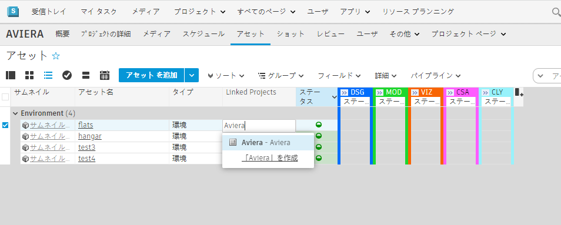
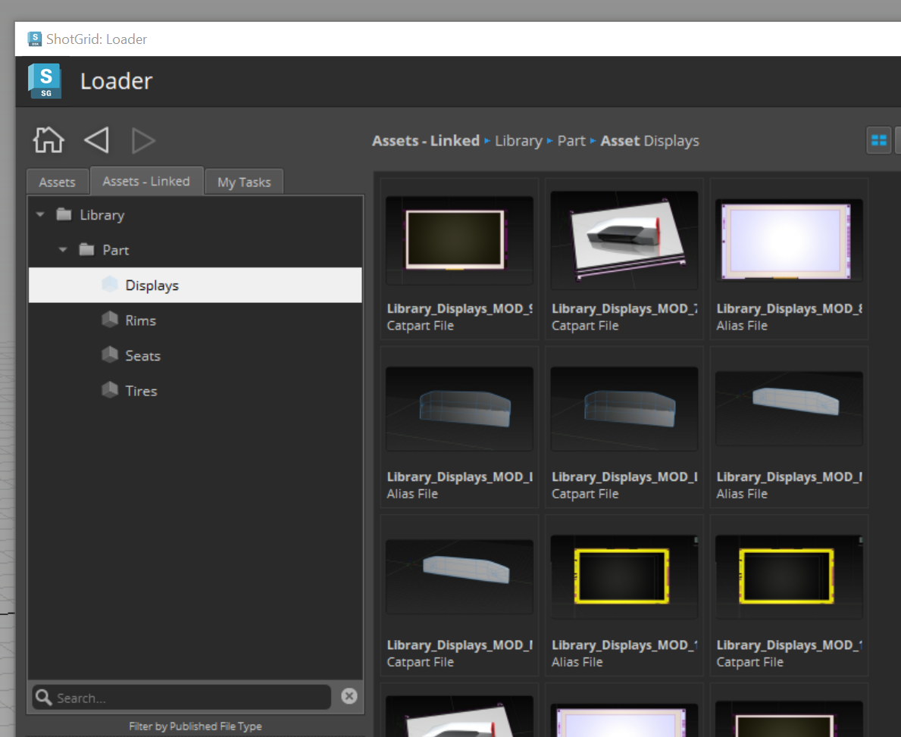
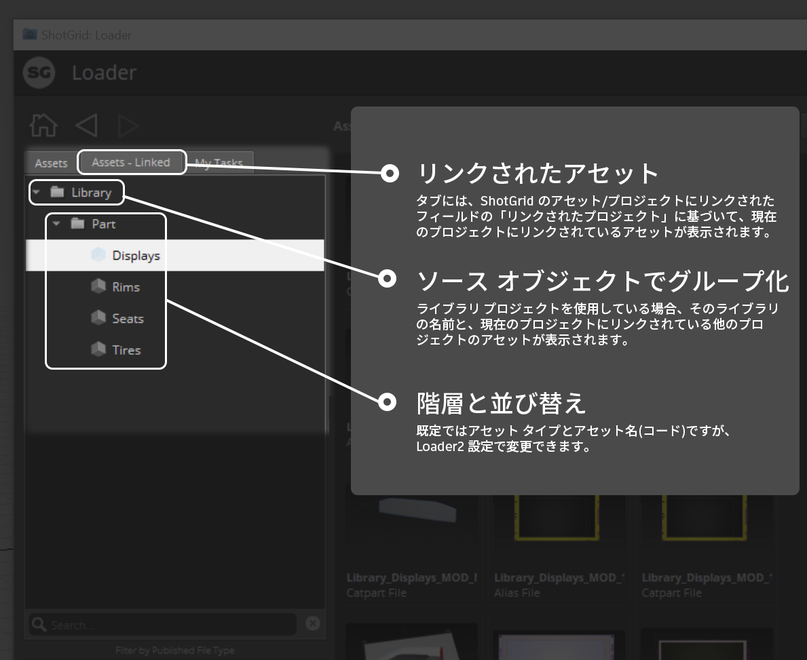
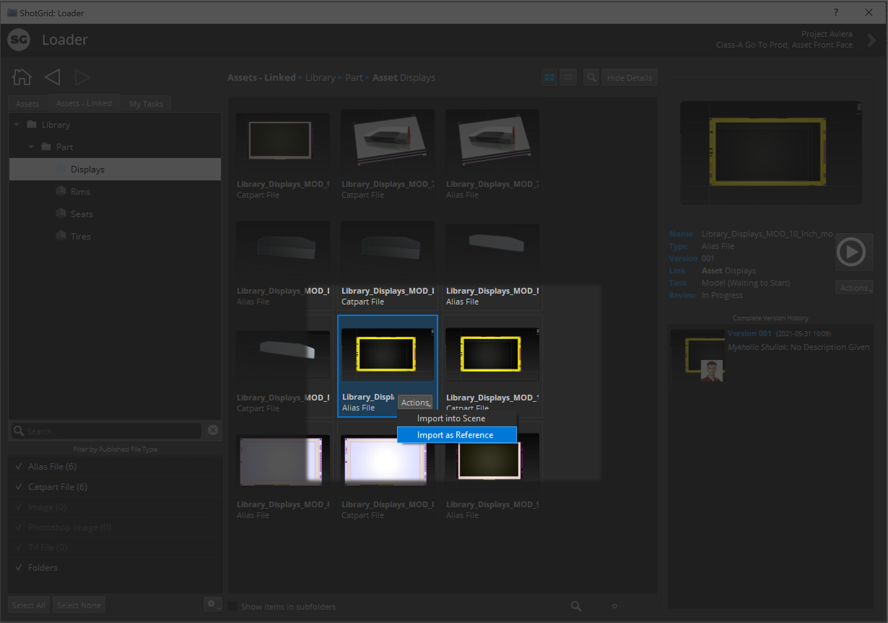

# プロジェクト間のワークフロー

## ベスト プラクティス

 のプロジェクト間ワークフローを使用すると、複数のプロジェクトにわたってアセットを再利用、共有、および使用することができます。アセットを再利用する最も一般的な方法は、単一の「アセット ライブラリ」プロジェクトをソース プロジェクトとして使用することです。単一の「ライブラリ」プロジェクトを使用してシンプルに保つことをお勧めしますが、 では任意のアクティブなプロジェクト間でアセットをリンクすることもできます。

アセットを再利用するには、主に 2 つの方法があります。より迅速なアプローチは、ソースアセットをそのまま再利用することです(直接参照)。ただし、プロジェクトとパイプラインに基づいて制限事項が適用されるため、ソース アセットをプロジェクトにコピーすることもできます(複製またはフォーク)。

* **直接参照**: ソース アセットをそのまま再利用します。アセットが変更された場合は、バージョンを保持するか、最新バージョンに更新することができます。
* **複製またはフォーク**: 別のプロジェクトからソース アセットを読み込んで(ソースへの接続を解除して)、そのソース アセットをベースに構築するか、コントロールを取得して現在のプロジェクトに保存します。

# プロジェクト間/ライブラリ プロジェクトのワークフロー
このチュートリアルでは、 Toolkit を使用して複数のプロジェクトでアセットを再利用し、スタジオのアーティストが簡単にアクセスできるアセット ライブラリを構築する方法について説明します。この機能を実行するには、3 つの主要な手順があります。

1. **プロジェクト間でリンクされた ShotGrid アセット**: **[リンクされたプロジェクト] (Linked Projects)**フィールドを使用して、アセットとプロジェクト間をリンクします
2. **アセットをシーンにロード/参照設定する**: ローダーのダイナミック タブを使用します
3. **アセットを最新に維持する**Scene Breakdown アプリを使用します

## 手順 1: アセットをリンクする

アセットを再利用するには、まず、ソース アセットを使用する他のプロジェクトを  に認識させます。

再利用している元のアセットを含むソース プロジェクトから、[アセット] (Assets)ページに移動します。**[リンクされたプロジェクト] (Linked Projects)**フィールドを[アセット] (Assets)ページに追加します(まだ表示されていない場合)。次に、アセットを再利用するプロジェクトを指定します。

**詳細なドキュメントは、[こちら](https://help.autodesk.com/view/SGSUB/JPN/?guid=SG_Administrator_ar_site_configuration_ar_cross_project_asset_linking_html)から参照してください。

## 手順 2: アセットをロードする
**[リンクされたプロジェクト] (Linked Projects)**フィールドを介してアセットが適切にリンクされると、Loader で単純かつ動的なタブを使用して、リンクされ、再利用されたアセットをスタジオに提供することができます。これにより、アーティストやクリエイティブ チームは、複数のプロジェクトでアセットを簡単に再利用できます。

アセットが適切にリンクされたら、以下を実行します。
* コンテンツ作成ソフトウェア(Maya、Houdini、Alias など)を起動する
* 作業シーンを開くか保存してコンテキストを設定する
* シーン コンテキストを設定したら、 メニューからローダーを起動する
* これで、**[アセット - リンク済み] (Assets - Linked)**タブが表示され、プロジェクト間でアセットのパブリッシュ ファイルにアクセスできるようになります。

*設定内のローダーにこのタブを追加する詳細な手順については、[こちら](https://developer.shotgridsoftware.com/ja/2088a677/)を参照してください。*

ここから、コンテンツ作成ソフトウェアのローダー アクションを利用して、読み込み(アセットを複製またはフォークしてソースへの接続を切断する場合)や、アセットの参照(現在のバージョンやこのアセットの後続のすべてのバージョンに継続的に接続する場合)を実行できます。

## 手順 3: これらのアセットを更新する
ソースへの接続を維持してアセットを参照する場合、そのソース アセットの更新と変更を確認することができます。このシナリオでは、他のチームがソース アセットを繰り返し使用し続ける一方で、最新バージョンが必要になることがよくあります。

設定で Scene Breakdown 2 アプリを使用すると、現在シーン内にあるすべてのリファレンス項目を表示できます。これらの参照のいずれかが更新されると、Scene Breakdown は競合を表示し、変更内容に関するパブリッシュ ファイルのノートを共有し、最新バージョンまたはパブリッシュ ファイルの他のバージョンに更新できるようになります。

*注: アセットの更新は、高度な設定を使用する場合にのみ適用されます。スタジオで基本設定を使用している場合、この Scene Breakdown アプリにアクセスすることはできません。*

