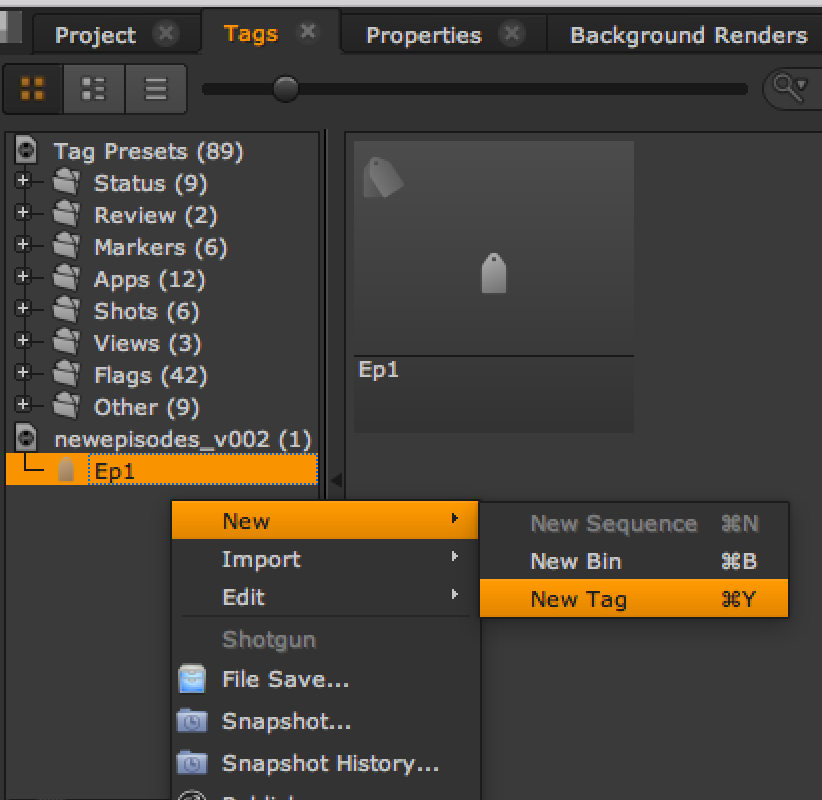
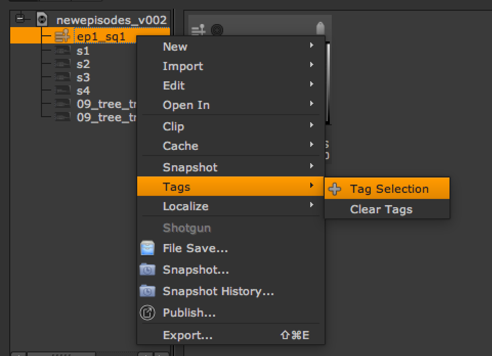
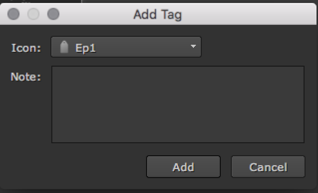
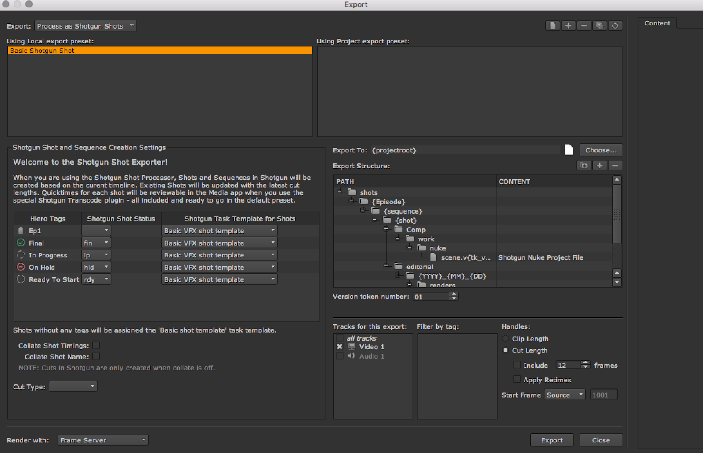

# Nuke Studio でのエピソード ワークフロー


## 概要および準備作業


この記事では、Nuke Studio または Hiero で `tk-hiero-export` アプリを使用してエピソード ワークフローを起動および実行する方法について説明します。 この方法が 1 つだけではないことに注意してください。目的のワークフローごとに方法は若干異なります。この例では、次のように仮定します。

* 目標は、`Episode > Sequence > Shot` という 3 つの層からなる階層を設定することです。
* [ファイル システム設定ガイド](https://developer.shotgridsoftware.com/ja/82ff76f7/)に記載された手順を参照して完了します。
* `Episode` エンティティ タイプを使用します(`CustomEntity02` ではありません。両方とも同じ方法で機能することができ、名前だけが異なります)。
* `Sequence` エンティティに `episode` というエンティティ フィールドがあります。
* Nuke Studio を使用しますが、プロセスは Hiero と同じです。
* Toolkit プロジェクトの[既定の設定](https://github.com/shotgunsoftware/tk-config-default2)を最初に使用します。

開始する前に決定しなければならないことがもう 1 つあります。それは、`Episode` の解決方法です。すぐに使える  Hiero/Nuke Studio の書き出しプロセスにより、Nuke Studio プロジェクトの内容に基づいて、 サイトに `Sequence` および `Shot` エンティティが作成されます。Toolkit を使用して Maya で作業する場合のように、アセットやタスクが既に作成されていると想定される場合と異なり、Nuke Studio では `Episodes` `Sequences` または `Shots` が既に作成されていると想定されません。そのため、Nuke Studio では `Episode` の定義方法をユーザが決定する必要があります。ここで使用できるオプションはいくつかあります。

*  でエピソードをあらかじめ作成し、エピソードのコンテキストで機能するように Nuke Studio Toolkit の統合を設定します。こうすることで、書き出すときに、現在のシーンのコンテキストから `Episode` エンティティを取得することができます。
* `Episode` エンティティがまだ作成されていないと想定して、Nuke Studio のタグ付け機能を利用してシーケンスにエピソード名をタグ付けし、書き出すときに `Episode` を解決します。

使用しているワークフローに適した別の方法が存在する可能性があります。たとえば、Nuke Studio のシーケンス名やショット名の一部からエピソード名を抽出する(例: シーケンス「ep1_s01」から「ep1」を取り出す)などの方法があります。 または、書き出しアプリの [hiero_customize_export_ui.py](http://areadownloads.autodesk.com/wdm/shotgrid/tu-episodic-nuke.zip) フックを使用して、書き出しとエピソードをリンクするための GUI を追加することができます。

この例では、2 番目のオプションである、シーケンスのタグ付けによる解決策を使用します。

*この手順の目的は、階層の 3 つのレイヤ(`Episode > Sequence > Shot`)を実装することです。`Sequence` エンティティ タイプを `Episodes` エンティティ タイプで単に置き換えるプロセス(`Episode > Shot`)の方が簡単です。 このシナリオについては、このガイドの最後の方で簡単に説明しますが、残りの説明を参照して理解を深めることをお勧めします。*

## スキーマとテンプレート


上記のように、この例では、[スキーマおよびテンプレートが更新](https://developer.shotgridsoftware.com/ja/82ff76f7/#how-can-i-add-a-new-entity-type-to-my-file-structure)されていることが前提となります。templates.yml 内の `hiero_plate_path` および `hiero_render_path` パスの値も更新されていて、正しい部分にエピソード キーが格納されていることを確認します。

## フックと設定


 書き出しプロセスを取得して `Episode` を正しく処理するには、書き出しフックの一部を変更する必要があります。この記事では、ユーザが[フック](https://developer.shotgridsoftware.com/ja/312b792f/#using-frameworks-from-hooks)の概要について理解していて、基本的な実装のオーバーライドに慣れていると想定しています。

エピソードを有効にするのに役立つ書き出しフックは 2 つあります。

* `hiero_get_shot.py`
* `hiero_resolve_custom_strings.py`

注: `hiero_translate_template.py` という 3 番目のフックがあります。この例ではこのフックを使用しませんが、シーケンスをエピソードで置き換えて、2 つのレイヤからなる階層を維持することのみを行う場合は、このフックが必要になります。これについては、記事の最後で少し詳しく説明します。

エピソードを検索して、 でこれに該当するエントリを作成できるように、`hiero_get_shot.py` を変更します。また、Nuke Studio がパス内の {Episode} キーに指定する値を取得できるように、`hiero_resolve_custom_strings.py` を変更します。次に、このステップの詳細を示します。

### 1. エピソード フィールドの追加

テンプレートに `Episode` というキーが追加されたため、`tk-hiero-export` アプリにその解決方法を指定する必要があります。`<pipeline_configuration>/config/env/includes/settings/tk-hiero-export.yml` ファイル内の `custom_template_fields` を次のように変更します。

```
 settings.tk-hiero-export:  
    custom_template_fields: [{keyword: Episode, description: The episode name}]  
 ...
```

`{Episode}`こうすると、 という名前の有効な書き出しトークンが Hiero エクスポータに追加されます。

### 2. hiero_get_shot フック

`hiero_get_shot.py` フックを使用して、書き出しプロセスにエピソード名を検索し、 で `Episode` を作成する方法を指定する必要があります。

[フックの既定のバージョン(hiero_get_shot.py)](http://areadownloads.autodesk.com/wdm/shotgrid/tu-episodic-nuke.zip)では、TrackItem と同じ名前の `Shot` が  から返されます。Nuke Studio シーケンス項目と同じ名前を持つ `Sequence` に `Shot` をリンクする必要もあります。`Sequence` または `Shot` が  内になければ、フックによって作成されます。別の階層レベルが追加されるため、`Episode` が存在しなければこれも作成するようにフックに指示する必要があります。

また、`Sequence` は `Episode` にリンクされているため、`Sequence` を検索するコード(`get_shot_parent()` メソッド)にこれを関連付ける必要があります。

環境設定のフック フォルダ内に `hiero_get_shot.py` ファイルを作成し、`hook_get_shot: '{config}/hiero_get_shot.py'` を `tk-hiero-export.yml` 設定に追加します。次のようになります。

```
 settings.tk-hiero-export:  
    custom_template_fields: [{keyword: Episode, description: The episode name}]  
    hook_get_shot: '{config}/hiero_get_shot.py'
```

`hiero_get_shot.py`次に、 フックのコード全体を示します。 作成したフックにこのコードを追加します。

```
from sgtk import Hook

class HieroGetShot(Hook):
    """
    Return a    Shot dictionary for the given Hiero items
    """

    def execute(self, task, item, data, **kwargs):
        """
        Takes a hiero.core.TrackItem as input and returns a data dictionary for
        the shot to update the cut info for.
        """

       # get the parent entity for the Shot
       parent = self.get_shot_parent(item.parentSequence(), data, item=item)

       # shot parent field
       parent_field = "sg_sequence"

       # grab shot from  
       sg = self.parent.shotgun
       filter = [
           ["project", "is", self.parent.context.project],
           [parent_field, "is", parent],
           ["code", "is", item.name()],
        ]

       # default the return fields to None to use the python-api default
       fields = kwargs.get("fields", None)
       shots = sg.find("Shot", filter, fields=fields)
       if len(shots) > 1:
           # can not handle multiple shots with the same name
           raise StandardError("Multiple shots named '%s' found", item.name())
       if len(shots) == 0:
           # create shot in {{ akn_product_name_lower }}
           shot_data = {
               "code": item.name(),
               parent_field: parent,
               "project": self.parent.context.project,
           }
           shot = sg.create("Shot", shot_data, return_fields=fields)
           self.parent.log_info("Created Shot in   : %s" % shot_data)
       else:
           shot = shots[0]

       # update the thumbnail for the shot
       upload_thumbnail = kwargs.get("upload_thumbnail", True)
       if upload_thumbnail:
           self.parent.execute_hook(
               "hook_upload_thumbnail",
               entity=shot,
               source=item.source(),
               item=item,
               task=kwargs.get("task")
           )

       return shot

    def get_episode(self, data=None, hiero_sequence=None):
        """
        Return the {{ akn_product_name_lower }} episode for the given Nuke Studio items.
        We define this as any tag linked to the sequence that starts
        with 'Ep'.
        """

       # If we had setup Nuke Studio to work in an episode context, then we could
       # grab the episode directly from the current context. However in this example we are not doing this but here
       # would be the code.
       # return self.parent.context.entity

       # stick a lookup cache on the data object.
       if "epi_cache" not in data:
           data["epi_cache"] = {}

       # find episode name from the tags on the sequence
       nuke_studio_episode = None
       for t in hiero_sequence.tags():
           if t.name().startswith('Ep'):
               nuke_studio_episode = t
               break
       if not nuke_studio_episode:
           raise StandardError("No episode has been assigned to the sequence: %s" % hiero_sequence.name())

       # For performance reasons, lets check if we've already added the episode to the cache and reuse it
       # Its not a necessary step, but it speeds things up if we don't have to check {{ akn_product_name_lower }} for the episode again
       # this session.
       if nuke_studio_episode.guid() in data["epi_cache"]:
           return data["epi_cache"][nuke_studio_episode.guid()]

       # episode not found in cache, grab it from  
       sg = self.parent.shotgun
       filters = [
           ["project", "is", self.parent.context.project],
           ["code", "is", nuke_studio_episode.name()],
       ]
       episodes = sg.find("Episode", filters, ["code"])
       if len(episodes) > 1:
           # can not handle multiple episodes with the same name
           raise StandardError("Multiple episodes named '%s' found" % nuke_studio_episode.name())

       if len(episodes) == 0:
           # no episode has previously been created with this name
           # so we must create it in {{ akn_product_name_lower }}
           epi_data = {
               "code": nuke_studio_episode.name(),
               "project": self.parent.context.project,
           }
           episode = sg.create("Episode", epi_data)
           self.parent.log_info("Created Episode in   : %s" % epi_data)
       else:
           # we found one episode matching this name in {{ akn_product_name_lower }}, so we will resuse it, instead of creating a new one
           episode = episodes[0]

       # update the cache with the results
       data["epi_cache"][nuke_studio_episode.guid()] = episode

       return episode

    def get_shot_parent(self, hiero_sequence, data, **kwargs):
        """
        Given a Hiero sequence and data cache, return the corresponding entity
        in    to serve as the parent for contained Shots.

        :param hiero_sequence: A Hiero sequence object
        :param data: A dictionary with cached parent data.

        .. note:: The data dict is typically the app's `preprocess_data` which maintains the cache across invocations of this hook.        

        """
        # stick a lookup cache on the data object.
        if "parent_cache" not in data:
            data["parent_cache"] = {}

        if hiero_sequence.guid() in data["parent_cache"]:
            return data["parent_cache"][hiero_sequence.guid()]

        episode = self.get_episode(data, hiero_sequence)

        # parent not found in cache, grab it from    

        sg = self.parent.shotgun filter = [
            ["project", "is", self.parent.context.project],
            ["code", "is", hiero_sequence.name()],
            ["episode", "is", episode],
            ]

        # the entity type of the parent.
        par_entity_type = "Sequence"

        parents = sg.find(par_entity_type, filter)
        if len(parents) > 1:
            # can not handle multiple parents with the same name
            raise StandardError(
                "Multiple %s entities named '%s' found" % (par_entity_type, hiero_sequence.name())
                )

        if len(parents) == 0:
            # create the parent in {{ akn_product_name_lower }}
            par_data = {
                "code": hiero_sequence.name(),
                "project": self.parent.context.project,
                "episode": episode,
                }

            parent = sg.create(par_entity_type, par_data)
            self.parent.log_info(
                "Created %s in   : %s" % (par_entity_type, par_data)
                )
        else:
            parent = parents[0]

        # update the thumbnail for the parent
        upload_thumbnail = kwargs.get("upload_thumbnail", True)

        if upload_thumbnail:
            self.parent.execute_hook(
                "hook_upload_thumbnail", entity=parent, source=hiero_sequence, item=None
            )

        # cache the results
        data["parent_cache"][hiero_sequence.guid()] = parent
        return parent
```

#### シーケンスを取得する

上記のコードを使用して、`get_shot_parent()` メソッドを変更しました。`Sequence` を検索して作成するときに、新しい `get_episode()` メソッドから `Episode` が返されるようになりました。  データベース内に既存の `Sequence` があることを確認するときに、`episode</code< field` でフィルタされるようになりました。`Sequence` を作成すると、シーケンスの `episode` フィールドに `get_episode()` から返された `Episode` が入力されます。


#### エピソードを取得する

エピソードを取得するには、どのようにしますか。 `get_episode()` メソッド コードは `get_shot_parent()` メソッドと非常によく似ていますが、`Sequence` でなく `Episode` を取得するように変更されています。

このガイドでは、タグを使用して Nuke Studio でエピソードを割り当てています。 たとえば、Nuke Studio で「Ep01」というタグを作成できます。作成したら、Nuke Studio でこのタグをシーケンスに適用します。

高度な `get_episode()` メソッドは、Nuke Studio 内のシーケンス項目に適用されるすべてのタグを参照します。先頭に文字列「Ep」が付いているタグが見つかった場合は、これがエピソード名を定義するタグと見なされます。 このメソッドを実行すると、 内で一致する `Episode` が検索されて、返されます。まだ存在しない場合は、作成されます。この情報もキャッシュされるため、コストのかかる検索呼び出しを再実行する必要はありません。

*エピソードを別の方法(コンテキストから取得する、またはシーケンス名やショット名の最初のセクションを取得するなど)で取得する場合は、この方法のロジックを使用します。*


#### ショットを取得する

hiero_get_shot フックの主な目的は、 のショット データを返すことです。実際は、ショットを取得するためのロジックを変更する必要はありません。変更する必要があるのは、`Sequence` で親を取得する方法のみです。カスタム フィールドを使用して `Shot` と `Episode` のリンクも行う場合は、その実行メソッド内のコードを変更する必要があります。`parent[“episode”]` のように `Sequence` から `Episode` にアクセスし、作成呼び出し内でこれをショットにリンクします。


### 3. Hiero_resolve_custom_strings.py

引き継ぐ必要がある 2 番目のフックは `hiero_resolve_custom_strings.py` です。 このフックによって、Nuke Studio の書き出し用パスを解決することができます。ここでも、フック フォルダ内にフックを作成し、`tk-hiero-export.yml` ファイルに設定 `hook_resolve_custom_strings: {config}/hiero_resolve_custom_strings.py` を追加する必要があります。

ステップ 1 で追加したカスタム キー `{Episode}` がこのフックに渡され、書き出し用アプリは解決されたフォルダ名が返されると予測します フックは、渡されたキーが `{Episode}` であるかどうかを確認する必要があります。キーが条件を満たす場合は、`hiero_get_shot.py` フック内の `get_episode()` メソッドを再利用して、`Episode` エンティティを取得します。`Episode` が取得されたら、コードはエピソードの名前を抽出して、フォルダを生成できます。

次に、このフックのコード全体を示します。

```
from sgtk import Hook


class HieroResolveCustomStrings(Hook):
    """Translates a keyword string into its resolved value for a given task."""
    # cache of shots that have already been pulled from {{ akn_product_name_lower }}
    _sg_lookup_cache = {}

    def execute(self, task, keyword, **kwargs):
        """
        The default implementation of the custom resolver simply looks up
        the keyword from the {{ akn_product_name_lower }} shot dictionary.

        For example, to pull the shot code, you would simply specify 'code'.
        To pull the sequence code you would use 'sg_sequence.Sequence.code'.
        """

        if keyword == "{Episode}":
            episode_entity = self.parent.execute_hook_method(
                "hook_get_shot",
                "get_episode",
                data=self.parent.preprocess_data,
                hiero_sequence=task._item.parentSequence(),
            )
            # hard coded to return the name of the episode
            # if however your folder for the episode in the schema, is not just made up from the code field
            # you need to get it to return what ever string value the folder would normally be created with.
            return episode_entity['code']

        shot_code = task._item.name()

        # grab the shot from the cache, or the get_shot hook if not cached
        sg_shot = self._sg_lookup_cache.get(shot_code)
        if sg_shot is None:
            fields = [ctf['keyword'] for ctf in self.parent.get_setting('custom_template_fields')]
            sg_shot = self.parent.execute_hook(
                "hook_get_shot",
                task=task,
                item=task._item,
                data=self.parent.preprocess_data,
                fields=fields,
                upload_thumbnail=False,
            )

            self._sg_lookup_cache[shot_code] = sg_shot

        self.parent.log_info("_sg_lookup_cache: %s" % (self._sg_lookup_cache))

        if sg_shot is None:
            raise RuntimeError("Could not find shot for custom resolver: %s" % keyword)

        # strip off the leading and trailing curly brackets
        keyword = keyword[1:-1]
        result = sg_shot.get(keyword, "")

        self.parent.log_debug("Custom resolver: %s[%s] -> %s" % (shot_code, keyword, result))
        return result

```

スキーマのエピソード フォルダの名前が `code` フィールド以外から生成されている場合は、ここでこの名前を置き換える必要があります。

より適切で、複雑な方法は、templates.yml で `episode_root` テンプレートを追加して、このテンプレートからフィールドを取得することです。 この方法の場合、スキーマ内のエピソード フォルダの名前を変更したときでも、返されたフォルダ名はスキーマと常に一致します。コードは次のようになります。

```
ctx = tk.context_from_entity("Episode", episode_entity[id])
my_template = tk.templates["episode_root"]
fields = my_template.get_fields(ctx.filesystem_locations[0])
return fields["Episode"]

```

## まとめ


以上です。 後は、変更内容が適切に機能するかテストするだけです。

Nuke Studio を起動し、プロジェクトを作成し、シーケンスや映像を入力したので、書き出しプロセスをテストすることができます。 まず、エピソード タグを作成します。`Ep` で開始するシーケンスのタグを検索するフックがコーディングされているため、タグに `Ep…` という名前を付ける必要があります。



シーケンスにタグを追加します。

  

完了したら、タグの付いたシーケンスからショットを書き出します。


構造の書き出しの階層がスキーマの階層と一致することを確認します。 一致しない場合は、[構造を更新](#tip-refresh)しなければならない可能性があります。




[書き出し] (export)をクリックすると、 サイト内にエピソード、シーケンス、およびショットが作成され、ディスク上にフォルダ構造が作成されます。この方法で問題が生じた場合は、Nuke Studio スクリプト エディタまたは [ のログ(tk-nukestudio.log)](https://developer.shotgridsoftware.com/ja/38c5c024/)で、発生した可能性のあるエラーがないか確認してください。

これでこのガイドは完了です。 もちろん、これはエピソードを処理する複数の方法の中の 1 つにすぎません。ご使用のスタジオに最適な方法および構造を特定するのは、ユーザの役割です。

## エピソードのシーケンスを切り替える


上で簡単に説明したように、エピソード/ショットの既定のシーケンス/ショット階層を単に切り替える場合は、エピソード名のソースとして Nuke Studio のシーケンス項目を使用することができます。

1. エピソード/ショット構造を使用するスキーマおよびテンプレートを設定します。

2. 上記のような既定の `hiero_get_shot.py` フックを引き継ぎます。ただし、今回は `parent_field` 変数の値を `sg_episode` に変更し(ショット エンティティ内にエピソード フィールドがあることを確認します)、`par_entity_type` `variable value to` `Episode`。

3. `hiero_translate_template.py` フックを引き継いで、フック ファイル内のマッピングを変更します。

```
 mapping = {
   "{Episode}": "{sequence}",
   "{Shot}": "{shot}",
   "{name}": "{clip}",
   "{version}": "{tk_version}",
}

```


Nuke Studio のシーケンス キー値を使用して、エピソード キーが解決されます。

> **ヒント:**<a id="tip-refresh"></a> これらの変更を行う前に Hiero/Nuke Studio プロジェクトを開いておいた場合、または変更中にテストする場合は、書き出しパスをリセットしなければならない可能性があります。書き出しダイアログを開くと、Nuke Studio は書き出しツリーをキャッシュに格納するため、スキーマに対する変更を再ロードする場合は、更新ボタンをクリックしてツリーを再構築する必要があります。