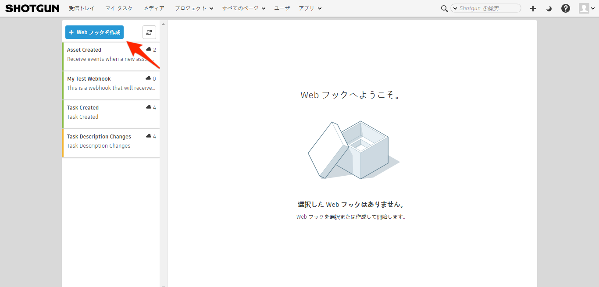
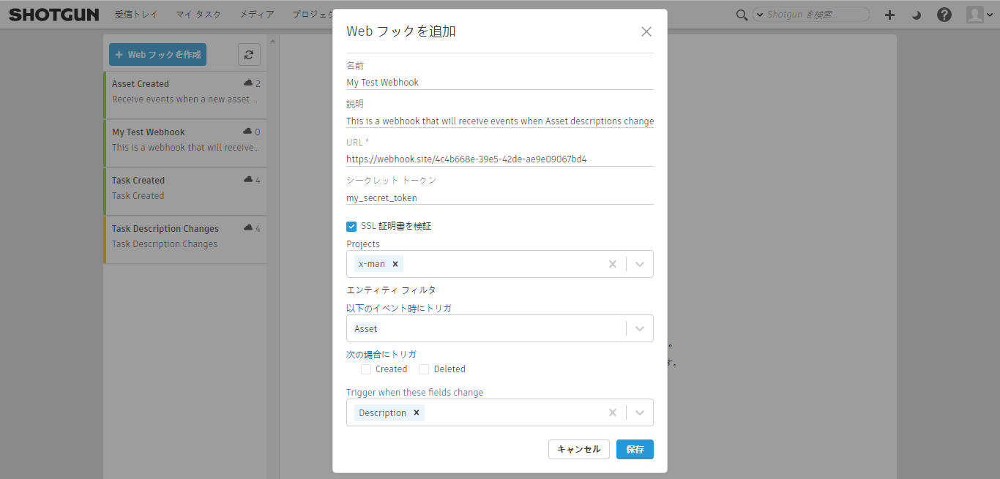
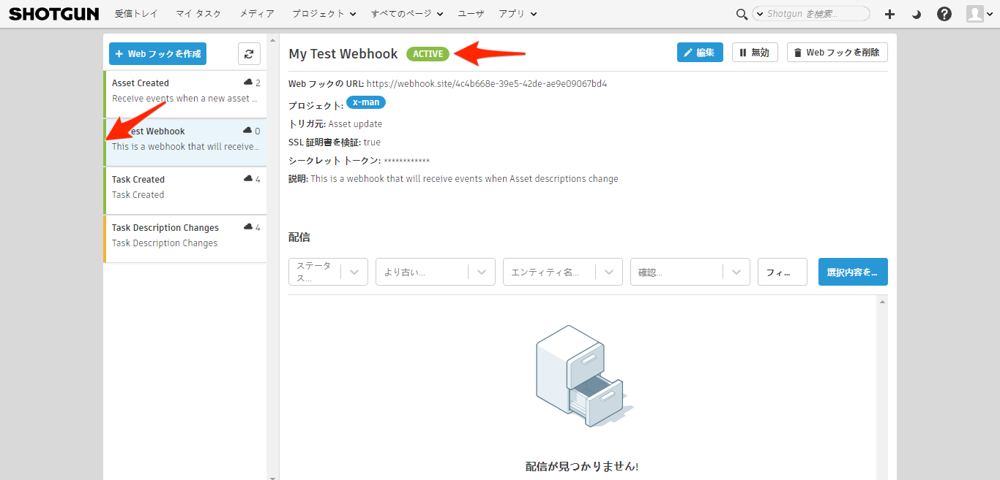
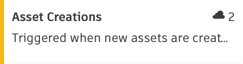
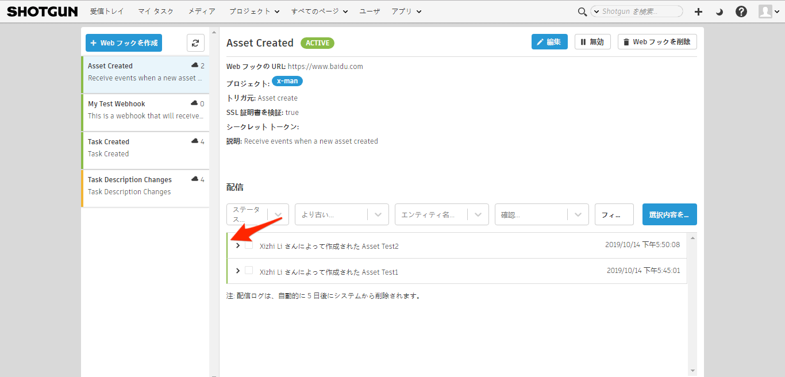
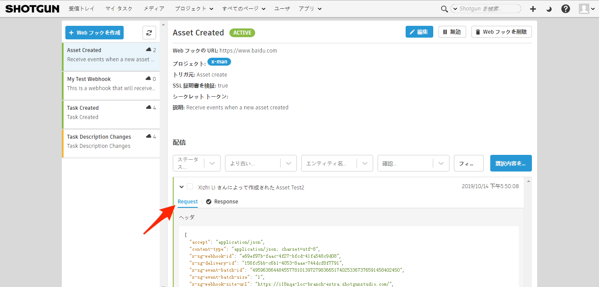

# Web フック



Web フックを使用すると、ユーザがコントロールしているサービスに Shotgun で発生したイベントを通知することができます。Web フックを作成する場合は、対象となるイベントのタイプを指定し、このイベントがトリガされたときにデータを送信する URL を Shotgun に指示します。Shotgun で関連イベントが発生すると、そのイベントを示すデータのペイロードが Web フックの URL に送信されます。これにより、Shotgun との統合が緊密化され、ワークフローの一部を自動化することができます。

## Web フックを使用する例

Web フックには多くの使用事例があります。このドキュメントでは役立つ事例をいくつか紹介しますが、Web フックの使用はこれらの例に限定されません。

### エンティティを作成するときにディスク上にディレクトリ構造を作成する

Shotgun で新しいエンティティを作成するときに何度も繰り返されてきたワークフローの 1 つとして、ディスク上にディレクトリ構造を作成することが挙げられます。Shotgun で新しいショットを作成したら、作業を進めて、アーティストの作業準備が整っていることを自動的に確認できると便利です。

### ステータス管理の自動化

アニメーション チームが作業を終えたら、作業を進めて、同じショットに関する下流工程のタスクのステータスを変更し、開始できる作業が増えたことを知らせるようにしましょう。こうすることで、別の作業に割り当てられているアーティストに、準備ができていることを自動的に通知できます。

ステータス管理の自動化が役立つもう 1 つの例は、新しい `Note` を作成するときに、`Task` エンティティのステータス変更をトリガすることです。この方法は、アーティスト チームとプロダクション チームに、レビュー セッション後にスーパーバイザーから現在の作品を変更または修正するよう要求されたことを知らせる場合に便利です。

## Shotgun のイベント デーモンではなく、Web フックを使用する場合

Web フックおよび [Shotgun のイベント デーモン](https://github.com/shotgunsoftware/shotgunEvents/wiki)の機能は似ていますが、重要な違いがいくつかあります。イベント デーモンは、ユーザ独自のサービスを実行、監視、メンテナンスする必要があります。すべてのコードを Python で記述する必要があり、これによって Shotgun との独自の接続を開始することが可能となります。対照的に、Web フックは複数の接続に対応し、任意のプログラム言語で記述することができます。Web フックは、[AWS Lambda](https://aws.amazon.com/jp/lambda/) などのサーバレス環境にホストしたり、[Zapier](https://zapier.com) や [IFTTT](https://ifttt.com) など、オンラインで使用可能な任意の自動化プラットフォームをトリガしたりできます。Web フックを使用できるのであれば、Web フックがお勧めのソリューションです。

## Web フックを作成する

Web フックの作成を開始するには、Web フックのページに移動し、Web フック リストの上にあるボタンにナビゲートします。



次に、新しい Web フックを作成するのに必要な情報を入力します。



### シークレット トークン

Web フックにシークレット トークンを割り当てる作業は省略できます。シークレット トークンを指定した場合、Web フックの URL に送信されるすべての要求はこのトークンを使用して署名されます。この要求と一緒にトークン値が送信されます(ヘッダ名は `X-SG-SIGNATURE`)。署名は HMAC および SHA1 を使用して計算され、署名されたメッセージが要求の本文(JSON 形式)になります。

#### ヘッダ形式

`<algorithm>=<signature>`

#### シークレット トークンを使用する理由

厳密に必要なわけではありませんが、シークレット トークンを指定すると、Web フックの URL に送信されるペイロードに署名が付けられます。これにより、カスタマー サービスは、データが予測された送信元から送信されていること、および送信中にペイロードがいかなる方法でも変更されなかったことを確認できます。

#### 署名の検証

Python を使用してペイロードの署名を確認する例の 1 つを、次に示します。

```
>>> import hmac
>>> import hashlib
>>> body | `<json body>'
>>> token | `mytoken'
>>> 'sha1=' + hmac.new(token, body, hashlib.sha1).hexdigest()  == 'sha1=32824e0ea4b3f1ae37ba8d67ec40042f3ff02f6c'
True
```

### SSL 証明書を検証する

SSL 証明書の検証機能はオプションです。Web フックの使用者 URL に対する接続のセキュリティを確保する際に役立ちます。この機能を有効にすると、Web フックの URL に配信された場合、Shotgun は OpenSSL の証明書検証ルーチンを使用して証明書を検証します。

## Web フックのステータス

Web フックはさまざまなステータスを取ることができます(健全性や、配信を引き続き受信できるかどうか)。



| ステータス | 例 | 説明 |
|--------|:-------:|:-----------:|
| アクティブ |  | Web フックの動作は安定しています。過去 24 時間以内に、この Web フックに対する配信が宛先に到達しなかったことはありません。 |
| 不安定 |  | Web フックの動作は不安定です。過去 24 時間以内に、一部の配信が宛先に到達しませんでしたが、Web フックが停止していると Shotgun が判断するには不十分です。 |
| 失敗 |  | Web フックは停止していると判断されていて、配信はこれ以上試行されません。この原因は、短期間に発生した配信失敗の数が多すぎたことです。システムは、Web フックが使用できなくなったと判断しました。**過去 24 時間以内に配信が 10 回失敗すると、Web フックに障害があると見なされます**。 |
| 無効 |  | Web フックは無効な状態です。再度有効になるまで、配信はこれ以上試行されません。 |

## 配信

Web フック リスト内の Web フックを選択すると、この Web フックに行われたすべての配信が 5 日前まで遡って表示されます。



### 配信ステータス

配信のステータスは、Web フックの URL に正常に配信されたかどうかを示します。



### 配信の詳細

配信を展開して、Web フックの URL に送信された要求およびこの要求に対する応答の詳細を表示することができます。



####  ペイロード

Web フックの URL に送信されるペイロードには、Shotgun で発生したイベントと、それをトリガしたユーザを示す情報が格納されています。この情報は、JSON 形式で提供されます。



##### サンプル ペイロード

```json
{
  "data": {
    "id": "95.0",
    "meta": {
      "type": "attribute_change",
      "entity_id": 758,
      "new_value": "This is the newest description ever!!",
      "old_value": "This is the old description!",
      "entity_type": "Asset",
      "attribute_name": "description",
      "field_data_type": "text"
    },
    "user": {
      "id": 113,
      "type": "HumanUser"
    },
    "entity": {
      "id": 758,
      "type": "Asset"
    },
    "project": {
      "id": 65,
      "type": "Project"
    },
    "operation": "update",
    "created_at": "2019-07-12 21:14:36.598835",
    "event_type": "Shotgun_Asset_Change",
    "session_uuid": "07473c00-a4ea-11e9-b3b8-0242ac110006",
    "attribute_name": "description",
    "event_log_entry_id": 248249
  }
}
```

##### セッション UUID

Shotgun でイベントをトリガした `session_uuid` が、イベント ペイロードの一部として提供されます。この値を [Shotgun の Python API](https://developer.shotgunsoftware.com/python-api/reference.html?highlight=session_uuid#shotgun_api3.shotgun.Shotgun.set_session_uuid) に提供して、この session_uuid を持つ、開いている任意のブラウザ セッションに、この API によって生成されたイベントの最新情報を表示することができます。

### 確認応答

配信を更新して確認応答を含めることができます。配信時に、要求の一部としてヘッダが提供されます。これらのヘッダには、`x-sg-delivery-id` キーに格納されている配信レコードの ID が含まれます。この ID を使用すると、[Shotgun REST API](https://developer.shotgunsoftware.com/rest-api) で配信レコードを更新し、確認応答を含めることができます。



#### サンプル ヘッダ

```json
{
  "accept": "application/json",
  "content-type": "application/json; charset=utf-8",
  "x-sg-webhook-id": "30f279a0-42a6-4cf2-bb5e-6fc550d187c8",
  "x-sg-delivery-id": "dea7a71d-4896-482f-b238-b61820df8b65",
  "x-sg-event-batch-id": "1",
  "x-sg-event-batch-size": "4",
  "x-sg-webhook-site-url": "http://yoursite.shotgunstudio.com/",
  "x-sg-event-batch-index": "3"
}
```

#### 確認応答の用途

確認応答を使用すると、成功または失敗を示す詳細レポートを帯域外で送信し、Web フックの URL で正常に受信された配信を処理することができます。これにより、Shotgun からの配信に関する受信ステータスを成功または失敗から切り離し、この配信に関連付けられているイベントを処理できるようになります。このようにして、正常に配信されたイベントにデバッグに役立つ追加情報を含めることができます。適切な例として、`Asset` エンティティの作成時にトリガされる Web フックがあります。新しい `Asset` ごとにディスク上にディレクトリ構造を 1 つ作成する作業を Web フックで行う場合、Web フックの URL は配信を正常に受信できますが、ディスクまたはネットワークが停止しているため、関連ディレクトリを作成することはできません。配信を受信した後、Web フックは、ディレクトリ構造が作成されなかったことおよびその理由を示す詳細なエラー メッセージを使用して、配信記録を更新することができます。

## Web フックのテスト

無料公開されている任意の Web フック URL ジェネレータをオンラインで使用して、テストすることができます。これらのサービスは特に、Web フックやその他のタイプの HTTP 要求をテストすることを目的としています。この方法は、ネットワーク上にインフラストラクチャを設定しないで、Web について学習する場合に便利です。

### webhook.site を使用する

[webhook.site](https://webhook.site) を使用することをお勧めします。このサイトでは、コピーして Web フックに貼り付けることができる一意の URL が提供されていて、このアドレスへの配信がリアルタイムに表示されます。このページは、特定のステータス コードおよび本文を含む配信に応答するようにカスタマイズできます。つまり、配信の成功と失敗をテストすることができます。

webhook.site サービスの速度は積極的に制限されます。つまり、一部の配信が拒否されて、Web フックが不安定になる、または停止することが容易に発生します。テストする場合は、プロダクションのライブ データではなく、既知のコントロール可能なプロジェクト環境を使用することをお勧めします。



### 配信に応答する

配信が正常に行われたとシステムが判断するためには、コンシューマー サービスが配信に応答する必要があります。



#### ステータス コード

| ステータス | コード | 説明 |
|--------|:----:|:-----------:|
| 成功 | < 400 | 配信は受信されて、正常に処理されました。 |
| エラー | >= 400 | 配信は受信されましたが、正常に処理されませんでした。 |
| リダイレクト | 3xx | 配信は受信されましたが、別の URL にリダイレクトする必要があります。 |
