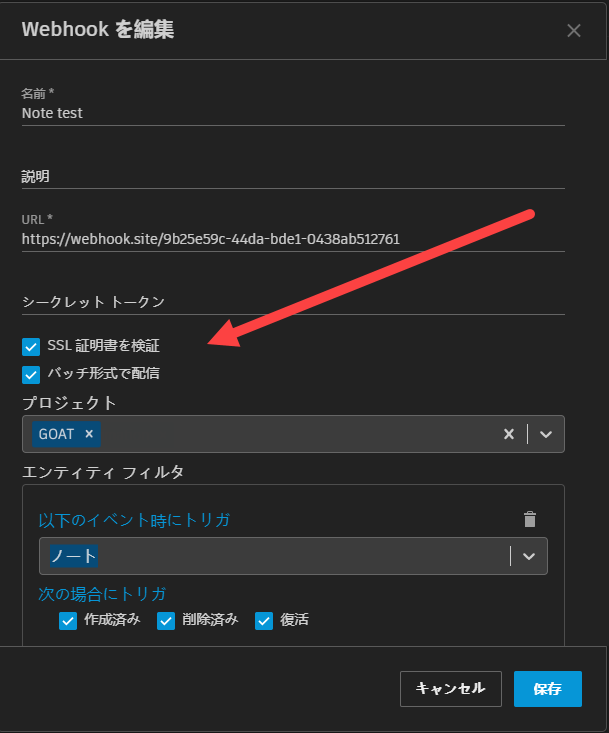

# バッチ配信

## バッチ配信を有効にする

[バッチ形式で配信](Deliver in Batched Format)オプションを選択すると、バッチ ペイロード形式で要求を行うように Webhook を設定できます。このオプションを有効にすると、各要求が形成された時点で、最大 50 個の保留中の配信がペイロードに格納されてバッチ処理されます。

これは、多数の SG イベントが短時間に生成された結果、急増した配信の処理を管理する際に役立ちます。一般的なシステム運用環境では、登録済みのイベントが 2 秒間に 1 回を超える頻度で生成された場合、1 つのペイロードにつき複数の配信が発生します。



## 配信に応答する

バッチ配信を有効にする場合は、イベントにつき 1 秒を超える速度で確実に応答するよう設計されている受信サービスを使用することをお勧めします。そうしないと、バッチが巨大化した場合に、タイムアウトと Webhook エラーが生じるリスクが高まります。



#### 非バッチ配信型の Webhook

- タイムアウトの許容時間は、配信あたり 6 秒です。つまり、Webhook エンドポイントは、6 秒以内に各要求に応答する必要があります。

#### バッチ配信型の Webhook

- タイムアウトの許容値は、最大で 6 秒、またはバッチ内のイベントあたり 1 秒です。
- スロットル制限は引き続き適用されます。ShotGrid サイトごとに許可される 1 分間あたりの Webhook エンドポイント応答時間は、Webhook 全体で 1 分です。

## Webhook 配信形式の比較

#### 非バッチ配信型の Webhook メッセージの本文(配信数は常に 1):

```json
{
  "data": {
    "id": "119.110.0",
    "event_log_entry_id": 479004,
    "event_type": "Shotgun_Asset_Change",
    "operation": "update",
    "user": { "type": "HumanUser", "id": 24 },
    "entity": { "type": "Asset", "id": 1419 },
    "project": { "type": "Project", "id": 127 },
    "meta": {
      "type": "attribute_change",
      "attribute_name": "code",
      "entity_type": "Asset",
      "entity_id": 1419,
      "field_data_type": "text",
      "old_value": "Cypress test asset for Webhooks deliveries",
      "new_value": "Revised test asset for Webhooks deliveries"
    },
    "created_at": "2021-02-22 17:40:23.202136",
    "attribute_name": "code",
    "session_uuid": null
  },
  "timestamp": "2021-02-22T17:40:27Z"
}
```

#### バッチ配信型 Webhook メッセージの本文(配信数は 1 ～ 50)

バッチ処理を有効にした場合は、バッチ内のイベント数が 1 つのみのときでも、`deliveries` キーは常に存在します。この値は個々のイベント配信データの配列であり、配信ごとに指定される情報は非バッチ モードと同じです。

```json
{
  "timestamp": "2021-02-22T18:04:40.140Z",
  "data": {
    "deliveries": [
      {
        "id": "170.141.0",
        "event_log_entry_id": 480850,
        "event_type": "Shotgun_Asset_Change",
        "operation": "update",
        "user": { "type": "HumanUser", "id": 24 },
        "entity": { "type": "Asset", "id": 1424 },
        "project": { "type": "Project", "id": 132 },
        "meta": {
          "type": "attribute_change",
          "attribute_name": "code",
          "entity_type": "Asset",
          "entity_id": 1424,
          "field_data_type": "text",
          "old_value": "Cypress test asset for Webhooks deliveries",
          "new_value": "Revised test asset for Webhooks deliveries"
        },
        "created_at": "2021-02-22 18:04:39.198641",
        "attribute_name": "code",
        "session_uuid": null
      },
      {
        "id": "170.141.1",
        "event_log_entry_id": 480851,
        "event_type": "Shotgun_Asset_Change",
        "operation": "update",
        "user": { "type": "HumanUser", "id": 24 },
        "entity": { "type": "Asset", "id": 1424 },
        "project": { "type": "Project", "id": 132 },
        "meta": {
          "type": "attribute_change",
          "attribute_name": "description",
          "entity_type": "Asset",
          "entity_id": 1424,
          "field_data_type": "text",
          "old_value": null,
          "new_value": "Some other *description*"
        },
        "created_at": "2021-02-22 18:04:39.212032",
        "attribute_name": "description",
        "session_uuid": null
      }
    ]
  }
}
```
