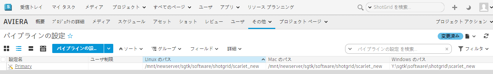

# パイプライン設定を新しい場所に移動するにはどうすればいいですか?



パイプライン設定を新しい場所に簡単に移動するには、`tank move_configuration` コマンドを使用します。これにより、ファイルを移動したり、 を更新したり、新しい場所を指すように設定ファイルを更新したりします。 

またこのコマンドは、1 つのオペレーティング システムで場所を移動するだけの場合や、以前は特定のオペレーティング システムを使用していなかったがこれから追加する場合などにも役立ちます。Toolkit は、移動する項目、追加する項目、またはそれ以外の項目を検出し、適用前に確認できるように実行内容が表示されます。

- [tank move_configuration コマンドを使用](#using-the-tank-move_configuration-command)
- [パイプライン設定を手動で移動する](#manually-moving-your-pipeline-configuration)



## タンク move_configuration コマンドを使用:

        $ cd /sgtk/software/shotgun/scarlet
        $ ./tank move_configuration

        Welcome to the  Pipeline Toolkit!

        For documentation, see https://toolkit.shotgunsoftware.com
        Starting Toolkit for your current path '/sgtk/software/shotgun/scarlet'
        - The path is not associated with any  object.

        - Falling back on default project settings.
        - Using configuration 'Primary' and Core v0.15.22
        - Setting the Context to Scarlet.
        - Running command move_configuration...

        ----------------------------------------------------------------------
        Command: Move configuration
        ----------------------------------------------------------------------

        Syntax: move_configuration linux_path windows_path mac_path

        This will move the location of the given pipeline configuration.
        You can also use this command to add a new platform to the pipeline
        configuration.

        Current Paths
        --------------------------------------------------------------

        Current Linux Path:   '/mnt/hgfs/sgtk/software/shotgun/scarlet'
        Current Windows Path: 'z:\sgtk\software\shotgun\scarlet'
        Current Mac Path:     '/sgtk/software/shotgun/scarlet'

        You typically need to quote your paths, like this:

        > tank move_configuration "/linux_root/my_config" "p:\configs\my_config"
        "/mac_root/my_config"

        If you want to leave a platform blank, just just empty quotes. For example, if
        you want a configuration which only works on windows, do like this:

        > tank move_configuration "" "p:\configs\my_config" ""

### 例:

        $ cd /sgtk/software/shotgun/scarlet
        $ ./tank move_configuration "/mnt/hgfs/sgtk/software/shotgun/scarlet_new" "z:\sgtk\software\shotgun\scarlet_new" "/sgtk/software/shotgun/scarlet_new"

        Welcome to the  Pipeline Toolkit!

        For documentation, see https://toolkit.shotgunsoftware.com
        Starting toolkit for path '/sgtk/software/shotgun/scarlet'
        - The path is not associated with any  object.

        - Falling back on default project settings.
        - Using configuration 'Primary' and Core v0.15.22
        - Setting the Context to Scarlet.
        - Running command move_configuration...

        ----------------------------------------------------------------------
        Command: Move configuration
        ----------------------------------------------------------------------

        Current Paths
        --------------------------------------------------------------
        Current Linux Path:   '/sgtk/software/shotgun/scarlet'
        Current Windows Path: 'z:\sgtk\software\shotgun\scarlet'
        Current Mac Path:     '/sgtk/software/shotgun/scarlet'

        New Paths
        --------------------------------------------------------------
        New Linux Path:   '/mnt/hgfs/sgtk/software/shotgun/scarlet_new'
        New Windows Path: 'z:\sgtk\software\shotgun\scarlet_new'
        New Mac Path:     '/sgtk/software/shotgun/scarlet_new'

        The configuration will be moved to reflect the specified path changes.

        Note for advanced users: If your configuration is localized and you have other
        projects which are linked to the core API embedded in this configuration,
        these links must be manually updated after the move operation.

        Are you sure you want to move your configuration? [Yes/No] yes
        Copying '/sgtk/software/shotgun/scarlet' -> '/sgtk/software/shotgun/scarlet_new'
        Copying /sgtk/software/shotgun/scarlet/cache...
        Copying /sgtk/software/shotgun/scarlet/config...
        Copying /sgtk/software/shotgun/scarlet/config/core...
        Copying /sgtk/software/shotgun/scarlet/config/core/hooks...
        Copying /sgtk/software/shotgun/scarlet/config/core/schema...
        Copying /sgtk/software/shotgun/scarlet/config/env...
        Copying /sgtk/software/shotgun/scarlet/config/env/includes...
        Copying /sgtk/software/shotgun/scarlet/config/hooks...
        Copying /sgtk/software/shotgun/scarlet/config/icons...
        Copying /sgtk/software/shotgun/scarlet/install...
        Copying /sgtk/software/shotgun/scarlet/install/apps...
        Copying /sgtk/software/shotgun/scarlet/install/apps/app_store...
        Copying /sgtk/software/shotgun/scarlet/install/core...
        Copying /sgtk/software/shotgun/scarlet/install/core/python...
        Copying /sgtk/software/shotgun/scarlet/install/core.backup...
        Copying /sgtk/software/shotgun/scarlet/install/core.backup/20150518_143244...
        Copying /sgtk/software/shotgun/scarlet/install/core.backup/20150518_143940...
        Copying /sgtk/software/shotgun/scarlet/install/engines...
        Copying /sgtk/software/shotgun/scarlet/install/engines/app_store...
        Copying /sgtk/software/shotgun/scarlet/install/frameworks...
        Copying /sgtk/software/shotgun/scarlet/install/frameworks/app_store...
        Updating cached locations in /sgtk/software/shotgun/scarlet_new/config/core/install_location.yml...
        Updating  Configuration Record...
        Deleting original configuration files...

        All done! Your configuration has been successfully moved.

## パイプライン設定を手動で移動する



既に手動で移動を開始したが正しく動作しない場合は、新しい場所に移動されたパイプライン設定で Toolkit が引き続き動作するようにするために、変更が必要な内容を以下に示します。

1. パイプライン設定を新しい場所に移動します。

        $ mv /sgtk/software/shotgun/scarlet /mnt/newserver/sgtk/software/shotgun/scarlet_new

2. Toolkit でパイプライン設定が格納されている場所を見つけられるように `install_location.yml` を編集します。

        $ vi /mnt/newserver/sgtk/software/shotgun/scarlet_new/config/core/install_location.yml

   適用可能なプラットフォームすべてで、パイプライン設定の新しい場所を示すようにこのファイル内のパスを更新します。プラットフォームを使用していない場合は、空の文字列 `''` を入力します。

        #  Pipeline Toolkit configuration file
        # This file was automatically created by setup_project
        # This file reflects the paths in the primary pipeline

        # configuration defined for this project.

        Windows: 'Y:\sgtk\software\shotgun\scarlet_new'
        Darwin: '/mnt/newserver/sgtk/software/shotgun/scarlet_new'
        Linux: ''

        # End of file.

3.  でこのプロジェクトに対応する PipelineConfiguration エンティティを特定し、上記の変更と一致するように、[Mac のパス](Mac Path)、[Windows のパス](Windows Path)、[Linux のパス](Linux Path)の各フィールドの値を修正します。

これでパイプライン設定が新しい場所から予想どおりに機能するようになりました。

