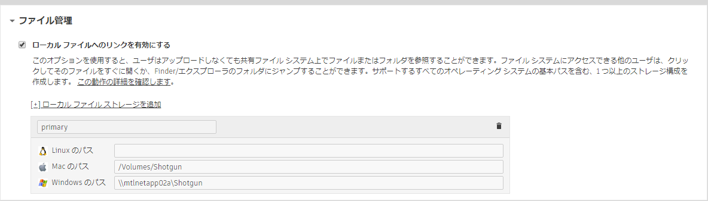

# プロジェクト ディレクトリを新しいローカル ストレージのルートに移動するにはどうすればいいですか?



必要に応じて、プロジェクト ファイル(シーン ファイルやレンダリングなど)を 新しいルート ストレージ場所に移動することがあります(たとえば `/mnt/smalldrive` から `/mnt/bigdrive/foo` へ)。このためには、単一ルート設定またはマルチルート設定を使用します。たとえば、「**asset_storage**」という名前のストレージを移動するとします。

- 古い場所から新しい場所にプロジェクト ファイルをコピー(または移動)します。
-  で、**[管理者] (Admin) > [サイト基本設定](Site Preferences)**ページに移動して、**[ファイル管理](File Management)**セクションを開きます。
   
- 各プラットフォームでプロジェクト ファイルの新しいストレージへのパスを設定して、「primary」と言う名前のローカル ファイル ストレージを更新します。特定のプラットフォームを使用していない場合は、空白のままにします。
- ページの上部または下部にある**[変更を保存](Save Changes)**ボタンをクリックします。
-  で保存したばかりの新しいパスの値と一致するようにプロジェクト設定の `config/core/roots.yml` ファイルを更新します。

Toolkit はパブリッシュ パスをストレージ ルートの相対パスとして保存します。そのため、古いストレージ ルートを使用すると、パスはその前提に基づいて展開されていました。

    [asset_storage]/assets/Character/betty => /mnt/smalldrive/assets/Character/betty

新しいストレージ ルートの定義を使用すると、パスは次のように展開されます。

    [asset-storage]/assets/Character/betty => /mnt/bigdrive/foo/assets/Character/betty

これで、 や Toolkit 内の他のパブリッシュ情報の更新を心配する必要はありません。



## 参考情報

シーン ファイルで古いパスを指定している場合は、自分でパスを更新するか、パスが適切に解決されるようにシンボリック リンクを作成する必要があります。

## バージョン

この変更の影響を受ける[ムービーのパス](Path to Movie)フィールドまたは[フレームのパス](Path to Frames)フィールドに情報を持つバージョン エンティティを  で使用する場合、これらのフィールドも新しい場所をポイントするように更新する必要があります。これらのフィールドは、メディアへの絶対パスを含む文字列フィールドであるためです。