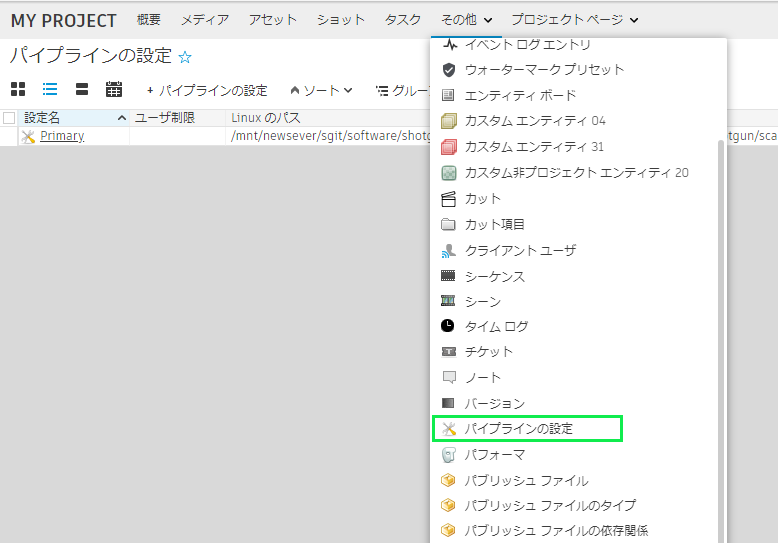
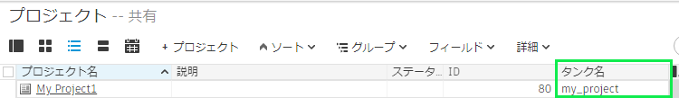

#  Desktop を使用して Toolkit プロジェクトを再セットアップするにはどうすればいいですか?

既にプロジェクト用に Toolkit 構成をセットアップしていて、最初からやり直す必要がある場合、以前のセットアップ構成を削除しない限り  Desktop の詳細セットアップ ウィザードでプロジェクトを再セットアップすることはできません。

これらの設定を手動で削除する手順は次のとおりです。

1.  でプロジェクトにリンクされているすべての `PipelineConfiguration` エンティティを削除します。    
2.  の `Project` エンティティの `Tank Name` フィールドを空白の値に設定します。    
3. ディスク上で対応するパイプライン設定ディレクトリをすべて削除します。
4.  Desktop で、セットアップするプロジェクトを選択します。*既にプロジェクトを表示していた場合は、プロジェクト リスト ビューに移動してから、もう一度プロジェクトに戻ります。*
6. これでプロジェクト セットアップ プロセスを再び実行できます。

**別の方法**

コマンド ラインで `tank setup_project` コマンドを使用してプロジェクトをセットアップすることに慣れている場合は、コマンドの最後に `--force` 引数を追加します。これにより、上記の手動での手順に従わずに、以前にセットアップしたプロジェクトをセットアップできます。

    tank setup_project --force"

