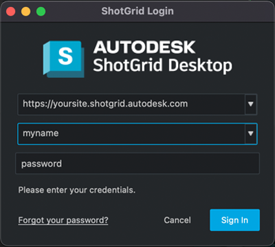

# カスタム スクリプトで認証とログイン資格情報を使用するにはどうすればよいですか?

## エラー メッセージ
スクリプトで次のようなエラーが表示された場合は、スクリプトと Shotgun サイトの通信が許可されていないことを意味します。

```text
tank.errors.TankError: Missing required script user in config '/path/to/your/project/config/core/shotgun.yml'
```
ユーザ認証またはスクリプト認証が事前に行われていない場合、Toolkit は環境設定の `shotgun.yml` ファイルで定義された資格情報を確認するためにフォールバックします。`shotgun.yml` ファイル内で資格情報を定義することは、旧式の認証処理方法です。資格情報を `shotgun.yml` ファイル内で定義しないで、次に示すいずれかの方法を使用してください。

## ユーザ向けスクリプト
スクリプトがユーザ向けの場合は、`Sgtk` インスタンスを作成する前に、先頭に以下を追加します。

```python
# Import the Toolkit API so we can access Toolkit specific features.
import sgtk

# Import the ShotgunAuthenticator from the tank_vendor.shotgun_authentication
# module. This class allows you to authenticate either programmatically or, in this
# case, interactively.
from tank_vendor.shotgun_authentication import ShotgunAuthenticator

# Instantiate the CoreDefaultsManager. This allows the ShotgunAuthenticator to
# retrieve the site, proxy and optional script_user credentials from shotgun.yml
cdm = sgtk.util.CoreDefaultsManager()

# Instantiate the authenticator object, passing in the defaults manager.
authenticator = ShotgunAuthenticator(cdm)

# Optionally clear the current user if you've already logged in before.
authenticator.clear_default_user()

# Get an authenticated user. In this scenario, since we've passed in the
# CoreDefaultsManager, the code will first look to see if there is a script_user inside
# shotgun.yml. If there isn't, the user will be prompted for their username,
# password and optional 2-factor authentication code. If a QApplication is
# available, a UI will pop-up. If not, the credentials will be prompted
# on the command line. The user object returned encapsulates the login
# information.
user = authenticator.get_user()

# print "User is '%s'" % user

# Tells Toolkit which user to use for connecting to Shotgun. Note that this should
# always take place before creating a Sgtk instance.
sgtk.set_authenticated_user(user)

#
# Add your app code here...
#
# When you are done, you could optionally clear the current user. Doing so
# however, means that the next time the script is run, the user will be prompted
# for their credentials again. You should probably avoid doing this in
# order to provide a user experience that is as frictionless as possible.
authenticator.clear_default_user()
```

`QApplication` が利用可能な場合は、次のような結果が得られます。





## ユーザ向け以外のスクリプト
レンダリング ファームやイベント ハンドラなど、スクリプトがユーザ向けではない場合は、Sgtk/Tank インスタンスを作成する前に、最初に以下を追加します。

```python
# Import Toolkit so we can access to Toolkit specific features.
import sgtk

# Import the ShotgunAuthenticator from the tank_vendor.shotgun_authentication
# module. This class allows you to authenticate either interactively or, in this
# case, programmatically.
from tank_vendor.shotgun_authentication import ShotgunAuthenticator

# Instantiate the CoreDefaultsManager. This allows the ShotgunAuthenticator to
# retrieve the site, proxy and optional script_user credentials from shotgun.yml
cdm = sgtk.util.CoreDefaultsManager()

# Instantiate the authenticator object, passing in the defaults manager.
authenticator = ShotgunAuthenticator(cdm)

# Create a user programmatically using the script's key.
user = authenticator.create_script_user(
    api_script="Toolkit",
    api_key="4e48f....<use the key from your Shotgun site>"
)

# print "User is '%s'" % user

# Tells Toolkit which user to use for connecting to Shotgun.
sgtk.set_authenticated_user(user)
```


