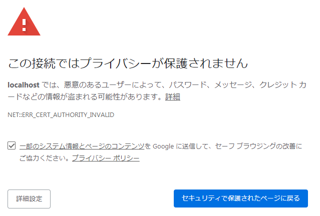
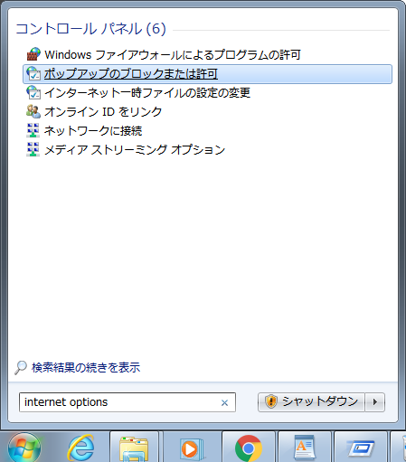
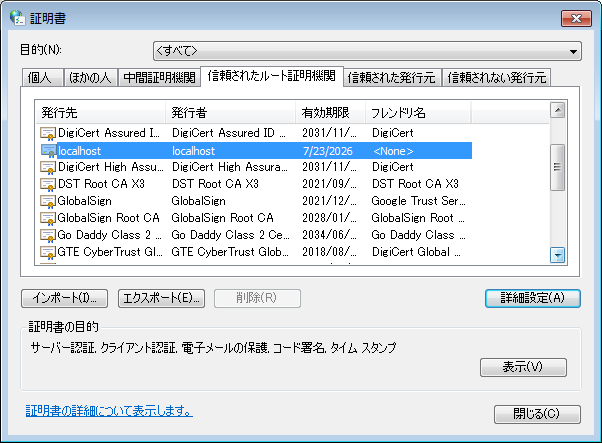

# ローカル ファイル リンクを使用できず、Chrome から Toolkit アプリケーションを起動できない

## 概要

 のアクション メニューで Toolkit アプリケーションのリストが表示されなかったり、 Desktop が動作していてもローカル ファイル リンクを使用するときにエラーが発生したりする場合があります。
 これは Chrome での  Desktop のブラウザ統合のトラブルシューティングに関するガイドです。皆さんの役に立つことを願っています。[Firefox]( のための個別のガイドがあります。/cant-use-file-linking-toolkit-app-firefox.md).

- [問題を診断する](#diagnosing-the-issue)
- [証明書問題をすばやく修正する方法](#how-to-quickly-fix-certificate-issues)
- [すべてのプラットフォームの ERR_CERT_COMMON_NAME_INVALID または ERR_SSL_SERVER_CERT_BAD_FORMAT を修正する](#fixing-neterr_cert_common_name_invalid-and-err_ssl_server_cert_bad_format-on-all-platforms)
- [Windows で ERR_CERT_AUTHORITY_INVALID を修正する](#fixing-neterr_cert_authority_invalid-on-windows)

## 問題を診断する

###  Desktop は動作していますか?

もちろん、そうだと思います。既に確認済みだと思いますが、念のためお尋ねしました。:)

###  Desktop の起動後に Chrome を再起動しましたか?

 Desktop が証明書を登録する前に Chrome を起動した場合( Desktop を初めて起動した場合にのみ発生し、その後は問題になりません)、Chrome は期限切れの証明書のコピーを使用し、 Desktop への接続を拒否します。すべてのタブを閉じても Chrome が終了するとは限らないため、アドレス バーに [chrome://restart](chrome://restart) と入力して[Enter]キーを押すことをお勧めします。これにより、Chrome に関連するすべてのプロセスを終了し、Chrome を再起動させます。

### ファイアウォール ソフトウェアを使用していますか?

ファイアウォール ソフトウェアが localhost またはポート 9000 との接続を妨げていないことを確認します。

### Chrome が証明書を拒否していますか?

Chrome が証明書を受け入れていることを確認するには、https://localhost:9000 を参照します。これは、ローカル ファイル リンクを使用して Toolkit アプリケーションを起動するために  Web サイトがアクセスを試みるアドレスです。通常、次のメッセージが表示されます。

または、次のいずれかのメッセージが表示された場合は、証明書の登録プロセスに問題があったことを示しています。 

## 証明書問題をすばやく修正する方法

この問題を回避する最も簡単な方法は、**ADVANCED** と **Proceed to localhost (unsafe)** をクリックすることです。これにより、Chrome は証明書を承認していることを把握でき、 Web サイトが  Desktop と通信できるようになります。





## すべてのプラットフォームの NET::ERR_CERT_COMMON_NAME_INVALID と ERR_SSL_SERVER_CERT_BAD_FORMAT を修正する

Chrome は自己署名証明書のセキュリティを定期的に更新しますが、ブラウザ統合がこの更新で壊れることがあります。残念ながら、このような問題を解決するには証明書の certificate_path を再生成するしかありません。

証明書を再生成するには、 Desktop のユーザ メニューの **[詳細設定] (Advanced)**セクションにある **Regenerate Certificates** オプションを選択します。(このオプションが表示されない場合は、ロック解除のために `tk-desktop` エンジンを更新してください。)

証明書の再生成を確定すると、証明書を初めて生成したときのように一連のダイアログが表示されます。Windows と macOS で、Windows Certificate Store または macOS キーチェーンの更新を求めるプロンプトが 2 回表示されます。1 回目は古い証明書の削除のときで、2 回目は新しい証明書の登録のときです。Linux では、確認なしで登録されます。登録されると、 Desktop が再起動されます。

 Desktop の準備が完了したら、Chrome が完全にシャットダウンしてその証明書キャッシュがクリアされるように、アドレス バーに [chrome://restart](chrome://restart/) と入力して Chrome を再起動することをお勧めします。

コンピュータがインターネットに接続されておらず、更新をダウンロードできない場合は、[サポート サイト](https://knowledge.autodesk.com/ja/contact-support)にアクセスしてサポートを依頼してください。

## Windows で NET::ERR_CERT_AUTHORITY_INVALID を修正する

特定の状況において、Windows で証明書の読み込みが成功した場合でも、証明書を必要とするアプリケーションがその証明書を使用できないことがあります。これは Windows の証明書ダイアログにアクセスすると確認できます。アクセスするには、[Windows]キーを押してから **インターネット オプション** と入力します。**[インターネットのプロパティ](Internet Properties)**ダイアログで**[コンテンツ] (Content)**タブに切り替え、**[証明書] (Certificates)** ボタンをクリックします。最後に、**[信頼されたルート証明機関](Trusted Root Certification Authorities)** をクリックし、**localhost** を探します。

![インターネット プロパティの[コンテンツ] (Content)タブ](images/windows-internet-properties.png)

エントリが見つからない場合は、Windows ドメインまたはローカル コンピュータのグループ ポリシーに問題がある可能性があります。問題がある場合は、[サポート チーム](https://support.shotgunsoftware.com/hc/ja/requests/new)に連絡することをお勧めします。

ここで、組織の Windows コンピュータを管理するユーザに連絡し、自己署名証明書を信頼しないように Windows に指示しているグループ ポリシーがないかどうかを確認してもらうことをお勧めします。

## グループ ポリシーの問題を調査する

コンピュータがドメイン上にある場合、管理者は[この StackExchange の投稿](https://superuser.com/questions/145394/windows-7-will-not-install-a-root-certificate/642812#642812)で説明されている手順を試してみてください。

コンピュータがドメイン上にない場合は、管理者によってコンピュータがまだロックされている可能性があります。次の手順には Windows の管理者アカウントが必要です。

[Windows]キーを押して、**mmc** と入力して[Enter]キーを押します。これにより、**Microsoft 管理コンソール**が起動します。このアプリケーションで、**[ファイル] (File)**メニューをクリックし、**[スナップインの追加と削除](Add/Remove Snap-In)**を選択します。これにより、**[スナップインの追加と削除](Add/Remove Snap-In)**ダイアログが表示されます。左側で、**Group Policy Object Editor** を探して選択し、**[追加 >] (Add >)**をクリックします。新しいダイアログが表示されたら、**[終了] (Finish)**をクリックして閉じます。最後に、**[スナップインの追加と削除](Add/Remove Snap-In)**ダイアログで、**[OK]** をクリックします。

](images/microsoft-management-console.png)

最後に、メイン ダイアログの左側から **[ローカル コンピュータ ポリシー/コンピューターの構成/Windows 設定/セキュリティ設定/公開キーのポリシー](Local Computer Policy/Computer Configuration/Windows Settings/Security Settings/Public Key Policies)**に移動します。選択したら、中央のペインで **[証明書パス検証の設定](Certificate Path Validation Settings)** をダブルクリックします。

](images/certificate-path-valiation-settings.png)

次のダイアログ ボックスで、**[これらのポリシーの設定を定義する](Define these policy settings)** の選択が解除されていることを確認します。選択されている場合は、**[ユーザーが信頼するルート証明機関 (CA) が証明書の検証に使用されることを許可する(推奨)](Allow user trusted root CAs to be used to validate certificates (recommended))** が選択されていることを確認します。完了後、**OK** をクリックすると、設定が保存されます。

ここで、Chrome のすべてのウィンドウを閉じて、Chrome を再起動する必要があります。上述のとおりに [chrome://restart](chrome://restart) を使用することをお勧めします。この操作は変更を有効にするために必要です。証明書リストを参照すると、**localhost** 証明書が表示されます。

この変更後にブラウザ統合を使用して問題が発生した場合、または元の設定が正しい場合は、[サポート チーム](https://support.shotgunsoftware.com/hc/ja/requests/new)までご連絡ください。

## 他の OS でのトラブルシューティング

他の OS での  Desktop 統合に問題がある場合は、この記事を更新してサポートできるように、[サポート チーム](https://support.shotgunsoftware.com/hc/ja/requests/new)までご連絡ください。