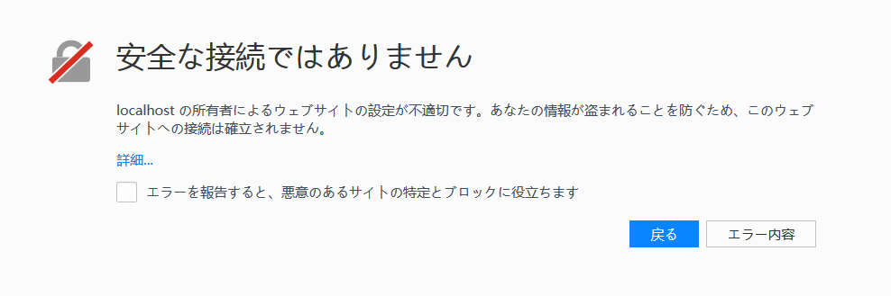
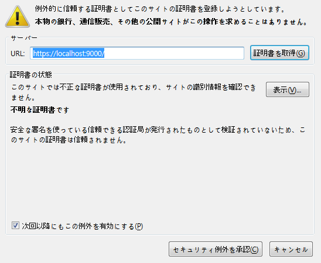
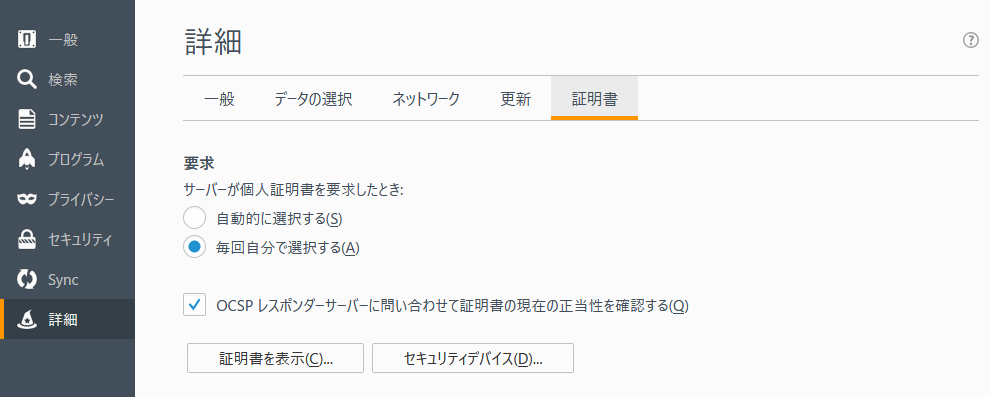
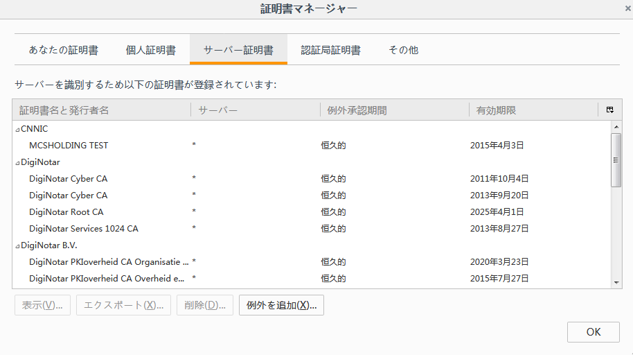

# ローカル ファイル リンクを使用できず、Firefox から Toolkit アプリケーションを起動できない

## 概要

 のアクション メニューで Toolkit アプリケーションのリストが表示されなかったり、 Desktop が動作していてもローカル ファイル リンクを使用するときにエラーが発生したりする場合があります。
これは Firefox での  Desktop のブラウザ統合のトラブルシューティングに関するガイドです。皆さんの役に立つことを願っています。[Chrome]( のための個別のガイドがあります。/cant-use-file-linking-toolkit-app-chrome.md).

## 問題を診断する

###  Desktop は動作していますか?

もちろん、そうだと思います。既に確認済みだと思いますが、念のためお尋ねしました。:)

### ファイアウォール ソフトウェアを使用していますか?

ファイアウォール ソフトウェアが **localhost** またはポート **9000** との接続を妨げていないことを確認します。

### Firefox が証明書を拒否していますか?

Firefox が証明書を受け入れていることを確認するには、https://localhost:9000 を参照します。これは、ローカル ファイル リンクを使用して Toolkit アプリケーションを起動するために  Web サイトがアクセスを試みるアドレスです。通常、次のメッセージが表示されます。

次のいずれかのメッセージが表示された場合は、証明書の登録プロセスに問題があったことを示しています。

## 「安全な接続ではありません」というエラーを解決する方法

証明書を受け入れられるように例外を Firefox ブラウザに追加する必要があります。**https://localhost:9000** にアクセスしたばかりの場合は、**[詳細] (Advanced)**をクリックし、**[例外を追加](Add Exception)**ボタンをクリックして例外を追加するのが最も簡単な方法です。ダイアログが表示されます。

**[証明書を取得](Get Certificate)**、**[セキュリティ例外を承認](Confirm Security Exception)**の順にクリックします。証明書を信頼できないというメッセージは無視します。証明書は認証局ではなく  Desktop によって生成されているため、問題ありません。

これで  サイトからローカル ファイル リンクにアクセスし、Toolkit アプリケーションを起動できるようになるはずです。例外を追加しても問題が解決しない場合は、[サポート サイト](https://knowledge.autodesk.com/ja/contact-support)にアクセスしてサポートを依頼してください。

## 「安全な接続ができませんでした」というエラーを解決する方法

**[メニューを開きます](Open Menu)**ボタンをクリックして、**[基本設定] (Preferences)**を選択します。次に、左側で**[詳細] (Advanced)**を選択し、**[証明書] (Certificates)**、**[証明書を表示](View Certificates)**の順に選択します。

**[サーバー証明書] (Servers)**セクションで項目をクリックし、`localhost` と入力するか、または単に **localhost:9000** という名前のエントリが表示されるまでスクロールします。このエントリを削除します。次に、**[認証局証明書] (Authorities)**タブに移動して `localhost` と再び入力します。もう一度、**localhost** エントリを持つ **Autodesk** セクションが表示されるまでスクロールします。**localhost** エントリを削除します。これが完了したら、**[OK]** をクリックして Firefox を再起動します。Firefox の再起動が完了したら、**https://localhost:9000** にアクセスします。次のメッセージが表示されます。

ここで、例外を追加するために上記の手順を実行する必要があります。

これとは異なる画面が表示される場合は、[サポート サイト](https://knowledge.autodesk.com/ja/contact-support)にアクセスしてサポートを依頼してください。