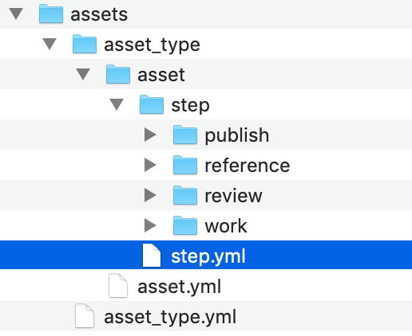

# タスク/ステップがファイル名の一部としては存在しているのにコンテキストで見つからないのはなぜですか?

Toolkit でフォルダを作成すると、エンティティに対する[パスが登録され](../administering/what-is-path-cache.md)、検索を実行できるようになります。これは、パスを指定することによって正しいコンテキストを決定できることを意味します。Toolkit はスキーマから生成されたフォルダに対してのみレジストリを作成するので、`templates.yml` ファイルでのみ定義されているファイル名やフォルダを考慮しません。スキーマに `Task` フォルダがない場合、Toolkit がファイルのタスクを知る必要があっても、パスだけではタスクを解決できない状況になる可能性があります。

**例**

次の既定のスキーマ構造を取ります。`Asset` および `Step` フォルダはフォルダ作成プロセス中に登録されます。

次のようなテンプレートを使用してファイル パスを生成した場合:

    assets/{sg_asset_type}/{Asset}/{Step}/work/maya/{task_name}_{name}.v{version}.{maya_extension}`

生成されたパスからコンテキストを見つけようとすると、タスクの名前がファイル パスにあるにもかかわらず、確立できるのは `Asset` と `Step` のみで、`Task`を確立することは**できません**。

**解決策**

ほとんどのワークフローでは、スキーマに `Step` フォルダがあり、`Task` フォルダがないことは問題ありません。通常は、Workfiles アプリを使用して、実行するタスクを選択してからファイルを選択し、シーン ファイルを開きます。UI で選択したタスクは、開いたファイルのパスからコンテキストを把握しようとするのではなく、コンテキストを駆動するために使用されます。

ただし、次のような場合は、パスからコンテキストを取得できることが重要になります。

- 当社の自動コンテキスト切り替え機能を使用する場合。この機能を使用すると、Toolkit はユーザーが(Workfiles アプリを介さずに)ソフトウェアのネイティブの開くダイアログでファイルを開いたことを検出し、それに応じて現在のコンテキストを切り替えることができます。
- 特定のファイルのコンテキストを知る必要があるスタンドアロン プ​​ロセスで API を使用する場合。

このような場合の解決策は、スキーマに `Task` フォルダを導入するか、自動コンテキスト切り替え機能を使用しないことです。API スクリプトの場合は、プロセスに必要なコンテキスト情報が既に存在し、この検索を実行する必要がないことを確認します。