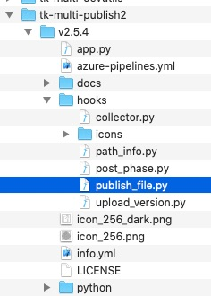
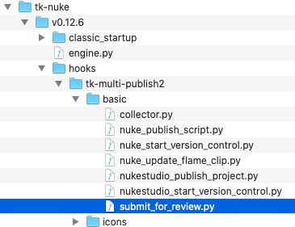

# Exception: Review submission failed. Could not render and submit the review associated sequence.

## 使用例:

Nuke の「Submit for publish」が機能していません、

**質問 1:**
上流に移動するにはどうしたらよいですか?「HookBaseClass」までは到達しますが、そこから進めません。

現在、Nuke で作業内容をレビューするために送信すると、問題が発生します。

Nuke の SG パブリッシュ GUI で次のエラーが発生します。


    Traceback (most recent call last):

      File "C:\Users\STEVE\AppData\Roaming\Shotgun\bundle_cache\app_store\tk-multi-publish2\v2.4.1\python\tk_multi_publish2\api\plugins\publish_plugin_instance.py", line 282, in _handle_plugin_error

        yield

      File "C:\Users\STEVE\AppData\Roaming\Shotgun\bundle_cache\app_store\tk-multi-publish2\v2.4.1\python\tk_multi_publish2\api\plugins\publish_plugin_instance.py", line 198, in run_publish

        self._hook_instance.publish(settings, item)

      File "C:\Users\STEVE\AppData\Roaming\Shotgun\bundle_cache\app_store\tk-nuke\v0.12.5\hooks\tk-multi-publish2\basic\submit_for_review.py", line 272, in publish

        raise Exception("Review submission failed. Could not render and "

    Exception: Review submission failed. Could not render and submit the review associated sequence.

また、次の例外も発生します。

`'sg_publish_data' was not found in the item's properties. Review Submission for 'path/to/sequences/AB/AB_001/comp/work/images/AB_001_comp_v002_output/AB_001_comp_v002_output.%04d.jpg' failed. This property must be set by a publish plugin that has run before this one.`


そのため、「publish_plugin_instance.py」内で以下を検索しています。


    _handle_plugin_error
        yield

    run_publish
        self._hook_instance.publish(settings, item)

これらはローカルの Appdata フォルダ内にありますが、メイン インストールには含まれていません。そのため、この問題を解決するには、「submit_for_review.py」を参照する必要があると想定しています。

このファイルを参照すると、「HookBaseClass」の上流にある項目の設定と情報を使用していることが分かります。

「submit_for_review.py」内で「sg_publish_data」の設定場所を探すと、行 225 が見つかります。`sg_publish_data = item.properties.get("sg_publish_data")`

**質問 2**
「item.properties」は上流のどこで設定されていますか?Nuke collector.py に含まれている可能性がありますが、「sg_publish_data」はそこにはなく、「HookBaseClass」の子にもなっています。

## 修正方法

### 簡潔な回答:

カスタム コードの追加や設定の大幅な変更を行わなかった場合は、レビュー用に送信している項目の `Publish to ` がオンになっていることを確認する必要があります


### 詳細な回答:

まず、パブリッシャー API のドキュメントについては、[こちら](https://developer.shotgunsoftware.com/tk-multi-publish2/)を参照してください。この問題の解決に関連する概念のほとんどは、ここに記載されています。ただし、特定の問題については、ここで詳細に説明します。このような状況を経験することで、今後の問題のデバッグに役立てることもできます。

上記スクリーンショットの `ShorgunWrite1` 項目の下に 2 つの `plugins` が表示されています。これらは、設定で定義されたプラグインに対応しています。


これらのプラグインは順番に実行され、メモリ内の同じ項目に作用します。問題を見極めるには、これら 2 つのプラグインのコードを調べる必要があります。`hook` の設定を確認して、これらが有効な場所を特定することができます。

最初のプラグインで確認しているのは `tk-multi-publish2` の設定であるため、`{self}` は `tk-multi-publish2` を表します。そのため、
```
{self}/publish_file.py
```
は、tk-multi-publish2 アプリ フォルダ内にあります。



ファイル システム上のアプリの場所は、`app_locations.yml` の設定方法によって異なりますが、何も変更していない場合は、バンドル キャッシュ フォルダ内にあります。必要に応じて、[キャッシュの場所の確認方法](https://developer.shotgunsoftware.com/ja/7c9867c0/)を参照してください。

2 番目のプラグインのフック パスは次のとおりです
```
{engine}/tk-multi-publish2/basic/submit_for_review.py
```
Nuke では `tk-nuke` エンジンを実行しているため、このパブリッシュ フックを見つけるには、`tk-nuke` でバンドル キャッシュの内容を調べる必要があります。



コードの場所が分かったので、この場所を調べると、[1 番目のプラグインには、2 番目のプラグインで使用されると予測される値が設定されていることが分かります](https://github.com/shotgunsoftware/tk-multi-publish2/blob/a83e35dbf1a85eac7c3abd7e7f5509a42a8b8cf1/hooks/publish_file.py#L425)。

これら 2 つのプラグインを組み合わせるということは、パブリッシュされた(変更されない)内容をレビューするために送信するということです。そのため、ワークフローでは、まずソース ファイルをパブリッシュし、そこからレビューのための SG バージョンを作成します。このバージョンはパブリッシュにもリンクされます。1 番目のプラグインはファイルのパブリッシュを実行し、2 番目のパブリッシュで使用する項目に情報を格納します。

継承についての指摘があったので、この点を明確にする必要がありました。このドキュメントで説明する内容は、設定によって制御されるフック継承に関するものです。ユーザにとって意味があると思われる Python 継承に関するものではありません。

Python ファイルを参照すると、すべてのフックが `HookBaseClass` から継承されていることが分かります。ただし、設定のフック メカニズムを使用すると、基本的にこれらのベース フックを混合可能な要素と見なして結合し、コードを再利用するときに必要なすべての機能を取得することができます。`tk-multi-publish2` 設定で、この例を確認することができます。

```
settings.tk-multi-publish2.nuke.shot_step:
  collector: "{self}/collector.py:{engine}/tk-multi-publish2/basic/collector.py"
```

ここで定義されたコレクタは、どの Python ファイルにも存在しません。このコレクタは、実際には `tk-multi-publish2` の `collector.py` と `tk-nuke` の `collector.py` を組み合わせたものです。

クイック修正で十分に対応できず、これらのフックを修正する必要がある場合は、「[パブリッシュ ワークフローのカスタマイズ](https://developer.shotgridsoftware.com/ja/869a6fab/#shotgrid-toolkit-webinar-videos)」のビデオを参照してください。作業を開始するには、このビデオを見るのが最適です。

[コミュニティの完全なスレッド](https://community.shotgridsoftware.com/t/nuke-submit-for-review-py/10026)を参照してください。

