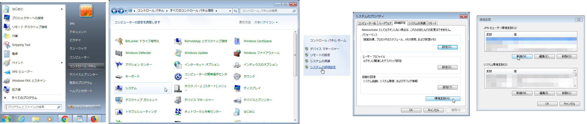

# デバッグ ログをオフにするにはどうすればいいですか?

Toolkit ツールの出力よりも多くのログ データを既定で表示することが必要な場合があります。詳細なログ出力を表示するには、**デバッグ ログ**を有効にします。このための方法はいくつかあります。



## Shotgun Desktop によるデバッグを有効にする

デバッグを有効にする最も簡単な方法は、Shotgun Desktop アプリを使用してオンに切り替えることです。これは、Shotgun Desktop にログインした後で設定できます。アプリの右下にあるプロファイル画像をクリックして、**[Advanced] -> [Toggle Debug Logging]**を選択します。この設定はセッションの終了後も維持されるため、デバッグが終了したら忘れずにオフにしてください。


デバッグをオンにすると、Shotgun Desktop から起動されたアプリ、またはブラウザ統合を介した Toolkit コマンドも、このデバッグ状態を継承することに注意してください。

## 環境変数をセットアップする

### デバッグ ログを常にオンにする
最初に、新しい環境変数 `TK_DEBUG=1` をセットアップする必要があります。



#### Windows 7 を使用する場合

- **デバッグ ログを常にオンにするには、Windows アイコン > [コントロール パネル] > [システム] > [システムの詳細設定] > [環境変数…] > [新規…]にアクセスします**




- **変数名**: `TK_DEBUG`
- **変数の値**: `1`
- [OK]を選択します。

これで、環境変数が正しくセットアップされ、デバッグ ログがオンになりました。



デバッグ ログをオフにするには、次のいずれかを実行します。

a. `TK_DEBUG` 環境変数を 0 に設定します。

b. `TK_DEBUG` 環境変数を削除します。

### 環境変数が既に設定されているかどうかを確認する

環境変数が正しく設定されているかどうかを確認するには、ターミナルを開いて `set` コマンドを実行します。

次に、`TK_DEBUG=1` を検索します。

これにより、Desktop を起動すると、デバッグ ログがオンになります。

### デバッグ ログを一時的にオンにする

セッションの代わりにデバッグ ログを一時的に使用する場合は、ターミナルを開き、`set TK_DEBUG=1` コマンドを使用してデバッグ ログを設定できます。

次に、ターミナルを介して Desktop を起動します。




## 詳細設定のデバッグ ログ オプション

詳細設定にはいくつかのオプションがあります。 この機能は、Toolkit の設定をコントロールできる場合のみ利用可能です。

すべてのエンジンの環境ファイルには `debug_logging` 設定があります。これをオンにすると、ソフトウェア(Nuke または Maya のスクリプト エディタなど)の既定の出力に追加のデバッグレベル ログ メッセージが送信されます。 エンジンで実行中のアプリすべてがこのようなデバッグ レベルのメッセージを発行するため、エンジンでこの設定をオンにすると、すべてのアプリの設定も実質的にオンになります。

これにより、ファイルにログ メッセージが出力されることはありません。標準的なロギング フレームワークでこの出力が可能になるように現在取り組んでいます。例外は [Shotgun Desktop](https://support.shotgunsoftware.com/hc/ja/articles/219039818-Shotgun-Desktop) および [Photoshop エンジン](https://support.shotgunsoftware.com/hc/ja/articles/115000026653-Photoshop-CC)で、これらはログの出力を GUI コンソールとファイルの両方に記録します。

### ソフトウェアでエンジンのデバッグ ログをオンにする

たとえば、ショットのステップ環境で Nuke エンジンのデバッグ出力をオンにするには、環境ファイルで Nuke エンジン(`tk-nuke`)セクションを見つけて、この設定を `debug_logging: true` に更新します。

`config/env/shot_step.yml` を編集します。

```yaml
engines:
  ...
  ...
  tk-nuke:
    apps:
      ...
      ...
    compatibility_dialog_min_version: 9
    debug_logging: true
    favourite_directories: []
    location: {name: tk-nuke, type: app_store, version: v0.2.23}
    ...
   ...
```

ファイルを保存し、ショットのステップ環境で Nuke を再起動します。これで、スクリプト エディタ ウィンドウにデバッグ出力が表示されます。



### tank コマンドのデバッグ ログをオンにする

tank コマンドを実行し、ターミナルでデバッグ出力を確認する場合は、実行するコマンドで `--debug` オプションを使用すると、コマンドのデバッグ ログがオンになります。

    ./tank --debug core
    DEBUG [10:11:38 617.835998535]:
    DEBUG [10:11:38 618.768930435]: Running with debug output enabled.
    DEBUG [10:11:38 618.921995163]:
    DEBUG [10:11:38 619.092941284]: Core API resides inside a (localized) pipeline
    configuration.
    DEBUG [10:11:38 619.235992432]: Full command line passed:
    ['/sgtk/software/shotgun/scarlet/install/core/scripts/tank_cmd.py',
    '/sgtk/software/shotgun/scarlet', '--debug', 'core']
    DEBUG [10:11:38 619.364023209]:
    DEBUG [10:11:38 619.463920593]:
    DEBUG [10:11:38 619.575977325]: Code install root:
    /sgtk/software/shotgun/scarlet
    DEBUG [10:11:38 619.678020477]: Pipeline Config Root:
    /sgtk/software/shotgun/scarlet
    DEBUG [10:11:38 619.756937027]:
    DEBUG [10:11:38 619.826078415]:
    DEBUG [10:11:38 619.905948639]:
    DEBUG [10:11:38 619.978904724]: Context items:
    ['/sgtk/software/shotgun/scarlet']
    DEBUG [10:11:38 620.06688118]: Command: core
    DEBUG [10:11:38 620.129108429]: Command Arguments: []
    DEBUG [10:11:38 620.193004608]: Sgtk Pipeline Config Location:
    /sgtk/software/shotgun/scarlet
    DEBUG [10:11:38 620.270967484]: Location of this script (__file__):
    /sgtk/software/shotgun/scarlet/install/core/scripts/tank_cmd.py

    Welcome to the Shotgun Pipeline Toolkit!
    For documentation, see https://toolkit.shotgunsoftware.com
    Starting Toolkit for your current path '/sgtk/software/shotgun/scarlet'
    - The path is not associated with any Shotgun object.
    - Falling back on default project settings.
    DEBUG [10:11:39 125.463962555]: Sgtk API and Context resolve complete.
    DEBUG [10:11:39 126.449108124]: Sgtk API: Sgtk Core v0.15.18, config
    /sgtk/software/shotgun/scarlet
    DEBUG [10:11:39 126.588106155]: Context: scarlet
    - Using configuration 'Primary' and Core v0.15.18
    - Setting the Context to scarlet.
    DEBUG [10:11:39 129.276990891]: No need to load up the engine for this
    command.
    - Running command core...


    ----------------------------------------------------------------------
    Command: Core
    ----------------------------------------------------------------------


    Welcome to the Shotgun Pipeline Toolkit update checker!
    This script will check if the Toolkit Core API installed
    in /sgtk/software/shotgun/scarlet
    is up to date.


    Please note that when you upgrade the core API, you typically affect more than
    one project. If you want to test a Core API upgrade in isolation prior to
    rolling it out to multiple projects, we recommend creating a special
    *localized* pipeline configuration. For more information about this, please
    see the Toolkit documentation.


    You are currently running version v0.15.18 of the Shotgun Pipeline Toolkit
    No need to update the Toolkit Core API at this time!
    DEBUG [10:11:39 981.74405098]: Exiting with exit code None

