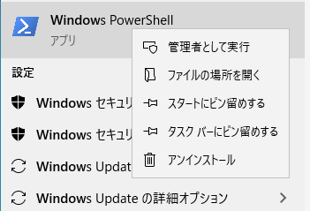
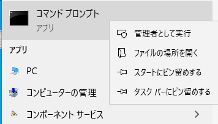

# [SSL: CERTIFICATE_VERIFY_FAILED] certificate verify failed: unable to get local issuer certificate

## 使用例

Windows で Python API を使用して Amazon に対してメディアをアップロードおよびダウンロードする際に問題が発生します。この問題が発生すると、Python API によって次のエラー メッセージが表示されます。

```
shotgun_api3.shotgun.ShotgunFileDownloadError: Failed to open https://xxx.shotgunstudio.com/file_serve/attachment/xyz
<urlopen error [SSL: CERTIFICATE_VERIFY_FAILED] certificate verify failed: unable to get local issuer certificate (_ssl.c:1108)>
```
Amazon は一部の証明書をバックエンドで更新しました。Windows で新しい証明書を必要とする Web ページを参照すると、通常は、証明書ストアが更新されます。通常の参照アクティビティを認識しないコンピュータで実行されているスタンドアロンの Python スクリプトでは証明書の更新が取得されないため、コンピュータの証明書が大量に不足する可能性があります。

## 修正方法

問題のあるマシンに GUI でアクセスできる場合は、S3 に現在保存されているメディアを再生するだけで、証明書ストアが更新されます。この再生ソリューションは、Chrome、Internet Explorer、Edge、またはその他の Chromium ベース ブラウザでのみ機能します。Firefox または Safari では機能しません。これらのブラウザでは、証明書の検証に Windows の標準 API が使用されないためです。

このソリューションが機能しない場合や、更新するコンピュータ数が非常に多い場合は(Deadline レンダリング ファームなど)、不足している証明書をコンピュータに追加するスクリプトも提供されます。[公開されているスクリプトのリンクはこちら](https://developer.shotgridsoftware.com/ja/c593f0aa/)です。

Windows 10 の Powershell ユーザまたは Windows 7 の Powershell 3 ユーザは、コンピュータの管理者として次のスクリプトを実行して新しい証明書を取得することができます。



```
$cert_url = "https://www.amazontrust.com/repository/AmazonRootCA1.cer"
$cert_file = New-TemporaryFile
Invoke-WebRequest -Uri $cert_url -UseBasicParsing -OutFile $cert_file.FullName
Import-Certificate -FilePath $cert_file.FullName -CertStoreLocation Cert:\LocalMachine\Root
```

コマンドが機能した場合は、次のように表示されます。

```
   PSParentPath: Microsoft.PowerShell.Security\Certificate::LocalMachine\Root

Thumbprint                                Subject
----------                                -------
8DA7F965EC5EFC37910F1C6E59FDC1CC6A6EDE16  CN=Amazon Root CA 1, O=Amazon, C=US
```

これにより、証明書が実行されているコンピュータでは、すべてのユーザ アカウントがこの証明書を使用できるようになります。ユーザに管理者アクセス権がない場合は、次の方法で最後の行を変更できます。

```
Import-Certificate -FilePath $cert_file.FullName -CertStoreLocation Cert:\CurrentUser\Root
```

証明書が現在のユーザにのみ追加されます。

筆者のような保守的なユーザがまだ `cmd.exe` を使用している場合は、`certutil` を使用することもできます。まず、`https://www.amazontrust.com/repository/AmazonRootCA1.cer` から証明書をダウンロードし、コンピュータ上の任意の場所に保存する必要があります。

次に、管理モードでコマンド プロンプトを起動します。



次の行を実行します。

```
certutil -addstore root <path-to-the-cert>
```

これで、すべてのユーザ アカウントが証明書を使用できるようになります。管理者アクセス権がない場合は、次のように、`-user` を追加して現在のユーザにのみ証明書をインストールすることができます

```
certutil -user -addstore root <path-to-the-cert>
```

## 関連リンク

[コミュニティの完全なスレッド](https://community.shotgridsoftware.com/t/certificate-verify-failed-error-on-windows/8860)を参照してください。