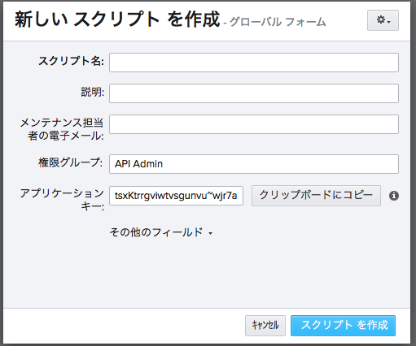

# API スクリプトの作成と管理

新しいスクリプトを作成するには、次の手順に従います。

1.  [管理者] (Admin)メニューに移動して、[スクリプト] (Scripts)を選択します。  
![[スクリプト]](./images/dv-manage-scripts-script-01.png)
2.  [+ スクリプト] (+ Scripts)ボタンを使用して新しいスクリプトを作成します。
3.  アプリケーション キーから値を取得します。これを使用して  との接続を開始します。  
  
    
    > **注:** API キーはパスワードのように扱われ、一度作成されると、 の Web アプリや API で再び表示することはできません。続行する前に、キーをコピーしておきます。
    
4.  これで、スクリプト キーを使用して  に接続できるようになりました。スクリプトを使用して  に接続する方法の詳細については、API ドキュメントの「[ メソッド](https://developer.shotgridsoftware.com/python-api/reference.html#shotgun-methods)」を参照してください。

> **ヒント:** 何らかの理由で、スクリプトのアプリケーション キーをリセットする必要がある場合は、その操作を実行する新しい  スクリプト エンティティを作成する必要があります。最初に、既存のスクリプトの名前を "[My Script]—OLD" などの名前に変更してから削除します。新しいスクリプトを作成します。 で古いスクリプトの名前を変更するのは、各スクリプトに一意の名前が必要であるからです。

## 新しいスクリプトを設定するタイミング

スクリプトの処理はログに記録できます。個々のスクリプト キーの使用がきめ細かくなればなるほど、どのスクリプトがデバッグのための変更を行っているかを簡単にトラックできるようになります。個別のスクリプトを使用する方法は、 サイトの変更によって影響を受けるスクリプトおよびスクリプト管理者をトラックする際にもお勧めします。