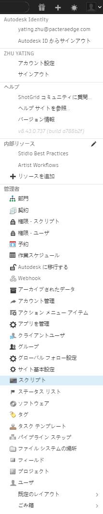

# API の概要

**注:**  API の詳細については、[API ドキュメント](https://developer.shotgridsoftware.com/python-api/)を参照してください。

 Python のアプリケーション プログラミング インタフェース(API)を使用すると、ユーザは独自のツールを  に簡単に統合することができます。これにより、自動プロセスの作成、数多くのサード パーティ ソフトウェア パッケージとの統合、スタジオ内の既存のツールとの通信が可能になります。スタジオごとにニーズが大きく異なるため、 API は最低限の強力な機能のみを提供し、ビジネス ロジックのほとんどはお客様が決定できます。

API は、メディア・エンターテインメント業界で広く使用される一般的なプログラミング言語である [Python](https://www.python.org/) を使用して作成されています。[ Python API](https://github.com/shotgunsoftware/python-api) は、 サイトから無料で使用できます。

API は CRUD パターンに従うため、単一のエンティティ タイプに対して作成、読み取り、更新、および削除の操作をスクリプトで実行することができます。多くの操作には、フィルタ、返される列、およびソート結果を定義する機能が含まれています。

API を使用して  サーバと通信する場合、ユーザの資格情報を提供するか、スクリプト キーを使用して、スクリプトをサーバで認証できます。新しいスクリプト キーは、[管理者] (Admin)メニューに表示される[スクリプト] (Scripts)ページから生成することができます。

**ヒント:** スクリプトは個別に登録し、それぞれに個別の API キーを設定します。これにより、各スクリプトと実行されるアクションを[イベント ログ](https://help.autodesk.com/view/SGSUB/JPN/?guid=SG_Administrator_ar_data_management_ar_event_logs_html)でより正確に監視できます。

## 一般的な最初のプロジェクト

API は [https://github.com/shotgunsoftware/python-api](https://github.com/shotgunsoftware/python-api) でダウンロードすることができます。 一般的な最初のプロジェクトのいくつかには、以下のものが含まれます。

1. [バージョンを作成し、ショットにリンク](https://developer.shotgridsoftware.com/python-api/cookbook/examples/basic_create_version_link_shot.html)します。レビュー用に新しいレンダラの送信を自動化できます。
2. [サムネイルをアップロード](https://developer.shotgridsoftware.com/python-api/cookbook/examples/basic_upload_thumbnail_version.html)します。サイト上のすべての要素に、手動で追加することなく最新のサムネイルを反映できます。
3. [SVN などのコード リポジトリと  を統合](https://developer.shotgridsoftware.com/python-api/cookbook/examples/svn_integration.html)します。 を利用してソフトウェア開発のプロジェクトを管理します。

## API で実行できない操作

* 権限ルールへのアクセスまたは変更(セキュリティ上の理由による)
* ページ設定の読み取りまたは変更
* 個々のページまたはウィジェットのフィルタまたはクエリー設定へのアクセス
* UI の操作
* 条件付きフォーマット設定ルールの追加、編集または削除
* クエリー フィールドの作成または編集

## アクション メニュー アイテム(AMI)

 のインタフェース内から簡単に起動できるスクリプトを作成するには、[AMI](https://developer.shotgridsoftware.com/ja/67695b40/) を使用します。これらは、データの行を右クリックして表示するコンテキスト メニューに表示される、カスタマイズ可能なオプションです。クリックするとコンテキスト データ ダンプが Web サーバまたはカスタム ブラウザ プロトコル ハンドラに送信されます。ここでカスタム ビジネス ロジックを実行できます。

エンティティごとに異なる AMI を設定することができ、プロジェクトまたは権限グループ別にそれらの項目へのアクセスを制限することができます。

## イベント トリガ デーモン

 で(ユーザまたは API スクリプトにより)実行されるあらゆるアクションでイベントが生成されます。[イベント デーモン](https://github.com/shotgunsoftware/shotgunEvents)では、イベント ストリームを監視し、定義された条件に基づいて特定の API スクリプトを実行することができます。次に、いくつかの例を示します。

* 上流工程のタスクのステータスに基づいて、下流工程のタスクのステータスを自動的に変更する
* 値が変更された場合に関連する cut duration フィールドを再計算する
* ショットが特定のステータスに設定されている場合、ファイルのパッケージ化と転送操作を実行する

## 追加情報

 API に関する詳細については、次の記事を参照してください。

* [GitHub からの  API のダウンロード](https://github.com/shotgunsoftware/python-api/)
* [ APIドキュメント](https://developer.shotgridsoftware.com/python-api/)
* [-dev リスト(公開)](https://groups.google.com/a/shotgunsoftware.com/forum/?fromgroups#!forum/shotgun-dev)
* [ イベント デーモン サンプル コード](https://github.com/shotgunsoftware/shotgunEvents)
* [イベント駆動型トリガの書き込み](https://developer.shotgridsoftware.com/ja/0d8a11d9/)
* [ スキーマ](https://help.autodesk.com/view/SGSUB/JPN/?guid=SG_Administrator_ar_get_started_ar_shotgun_schema_html)
* [API のベスト プラクティス](https://developer.shotgridsoftware.com/ja/09b77cf4/)

## 投稿とコラボレーション

世界中の人と共有したいと思うような優れたツールを  で作成したことはありませんか。それはすばらしいことです。オートデスクには、情報を共有したり、協力し合うことが大好きな開発者向けの、活発な[開発者コミュニティ](https://community.shotgridsoftware.com/)があります。参加するには:

* [ コミュニティ](https://community.shotgridsoftware.com/)に参加してください。
* [GitHub](https://github.com/) にコードを投稿します(コードはパイプライン固有のものではなく、十分に立証されたものであり、.txt または .mdk 形式の README が必要です)。
* リンクと説明を dev リストに投稿します。開発者コミュニティと  の開発者はその投稿をよく調べて、フィードバックを提供したり、良い点は高く評価します。

当社は、絶えずお客様が提供するさまざまなツールや統合に感動し、刺激を受けています。ぜひお客様の実力をお見せください。