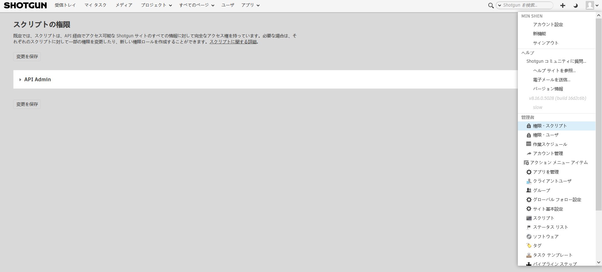
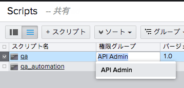

# API ユーザの権限グループ

API ユーザに対して個別に権限グループを作成し、ユーザと同様に、スクリプトおよびキーにさまざまな権限レベルを設定することができます。

## API ユーザ ページにアクセスする

[管理者](Admin)メニューに移動し、[権限](Permissions) > [スクリプト](Scripts)を選択します。

使用方法については、 を参照してください。

## API ユーザの権限グループを使用する方法

初期の API 管理者を超える API 権限グループを作成すると、それらを API スクリプトに使用することができます。

1. [管理者](Admin)メニューから、[スクリプト](Scripts)を選択します。
2. [権限グループ](Permission Group)列が表示されるので、適切な権限グループを選択します。  
   

## 例

これはどのような目的で使用したら良いでしょうか。さまざまな用途が考えられますが、以下に 2 つの用途を示します。

**例 1:** 完全な管理者権限を持たないスタジオ内のユーザに API キーを与える。

**例 2:** 一方向の同期({{ akn_product_name }} データベースから該当ユーザの {{ akn_product_name }} データベースへ)を実行するための読み取り専用 API キーをパートナー スタジオに与え、制限されたエンティティ セットのみ公開する。

**例 3:** プロジェクトごとに API スクリプトを制限する。

1. [管理者] (Admin)メニューから**[権限 - スクリプト] (Permissions - Scripts)**ページに移動し、新しいロールを作成します。 [割り当てられたプロジェクトのみを表示](See Assigned Projects Only)の詳細権限が有効になっていることを確認します。また、その他の必要な権限を微調整することもできます(たとえば特定のエンティティ/フィールドに対する読み取りアクセス権のみを付与する場合など)。
2. [管理者](Admin)メニューから**[スクリプト](Scripts)**ページに移動します。[プロジェクト](Projects)フィールドを公開します。ここで、スクリプトの範囲を制限するプロジェクトを入力することができます。
3. [権限グループ](Permission Group)フィールドを使用して、手順 1 で作成した新しいスクリプトにスクリプトの権限を割り当てます。