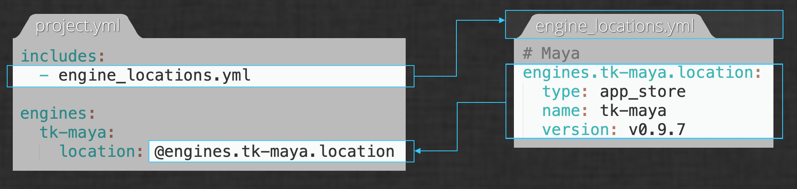

# 環境設定リファレンス

## はじめに

Toolkit パイプラインの中心にあるのは環境設定です。Toolkit パイプライン設定内の環境構成ファイルでは、さまざまな DCC 内で使用可能な Toolkit アプリを定義し、それぞれの設定をカスタマイズできます。このドキュメントは環境設定ファイルの構造と機能についての完全なリファレンスです。ここでは、プロジェクト内のさまざまなワークフローを設定するための Toolkit の*「環境」*の概念、環境設定の構成、ファイル参照、そしてどのようなカスタマイズが行えるかを確認する方法について説明します。




## 環境について

Shotgun Toolkit プラットフォームは、一般的に使用されるコンテンツ作成ソフトウェアのための完全にカスタマイズ可能な統合セットを提供するため、これを使用してスタジオのパイプラインを構築できます。プロジェクトの構成において、統合されているソフトウェア パッケージはどれか、そのそれぞれで利用可能な Toolkit アプリはどれかを指定し、さらに各アプリのオプションを指定することにより、スタジオのニーズに合わせてアーティストのワークフローを構築できます。

しかし、スタジオのパイプラインでは、さまざまなタイプのアーティストが異なるワークフローを使用するのが一般的です。簡単な例として、アセットを扱うアーティストの場合は Mari などのテクスチャ ペイント ソフトウェアを利用可能にし、ショットを扱うアーティストの場合は Nuke などの合成ソフトウェアを利用可能にします。

ソフトウェア パッケージの他にも、異なるアーティストに対して、同じ Toolkit アプリで異なる設定を使用することができます。たとえば、ショットのアーティストとアセットのアーティストの両方が [Workfiles アプリ](https://support.shotgunsoftware.com/hc/ja/articles/219033088)を使用することがありますが、ショットのアーティストは Shot エンティティ、アセットのアーティストは Asset エンティティに関連付けられているファイルにのみナビゲートできるように制限することができます。

プロジェクト内でこれらの個別のワークフローをサポートするために、Toolkit はアプリとエンジンの構成を環境上で分離しています。環境には、一連のソフトウェア パッケージの統合とその設定が含まれています。それらのすべてには、特定の共通するコンテキストがあります。

上記の例では、アセットを扱うアーティストはアセットの手順の環境で作業し、ショットを扱うアーティストはショットの手順の環境で作業しています。環境はそれぞれ独立して構成されているため、プロジェクト内で異なるワークフローを使用できます。

## Toolkit の既定の設定に関するメモ

Toolkit での環境設定の構築には多くの自由が与えられています。このドキュメントは利用可能なすべてのオプションのリファレンスで、実際のパイプラインのニーズに最も適した選択をするのに必要な知識を得ることができます。

またこのドキュメントでは、[既定の設定](https://github.com/shotgunsoftware/tk-config-default2)と呼ばれる、パイプライン設定の出発点として選択された特別な設定についても説明します。パイプラインをカスタマイズする準備が整ったら、最初の手順は[プロジェクト用の編集可能なパイプライン設定を作成する](../../guides/pipeline-integrations/getting-started/editing_app_setting.md)ことです。

これらの選択は単なる規則であり、Toolkit のワークフローにハードコードされているわけではありませんが、既定の設定を例として参照すると、パイプラインのカスタマイズを開始した後に使用できる機能や、独自の設定を構築するためのベスト プラクティスについて学ぶことができます。また、新しい Toolkit ユーザが既定の設定を出発点として参照すれば、Toolkit の規則について知るのにも役立ちます。このドキュメントでは、Toolkit の環境設定の一般的な機能と、既定の設定における特定の選択とを常に区別します。既定の設定の環境構成の詳細については、[README ファイル](https://github.com/shotgunsoftware/tk-config-default2/blob/master/env/README.md)を参照してください。

## ファイルの場所

パイプライン設定内の `config/` ディレクトリには、カスタマイズ対象のすべてのファイルとフォルダが含まれています。`config/` には、`cache`、`core`、および `env` の 3 つのサブディレクトリがあります。`env` ディレクトリには環境設定ファイルが保持されるため、このドキュメントでは `config/env` 内のファイルを参照します。


既定の設定では、`config/env/` に次のファイルが表示されます。

```
asset.yml
asset_step.yml
project.yml
sequence.yml
shot.yml
shot_step.yml
```

これらの各ファイルは環境に対応しています。異なるファイルを含めることで、各環境を別々に設定できます。

## Toolkit が現在の環境を判断する仕組み

Toolkitは [pick_environment](https://github.com/shotgunsoftware/tk-core/blob/master/hooks/pick_environment.py) というコア フックを使用し、現在の[コンテキスト](https://developer.shotgunsoftware.com/tk-core/core.html#context)に基づいて特定の時点で使用する環境ファイルを決定します。`pick_environment` フックの戻り値は環境設定ファイルに対応しています。たとえば、`pick_environment` が `shot_step` を返した場合、Toolkit は `config/env/shot_step.yml` を使用して Toolkit 環境を設定します。

## カスタム環境

上記の環境設定ファイルは、既定の設定で提供されます。ただし、スタジオによっては、異なる環境や追加の環境を採用することがあります。たとえば、スタジオによっては、パイプラインのステージごとに異なる構成設定が必要な場合があります(`asset_step_rig`、`asset_step_model`、`shot_step_anim`、`shot_step_light` など)。 その場合、利用可能な環境を完全にカスタマイズできます。

これを行うには、目的の環境設定ファイルを `config/env` ディレクトリに追加します。次に、`pick_environment` コア フックをオーバーライドして、新しい環境をいつ使用するかを定義するロジックを追加します。

## 基本構造

Toolkit の設定ファイルは [YAML](https://yaml.org/) で記述されます。バンドル(アプリ、エンジン、またはフレームワーク)の一般的な設定の構成は次のとおりです。

```yaml
bundle_name:
  setting1: value
  setting2: value
  complex_setting:
    sub_setting1: value  
    Sub_setting2: value
  location:
    type: descriptor_type
    descriptor_setting1: value
    descriptor_setting2: value
```

この構成を説明するために、非常に単純な例を示します。単一のエンジンがあり、その中に単一のアプリケーションが定義されている環境です。以下は、この設定の `project.yml` の内容です。

```yaml
engines:
  tk-maya:
    apps:
      tk-multi-workfiles2:
        location:
          type: app_store
          name: tk-multi-workfiles2
          version: v0.11.8
    location:
        type: app_store
        name: tk-maya
        version: v0.9.4
```

### エンジン ブロック

すべての環境設定ファイルは `engines` ブロックで始まります。ここに、その環境用に定義されているすべてのエンジンがネストされています。

この例では、単一のエンジン `tk-maya` のみが定義されています。`apps` と `location` の 2 つの設定がリストされています。

`location` はすべてのバンドルに必要な特別な設定です。`apps` 設定はエンジンに定義されたすべてのアプリのリストで、それぞれ独自の設定があります。この場合、エンジンに対して定義されるアプリは 1 つのみです(`tk-multi-workfiles2`)。


### ロケーション ディスクリプタ

すべての Toolkit バンドルには `location` 設定があり、これをバンドルの*「ディスクリプタ」*と呼びます。ディスクリプタは、特定のバンドルの入手元、およびそのタイプに応じて直接アクセスするかローカルにキャッシュするかを Toolkit に指示します。Toolkit バンドルを入手できる場所の例としては、Shotgun App Store、GIT リポジトリ、ディスク上のパス、または Shotgun サイトにアップロードされた zip ファイルなどがあります。これらには、それぞれ対応するディスクリプタ タイプがあり、そのタイプに固有の設定があります。以下に、上記の例の `tk-maya` エンジンのディスクリプタをもう一度示します。

```yaml
    location:
        type: app_store
        name: tk-maya
        version: v0.9.4
```

これはタイプ `app_store` のディスクリプタで、指定されたバンドルを Shotgun App Store から入手するよう Toolkit に指示します。タイプ `app_store` のディスクリプタの設定は `name` と `version` です。

対照的に、スタジオでカスタム バンドルをアクティブに開発している場合、たとえば特定のワークフロー用の Toolkit アプリを作成している場合は、ディスク上のパスから直接入手することができます。この場合、以下に示すようにタイプ `dev` のディスクリプタを使用します。

```yaml
    location:
        type: dev
        path: /path/to/app
```

`dev` ディスクリプタは `app_store` ディスクリプタとは設定が異なります。他の設定を使用することもできますが、ディスク上のアプリの場所を参照する `path` 設定を使用して簡単にセットアップすることができます。

利用可能なすべてのディスクリプタ タイプとその設定に関する詳細は、[Toolkit Core API ドキュメントの「ディスクリプタ」セクション](https://developer.shotgunsoftware.com/tk-core/descriptor.html)を参照してください。

### アプリ ブロック

アプリは Toolkit のユーザ ツールであり、各アプリは他のアプリから独立して実行できます。パイプラインのニーズに基づいてどのアプリを使用するかを選択できます。エンジン ブロック内の `apps` 設定は、特定のエンジンで使用できるアプリを定義します。

以下に、上記の例の `apps` 設定をもう一度示します。

```yaml
engines:
  tk-maya:
    apps:
      tk-multi-workfiles2:
        location:
          type: app_store
          name: tk-multi-workfiles2
          version: v0.11.8
```

単一のアプリ、`tk-multi-workfiles2` アプリが定義されていることがわかります。現在のところ、単一の設定、すなわちディスクリプタのみが定義されています。

`project` 環境の `tk-maya` エンジンで他のアプリを利用できるようにするには、ここで追加します。ここでは、エンジンに Panel、`tk-multi-shotgunpanel`、および About アプリ、`tk-multi-about` を追加します。例の `project.yml` ファイルは次のようになります。

```yaml
engines:
  tk-maya:
    apps:
      tk-multi-about:
        location:
          type: app_store
          name: tk-multi-about
          version: v0.2.8
      tk-multi-shotgunpanel:
        location:
          type: app_store
          name: tk-multi-shotgunpanel
          version: v1.6.3
      tk-multi-workfiles2:
        location:
          type: app_store
          name: tk-multi-workfiles2
          version: v0.11.8
    location:
        type: app_store
        name: tk-maya
        version: v0.9.4
```

ここでは、いくつかの重要な注意事項があります。

* 既定の設定ではバンドルがアルファベット順にリストされ、この例ではその規則に従います。
* ファイルが長くなり始めていますが、構成設定はまだ追加していません。
* 他のエンジンや他の環境でこれらと同じアプリを使用していることが想像できます。たとえば、Panel、About アプリ、Workfiles アプリの 3 つのすべてのアプリが、異なるエンジン(Houdini、Nuke、Photoshop など)および異なる環境(`asset_step` や `shot_step`)で実行されている可能性があります。設定内の異なる場所で共通のアプリ設定を定義することは、変更が必要なときに、それぞれの場所で変更が必要になることを意味します。

最後の 2 つの問題を軽減するために、Toolkit 設定は*インクルード*をサポートします。

### インクルード

*「インクルード」*を使用すると、あるファイルのセクションを構成内の別のファイルで参照できます。インクルードを使用すると、構成設定を一箇所で設定し、複数の環境で使用できます。

インクルードは次の 2 つの部分で構成されます。

* `includes` リスト: キーが `includes` で、インクルードするすべてのファイルのリストを値に持つ YAML 辞書。
* 構成設定内のリファレンス。`@` 記号で始まり、インクルード ファイルから参照するセクションの名前をポイントする名前が付けられています。

上記の例を具体化するために、すべてのエンジンのロケーション ディスクリプタを保持する単一のファイルを作成しているとします。そのファイルを `includes` サブフォルダに置き、`engine_locations.yml` という名前を付けます。

`engine_locations.yml` の内容は以下のようになります。

`config/env/includes/engine_locations.yml`:

```yaml
engines.tk-maya.location:
  type: app_store
  name: tk-maya
  version: v0.9.4

engines.tk-nuke.location:
  type: app_store
  name: tk-nuke
  version: v0.11.5

...
```

このファイルはすべてのエンジンの場所に対する単一のソースとして機能し、すべての環境設定から参照することができます。このインクルード ファイルを使用した場合、この例は次のようになります。

`config/env/project.yml`:

```yaml
includes:
- includes/engine_locations.yml

engines:
  tk-maya:
    apps:
      tk-multi-about:
        location:
          type: app_store
          name: tk-multi-about
          version: v0.2.8
      tk-multi-shotgunpanel:
        location:
          type: app_store
          name: tk-multi-shotgunpanel
          version: v1.6.3
      tk-multi-workfiles2:
        location:
          type: app_store
          name: tk-multi-workfiles2
          version: v0.11.8
    location: @engines.tk-maya.location
```



ここでは、`tk-maya` エンジンの `location` 設定の値が、インクルードされる YAML ファイルのキーを参照していることがわかります。



アプリの場所を示すために、2 番目のインクルード ファイルを追加することができます。実際には、これは既定の設定によって行われます。例を拡張してみましょう。

`config/env/includes/app_locations.yml:`

```yaml
apps.tk-multi-about.location:
  type: app_store
  name: tk-multi-about
  version: v0.2.8

apps.tk-multi-shotgunpanel.location:
  type: app_store
  name: tk-multi-shotgunpanel
  version: v1.6.3

apps.tk-multi-workfiles2.location:
  type: app_store
  name: tk-multi-workfiles2
  version: v0.11.8
```


`config/env/project.yml`:

```yaml
includes:
- includes/app_locations.yml
- includes/engine_locations.yml

engines:
  tk-maya:
    apps:
      tk-multi-about:
        location: @apps.tk-multi-about.location
      tk-multi-shotgunpanel:
        location: @apps.tk-multi-about.shotgunpanel.location
      tk-multi-workfiles2:
        location: @apps.tk-multi-workfiles2.location
    location: @engines.tk-maya.location
```

インクルードされた `engine_locations.yml` ファイルから `tk-maya` エンジンのディスクリプタを取得し、インクルードされた `app_locations.yml` ファイルから `tk-maya` エンジン用に定義された各アプリのディスクリプタを取得します。

{% include info title="注" content="既定の設定では、この例では示されていない 2 番目のネスト レベルを使用しています。単なるディスクリプタ以上の設定を持つすべてのアプリまたはエンジンは、`includes/settings` に設定ファイルがあります(例: `includes/settings/tk-maya.yml`、`includes/settings/tk-multi-workfiles2.yml`)。エンジン設定ファイルには、アプリ設定ファイルからのアプリ設定が含まれ、環境設定ファイルにはエンジン設定ファイルからの設定が含まれています。既定の設定の構造の詳細については、[README ファイル](https://github.com/shotgunsoftware/tk-config-default2/blob/master/env/README.md)を参照してください。構成設定の変更に関する詳細な手順については、『[構成設定の編集に関する Toolkit の基本ガイド](./learning-resources/guides/editing_app_setting.md)』を参照してください。" %}


## スパース構成

すべての Toolkit バンドルには、使用可能な構成設定のセットがあり、それぞれの設定に既定値があります。Toolkit は*「スパース構成」*を許可します: 構成設定が環境設定ファイル(またはそこに含まれるファイル)で明示的に指定されていない場合、バンドルの既定値が使用されます。

この例では、`location` 以外にアプリの設定を指定していません。したがって、設定の現在の状態では、3 つのアプリはすべての設定に既定値を使用します。それでは、どの構成設定が利用可能であるかを知るにはどうすれば良いでしょうか。



## 利用可能な構成設定を検出する

スパース構成では、単に設定ファイルを見ただけでは、どの構成設定がアプリに使用できるかをすぐに判断することはできません。アプリで利用可能な構成設定を確認する場合、2 つの選択肢があります。

* **アプリのドキュメント**: 各アプリには独自のドキュメント ページがあり、それぞれのページに「設定オプション」セクションがあります。このセクションでは、アプリで使用可能なすべての構成設定が、それぞれの説明と既定値と共に一覧表示されています。たとえば、[Workfiles ドキュメント ページ](https://support.shotgunsoftware.com/hc/ja/articles/219033088)を参照することができます。[アプリとエンジンのページ](https://support.shotgunsoftware.com/hc/ja/articles/219033088)には、すべてのアプリとエンジンのドキュメント ページが一覧表示されています。
* **マニフェスト:** すべての Toolkit バンドルは、そのルート ディレクトリに `info.yml` というファイルを含んでいます。このファイルをバンドルの*「マニフェスト」*と呼び、バンドルで利用可能なすべての設定を、それぞれの説明と既定値と共に定義します。マニフェストは、バンドルの独自のキャッシュ(パイプライン設定内の `install/app_store/tk-multi-workfiles2/v0.11.8/info.yml` など)、または Github ([ここでは Workfiles の場合の例を示します](https://github.com/shotgunsoftware/tk-multi-workfiles2/blob/master/info.yml))にあります。

## 構成設定を修正する

既定値の設定を変更するには、パイプライン設定の適切な環境で、適切なブロックに構成を追加し、その値を設定します。

例に戻って、プロジェクト環境で Maya が起動されると `tk-multi-workfiles2` が自動的に起動するように設定してみましょう。[アプリのマニフェスト](https://github.com/shotgunsoftware/tk-multi-workfiles2/blob/v0.11.10/info.yml#L19-L25)を見ると、アプリの起動時に Workfiles UI を起動するかどうかを制御する `launch_at_startup` 設定があり、その既定値が `False` であることがわかります。そこで、`launch_at_startup` オプションを追加して `True` に設定します。`project.yml` ファイルは次のようになります。

`config/env/project.yml`:

```yaml
includes:
- includes/app_locations.yml
- includes/engine_locations.yml

engines:
  tk-maya:
    apps:
      tk-multi-about:
        location: @apps.tk-multi-about.location
      tk-multi-shotgunpanel:
        location: @apps.tk-multi-about.shotgunpanel.location
      tk-multi-workfiles2:
        launch_at_startup: True
        location: @apps.tk-multi-workfiles2.location
    location: @engines.tk-maya.location
```

`tk-multi-workfiles2` の設定がインクルード ファイルからのものである場合は、そのファイルでこの変更を行います。


## その他の参考情報

* [Toolkit の基本ガイド: パイプライン設定を編集する](./learning-resources/guides/editing_app_setting.md)
* [Toolkit の基本ガイド: アプリを追加する](./learning-resources/guides/installing_app.md)
* [アニメーション パイプラインのチュートリアル](../../guides/pipeline-integrations/workflows/pipeline-tutorial.md)
* [ディスクリプタのリファレンス ドキュメント](https://developer.shotgunsoftware.com/tk-core/descriptor.html#descriptors)
* [ウェビナー: Toolkit の管理](https://youtu.be/7qZfy7KXXX0)
* [ファイル システム設定リファレンス](https://support.shotgunsoftware.com/hc/ja/articles/219039868-Integrations-File-System-Reference)
* [既定の設定の環境構成に関する README](https://github.com/shotgunsoftware/tk-config-default2/blob/master/env/README.md)
