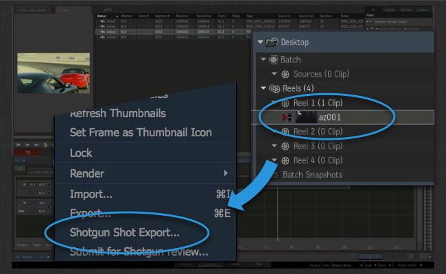
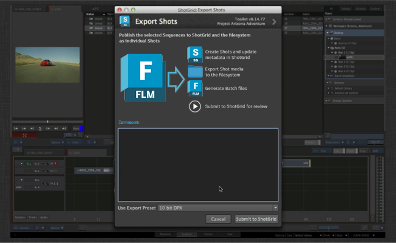
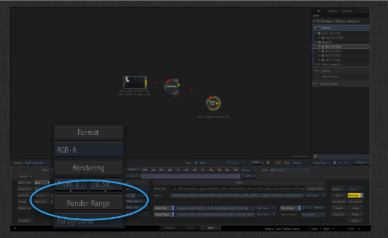
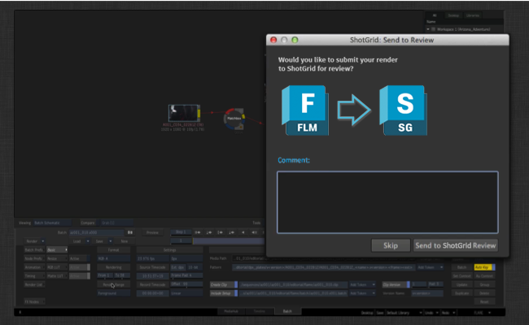

# Flame の書き出し

 Flame Export アプリはプロジェクトの開始時に役立ちます。

Flame で最初のコンフォームを作成したら、ショット書き出し機能を使用して、 でコンテンツをすばやく生成し、ディスクにプレートをレンダリングして、レビュー用にコンテンツを送信できます。

いったん軌道に乗った後は、書き出しアプリが Flare または Flame バッチ モードで実行されているすべてのレンダリングのトラックも行うため、ワークフローの一部としてコンテンツをレビュー用に簡単に送信できます。

##  にコンフォームを送信する

Flame でシーケンスのコンフォームをセットアップし、タイムラインのすべてのセグメントに**ショット名を割り当て**たら、シーケンスを選択し、右クリックして[ ショット書き出し] (Shotgun Shot Export)オプションを選択します。



これにより、パブリッシュの冒頭のコメントを入力できる  の UI が表示されます。このコメントはレビューに送信され、パブリッシュとその他のコンテンツに説明を追加する場合にも使用されます。

説明とは別に、書き出されるプレートに使用する出力データ形式を選択することもできます。これらのプリセットは Toolkit アプリ設定の一部であり、貴社のニーズに合うように設定できます。



送信ボタンをクリックすると、多くの処理がすぐに実行されます。

- ショットとタスクが  で作成されます。作成される新しいショットに関連するタスクのリストは、一貫性のある構造をすぐに無駄なく作成できるように、タスク テンプレート設定を介して設定可能です。既定では、ショットはシーケンスの子として関連付けられますが、これも設定可能で、シーンまたはエピソードを作業している場合は、代わりにショットと連携するように書き出し機能を再設定できます。

-  に正しいデータが含まれる場合は、標準的なフォルダ作成メカニズムを使用して、ディスク上にフォルダが作成されます。これにより、作成されるすべてのショットに一貫したフォルダのセットを使用してプロジェクトが開始できるようになります。

上記の 2 つの手順を実行したら、以降の手順を続行するための基本的な構造ができあがります。これらの処理はバックグラウンドで実行されます。

- プレートが、設定で定義されたプリセットに従ってショットごとにディスク上に書き出されます。ファイルの場所は Toolkit テンプレート システムを使用して定義されます。つまり、このプレートの場所は適切に定義されているため、パイプラインの下流工程にある他のツールからでも参照できます。

- バッチ ファイルとクリップ XML ファイルが書き出されます。これらのファイルは、反復ワークフローを有効にするために Flame で使用されます。これにより、Flame のメイン コンフォームに後で取り込まれる新しいバージョンをすぐにレンダリングできます。

- QuickTime が生成され、レビュー用に  にアップロードされます。


## レビューにバッチ レンダリングを送信する

ショットの Flame バッチ ファイルをパブリッシュしたら、レンダリングと出力の設定が事前に入力されたバッチ ファイルを開くために、このショットから Flare を直接起動できます。新しいバージョンをレンダリングするには、単純に Render Range ボタンをクリックします。



Toolkit にダイアログが表示され、 Review にレンダリングを送信するかどうかを選択できます。



 によってファイルがパブリッシュおよびトラックされ、必要に応じてレビューにも送信されます。

## 詳細について

詳細および処理のワークフローを確認する場合は、Flame エンジンのマニュアルを参照してください。このマニュアルには、処理のさまざまなワークフローを説明したいくつかのビデオ コンテンツがあります。

LINKBOX_ENGINE:software/tk-flame:Flame エンジン

統合やカスタマイズに関して疑問がある場合は、[サポート サイト](https://knowledge.autodesk.com/ja/contact-support)にアクセスしてサポートを依頼してください。

# 高度なトピック

以下に、設定とカスタマイズに関する高度な詳細情報を示します。

## 書き出しプリセットを使用する

書き出し機能は、設定の *「書き出しプリセット」* の概念を使用します。Flame 内で書き出し UI を起動すると、ドロップダウンに利用可能な書き出しプリセットが表示されます。各プリセットは、ファイルをディスクに書き込む方法と  にアップロードする方法を設定できる設定オプションです。ディスク上のファイルの場所など、高度な設定は環境設定で直接制御するため、パイプラインに合わせて既定の設定オプションを簡単に調整できます。

Flame を制御するために Flame に渡される実際の書き出し XML コンテンツに関する高度な設定と制御は、プリセットごとの動作が定義されているフックによって処理されます。フックでは、書き出し機能によってメディアを生成する方法を完全に制御できます。

##  サーバ側のトランスコーディングを回避する
既定では、`Version.sg_uploaded_movie` フィールドを設定すると、QuickTime が  Review にアップロードされます。これにより、 サーバ側のトランスコーディングがトリガされます。アップロードされた QuickTime は、ブラウザやモバイルで再生できるように `mp4` と `webm` の各形式に変換されます。場合によっては、このサーバ側のトランスコーディングを回避すると有用なときがあります。回避するには `bypass_shotgun_transcoding` 構成設定を指定します。true に設定すると、統合により  の `Version.sg_uploaded_movie_mp4` フィールドに直接アップロードされるため、サーバ側のトランスコーディングが回避されます。この場合、`webm` バージョンが生成されないため、Firefox でレビューを再生できなくなります。

詳細については、https://support.shotgunsoftware.com/hc/ja/articles/219030418 を参照してください。

## ffmpeg をカスタマイズする

書き出し機能で QuickTime を生成する場合は、Flame に付属する ffmpeg バージョンが使用されます。書き出し機能の設定フックを修正すると、組み込まれた ffmpeg の代わりに外部の ffmpeg バージョンを指定できます。Flame に付属する ffmpeg バージョンは ffmpeg のトランスコーディングとパフォーマンスの最新機能をトラッキングするため、最新バージョンを使用すると、パフォーマンスを改善できる可能性があります。

h264 パラメータが ffmpeg に渡される方法は、既定のバージョンと最新バージョンとの間で変更されています。ffmpeg を最新バージョンに切り替えると、推奨するトランスコーディング ガイドラインを完全に実装できるため、 側でアップロードとパフォーマンスが最適化されます。このガイドラインは以下を参照してください。

https://support.shotgunsoftware.com/hc/ja/articles/219030418

ffmpeg バージョンの変更は上級ユーザのみにお勧めします。変更する場合は、次の手順に従ってください。

### 設定フックをコピーする

修正が必要なすべての設定は、Flame 書き出しアプリに付属する設定フック内にあります。このフックを修正するには、最初にアプリの場所の内部にある既定の場所からユーザの設定にこのフック ファイルをコピーする必要があります。通常、フック ファイルはプロジェクト設定内の `install/apps/app_store/tk-flame-export/va.b.c/hooks/settings.py` と同じような場所にあります。`config/hooks` など、設定内の `hooks` の場所にこのファイルをコピーします。分かりやすい名前にするため、単なる `settings.py` よりも、さらに詳細な名前を付けることをお勧めします。

```
install/apps/app_store/tk-flame-export/va.b.c/hooks/settings.py -> config/hooks/flame_export_settings.py
```

それでは Flame 環境設定ファイルを編集しましょう。通常は `config/env/includes/flame.yml` です。見出し `tk-flame-export` の下に、`settings_hook: '{self}/settings.py'` と定義されたフックのパスがあります。基本的に、環境設定はアプリの場所(`{self}` など)内部でフック ファイルを探します。これを `settings_hook: '{config}/flame_export_settings.py'` に変更すると、代わりに環境設定内のフック ファイルを探すように Toolkit に指示されます。まとめると次のようになります。

```
settings_hook: '{self}/settings.py' -> '{config}/flame_export_settings.py'
```

### フックを修正する

これで `config/hooks/flame_export_settings.py` フックを修正する準備ができました。テキスト エディタで開きます。ffmpeg に関連するメソッドと ffmpeg 設定があることにお気づきでしょう。最初に修正するのは次の項目です。

```
def get_external_ffmpeg_location(self):
    """
    Control which version of ffmpeg you want to use when doing transcoding.
    By default, this hook returns None, indicating that the app should use
    the built-in version of ffmpeg that comes with Flame.

    If you want to use a different version of ffmpeg, simply return the path
    to the ffmpeg binary here.

    :returns: path to ffmpeg as str, or None if the default should be used.
    """
    return None
```

既定で `None` を返すことで、書き出し機能が Flame に組み込まれた ffmpeg を使用します。ffmpeg にフル パスを返すように変更します。Backburner クラスタを実行している場合は、クラスタ内のすべてのマシンから ffmpeg を呼び出せるため、実行可能ファイルは任意の場所にインストールされます。

ffmpeg の場所を更新すると、おそらくは ffmpeg に渡されるパラメータを微調整することになります。これは次の異なる 2 つのメソッドで変更する必要があります。

- `get_ffmpeg_quicktime_encode_parameters` は、 にアップロードする QuickTime を生成するときに使用されるパラメータを返します。

- `get_local_quicktime_ffmpeg_encode_parameters` は、QuickTime をディスクに書き込むときに使用されるパラメータを返します。

 のアップロードの場合、最初は既定の  のエンコード設定を使用することをお勧めします。

```
def get_ffmpeg_quicktime_encode_parameters(self):
    return "-vcodec libx264 -pix_fmt yuv420p -vf 'scale=trunc((a*oh)/2)*2:720' -g 30 -b:v 2000k -vprofile high -bf 0"
```

ローカルの  トランスコードの場合、 トランスコードに基づいて設定しながら、解像度の制限を削除してビット レートを増やすことをお勧めします。

```
def get_local_quicktime_ffmpeg_encode_parameters(self):
    return "-vcodec libx264 -pix_fmt yuv420p -g 30 -b:v 6000k -vprofile high -bf 0"
```

