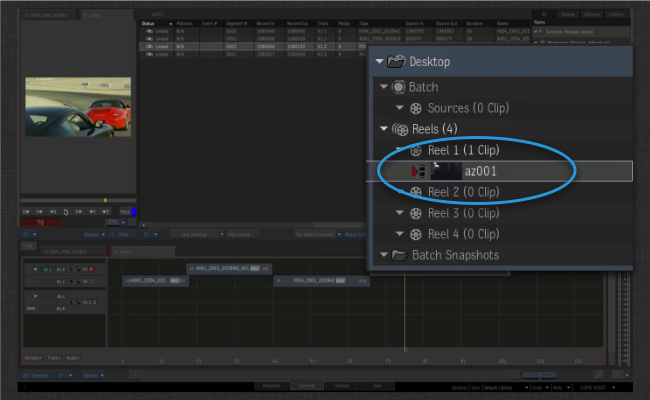

# Flame のレビュー

 Flame Review アプリにより、Flame の 1 つまたは複数のシーケンスを  Review に簡単にプッシュできます。

レビュー対象の 1 つのシーケンスまたは一連のシーケンスを右クリックします。

 Review のオプションを選択します。

レビュー ノートを追加できる Toolkit の UI が表示されます。

[OK]をクリックすると、バックグラウンド ジョブが生成され、すべての処理がシーンの背後で実行されます。
次の手順が実行されます。

- シーケンスが QuickTime 形式でディスクに書き出されます。この書き出しは Flame の QuickTime 書き出しとして処理され、設定フックを使用してさまざまな設定をすべて制御できます。

- シーケンスが完了すると、Toolkit は  に一致するシーケンスがあるかどうかを確認します。一致するシーケンスがない場合は、シーケンスが自動的に作成されます。

- レビュー バージョンが作成され、シーケンスと関連付けられます。

- 最後に、QuickTime はレビュー バージョンにアップロードされます。

このプロセスはオーディオ トラックやトランジションなどをサポートし、「見たままが得られる」ようになっています。 にアクセスすると、Client Review Site や  iPhone アプリなど、さまざまな方法でメディアをレビューできます。

## カスタマイズと設定

Flame レビュー アプリはいくつかの異なる方法でカスタマイズすることができます。

- Flame でシーケンスを表示するために  で使用する**エンティティ タイプ**を制御できます。たとえば、エピソード形式のコンテンツで作業している場合は、レビュー バージョンを  のシーケンスよりもエピソードにリンクするほうが便利な場合があります。

-  で作成された新しい項目に、アプリが自動的に追加するタスクをカスタマイズできます。このためにタスク テンプレート設定を使用すると、作成された構造を標準化できます。

- フックを使用すると、アプリが Flame 以外で QuickTime を生成するために使用する XML プリセットを完全に制御できます。
