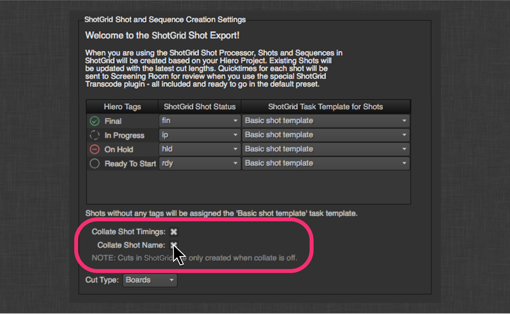

# Hiero/Nuke Studio の書き出し

### はじめに

このアプリを使用すると、 は Hiero のシーケンス用の書き出しダイアログを認識するようになります。

#### 概要のビデオとデモ

 Toolkit や Hiero の統合が初めての場合は、次のビデオを視聴すると、 Toolkit や Hiero を統合した場合のパイプライン機能の概要が簡単に分かります。

Toolkit と Hiero を既に使用している場合は、以降の説明をお読みください。

<center>
<iframe src="https://player.vimeo.com/video/82572226" style="font-size: 1em; line-height: 1.45em;" width="500" height="281" frameborder="0"></iframe>
</center>

###  ショット プロセッサ

このアプリ自体が起動すると、Hiero 書き出しダイアログに変更が登録されます。


最初に、新しいプロセッサが登録されていることが分かります。


このボタンをクリックすると、いくつかの変化があることが分かります。

ダイアログの上部には、シーケンスの書き出し後に  でショットを作成または更新する方法を制御する UI が追加されています。


### タグ
ドロップダウンを調整すると、さまざまな Hiero タグを  ショット ステータスとショット タスクのテンプレートにマッピングできます。そのため、Hiero のタグ設定ワークフローを実行して、 ショットを処理中に設定したり、グリーン スクリーンや CG などの任意の目的に合うようにショットのタスクを設定したりできます。この UI はフックを介して統合されるため、追加機能として簡単に設定できます。

### 照合
また、Hiero に組み込まれたロジックをミラーリングするトラック項目の照合を共に制御するオプションもあります。ショットを構成する複数の項目がある場合(異なるトラックでのオーバーラップまたは複数のトラック上の同一ショット名)、このオプションをオンにする必要があります。これにより、 Toolkit のショット更新ツールは、一致した照合項目を 1 つのショットとして処理します。



たとえば、ショット 010 と 020 を表す 2 つのトラック項目があるとします。010 から始まり、020 は別のトラックで 010 の最後とオーバーラップします。010 が最初のトラック項目であり、Hiero の項目です。照合が有効になっているため、 はこの 2 つの項目を 1 つのショット 010 として処理され、ショット 010 は  で作成または更新されます。カットインはトラック項目 010 の先頭と一致し、カットアウトはトラック項目 020 の最後と一致します。Screening Room 対応バージョンは項目ごとに作成されますが、両方ともショット 010 にリンクされます。プレートは項目ごとにパブリッシュされたファイルとして作成されますが、両方ともショット 010 にリンクされます。1 つの Nuke スクリプトはショット 010 とリンクしてパブリッシュされます。2 つの読み取りノードが含まれ、項目ごとに 1 つのノードが割り当てられます。この場合、ショット 010 と照合しているため、 でショット 020 は作成または更新されません。


### パス
次の  の UI は標準的なパス ダイアログです。既定で Hiero を介してショットに追加される項目は 3 つあります。既定の Nuke スクリプト、既定の Nuke 書き込み場所、プレート トランスコード用の既定の場所です。これらの項目の場所はアプリの設定によって決まり、テンプレート作成システムの機能をフル活用できます。


このアプリによって、Hiero で `{tk_version}` トークンを使用できるようになります。このトークンはバージョン文字列で置き換えられ、 Toolkit 用に正しくフォーマットされます。

### カスタム テンプレートのフィールド
`custom_template_fields` 設定で定義されて `resolve_custom_strings` フックで解決されるトークンは、有効な置き換えトークンの Hiero のリストに自動的に追加され、Toolkit テンプレートパスで有効な置き換えとみなされます。

たとえば、Toolkit `templates.yml` ファイルで次のようにキーを定義するとします。

```
    resolution:
        type: str
        filter_by: alphanumeric  
```

`tk-hiero-export` の `project.yml` 設定は次のようになります。

```
  ...
  ...
  tk-hiero:
    apps:
      tk-hiero-export:
        custom_template_fields:
        - {description: Shot Resolution, keyword: resolution}
  ...
  ...
```

その後、次のように `resolve_custom_strings` フックを修正します。

```
# Copyright (c) 2014  Software Inc.
#
# CONFIDENTIAL AND PROPRIETARY
#
# This work is provided "AS IS" and subject to the  Pipeline Toolkit
# Source Code License included in this distribution package. See LICENSE.
# By accessing, using, copying or modifying this work you indicate your
# agreement to the  Pipeline Toolkit Source Code License. All rights
# not expressly granted therein are reserved by  Software Inc.

from tank import Hook


class HieroResolveCustomStrings(Hook):
    """Translates a keyword string into its resolved value for a given task."""

    RESOLUTION_TOKEN_NAME = "{resolution}"


    def execute(self, task, keyword, **kwargs):
        """
        """

        self.parent.log_debug("attempting to resolve custom keyword: %s" % keyword)
        if keyword == self.RESOLUTION_TOKEN_NAME:
            translated_value = self._clip_resolution_string(task)
        else:
            raise RuntimeError("No translation handler found for custom_template_field: %s" % keyword)

        self.parent.log_debug("Custom resolver: %s -> %s" % (keyword, translated_value))
        return translated_value


    # Handle the {resolution_fs} token
    def _clip_resolution_string(self, task):
        """ returns sequence resolution or task format override"""
        width = ""
        height = ""

        sequence_format = task._sequence.format()

        width = sequence_format.width()
        height = sequence_format.height()

        if "reformat" in task._preset.properties():
            task_reformat_settings = task._preset.properties()["reformat"]
            if task_reformat_settings['to_type'] != "None":
                width = task_reformat_settings['width']
                height = task_reformat_settings['height']

        return "%sx%s" % (width, height)
```

Hiero で `resolution` トークンを使用できるだけでなく、Toolkit で定義したテンプレート パスに照らして検証できるため、次のような場所に書き出せるようになります。

```
    hiero_plate_path: "sequences/{Sequence}/{Shot}/hiero_plates/{resolution}/v{version}/{project}_{Shot}.mov"
```


###  タスク
2 つの新しいタスク タイプが登録されました。

#####  トランスコード イメージ
これは、標準的な Hiero トランスコーディング タスクのサブクラス タスクです。トランスコードの結果をパブリッシュとして  に登録します。必要に応じて、 でバージョンも作成されます。バージョンが作成されると、QuickTime も作成され、Screening Room メディアとしてアップロードされます。

#####  Nuke プロジェクト ファイル
これは、標準的な Hiero Nuke スクリプト書き出しのサブクラス タスクです。生成される Nuke スクリプトを PublishedFile としてショットにリンクされた  に登録します。この設定を使用すると、書き出し時にファイルに含める Toolkit 対応 WriteNode を指定できます。


アプリ設定 `plate_published_file_type` と `nuke_script_published_file_type` を使用すると、PublishedFiles を登録する際のファイル タイプを制御できます。さらに、`nuke_script_toolkit_write_nodes` を使用すると、書き出しダイアログで利用可能な WriteNode 設定を制御できます。

### 書き出しプロセス

書き出しを実行すると、書き出しキューにいくつかの追加タスクが表示されます。


各ショットは、 でのショットの作成と、スキーマ設定で指定した完全なショット構造の作成を行う ShotUpdater タスクを実行します。


###  でのシーケンスとショットの更新
Hiero シーケンスの名前はシーケンス名として使用され、ショットにはカット情報が設定されます([カットの順序](Cut Order)、[ヘッド(イン)](Head In)、[カット(イン)](Cut In)、[カット(アウト)](Cut Out)、[テール(アウト)](Tail Out)、[カットの長さ](Cut Duration)、[作業期間](Working Duration))。また、ショットを構成するシーケンスまたは項目のポスター フレームが選択されている場合は、ショットのサムネイルとしてアップロードされます。

ワークフローでショットの親として**シーケンス**以外のエンティティ(**エピソード**など)を使用する場合は、`hook_get_shot` フックの `get_shot_parent` メソッドをオーバーライドできます。既定の実装は**シーケンス**を(必要に応じて)作成し、返します。

### カット スキーマのサポート
 サイトがカット スキーマ(v7.0.0 以降)をサポートしている場合、このアプリは  で対応する**カット項目**を使用して**カット**を自動的に生成します。この**カット**エンティティは Hiero シーケンスに対応し、**カット項目**はシーケンス内の項目に対応します。**カット**は、`hook_get_shot` フックの `get_shot_parent` メソッドで返される親エンティティ(既定では**シーケンス**)にリンクされています。**カット項目**は**ショット**エンティティと関連付けられ、書き出し時に作成されるレビュー可能な**バージョン**にリンクされます。書き出し後、**カット**は  と **RV** の**[メディア] (Media)**タブで再生可能になります。

**カット**と**カット項目**エンティティに関連付けられたすべてのメタデータは、書き出し UI で指定可能な*[カット タイプ] (Cut Type)*フィールドを除いて Hiero から推定されます。


この値は**カット**の**[タイプ] (Type)**フィールドに表示されます。

いずれかの照合オプションが選択されている場合、カット スキーマはサポートされません。**カット**と**カット項目**エンティティの作成は省略されます。

また、カット スキーマはリタイム クリップを処理しません。リタイム クリップを書き出すと、デバッグの警告がログに記録されます。

### 代わりのショット階層
標準的な「シーケンス > ショット」階層では作業しないが、エピソードやシーンを使用する可能性がある場合は、どのようなショット階層が使用されていてもアプリが連携するように設定可能な `hiero_get_shot` フックがあります。
