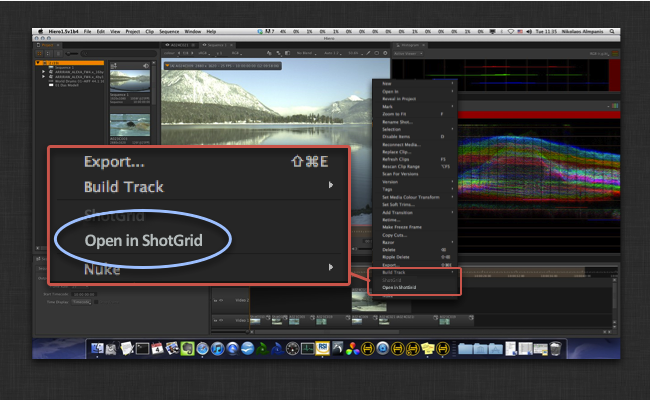

#  で Hiero/Nuke Studio を開く

このアプリによって、Hiero のスプレッドシートとタイムラインにコンテキスト メニューが追加されるため、任意のトラック項目にショットがある場合に、 でこの項目を表示することができます。



通常、このアプリを設定する場合は、 Engine for Nuke の環境設定に次のコードを追加すると、Hiero のタイムラインとスプレッドシートのメニューにアプリが表示されます。

```yaml
    timeline_context_menu:
    - {app_instance: tk-hiero-openinshotgun, keep_in_menu: false, name: "Open in ", requires_selection: true}
    spreadsheet_context_menu:
    - {app_instance: tk-hiero-openinshotgun, keep_in_menu: false, name: "Open in ", requires_selection: true}
```


