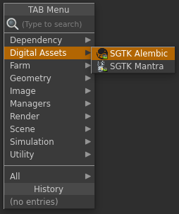

# Houdini Alembic Node

Houdini Alembic Node アプリは、Alembic ファイルの出力場所を簡単に標準化できるカスタムの  Alembic 出力ノードを提供します。各環境に合わせた設定が可能です。

## 一般用途

 Alembic 出力を使用するには、最初にスクリプトを Toolkit 作業ファイルとして保存し、Houdini の TAB メニューから新しいノードを作成します。これにより、通常の Alembic 出力ノードに類似したノードが作成されます。

このノードは複数の出力プロファイルを使用して設定できます。Alembic キャッシュをディスクに書き込む必要がある場合に、それぞれのプロファイルで異なるテンプレート パスを使用します。

手動でパスを入力するのではなく、使用する出力プロファイルを指定するだけで、ノードが残りのパスを自動的に計算してくれます。UI には計算されたパスが表示されます。

出力 Alembic ファイルはバージョンで管理され、バージョン番号は、Multi Publish を使用したパブリッシュ時に自動的に増分される現在の Houdini シーン ファイル バージョンに常に準拠します。

## 環境設定

Toolkit Alembic Node は、環境設定ごとに複数の出力プロファイルを指定することができます。次に、複数のプロファイルを使用したノードの設定例を示します。

<pre>
  tk-houdini:
    apps:
      tk-houdini-alembicnode:
        location:
          name: tk-houdini-alembicnode
          type: app_store
          version: v0.2.2
        work_file_template: houdini_shot_work
        default_node_name: tk_alembic_out
        output_profiles:
          - name: For Publishing
            settings: {}
            color: [1.0, 0.5, 0.0]
            output_cache_template: houdini_shot_work_alembic_cache
          - name: Local Testing
            settings: {}
            color: [0.0, 0.5, 1.0]
            output_cache_template: houdini_shot_local_alembic_cache
</pre>

`color` フィールドを介してノードの外観を変更するために出力プロファイルを使用したり、基本の Alembic ノードで個別のパラメータを調整するために `settings` フィールドにそのパラメータと一致するキーと値のペアを入力したりできます。最後に、`output_cache_template` フィールドは、ディスクに書き込まれる Alembic キャッシュの出力パスを操作します。
