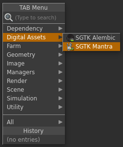
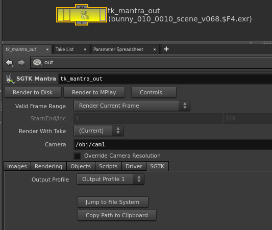

# Houdini Mantra Node

Houdini Mantra Node アプリは、レンダリング ファイルの出力場所を簡単に標準化できるカスタムの  Mantra 出力ノードを提供します。各環境に合わせた設定が可能です。

## 一般用途

 Mantra Node を使用するには、最初にスクリプトを Toolkit 作業ファイルとして保存し、Houdini の TAB メニューから新しいノードを作成します。これにより、通常の Mantra 出力ノードに類似したノードが作成されます。

このノードは複数の出力プロファイルを使用して設定できます。レンダリング出力(イメージ、ifd、dcm、aov など)をディスクに書き込む必要がある場合に、それぞれのプロファイルで一連の異なるテンプレート パスを使用します。

手動でパスを入力するのではなく、使用する設定を指定するだけで、ノードが残りのパスを自動的に計算してくれます。UI には計算されたパスが表示されます。

レンダリングされたファイルはバージョンで管理され、バージョン番号は、Multi Publish を使用したパブリッシュ時に自動的に増分される現在の Houdini シーン ファイル バージョンに常に準拠します。

## 環境設定

Toolkit Mantra Node は、環境設定ごとに複数の出力プロファイルを指定することができます。次に、複数のプロファイルを使用したノードの設定例を示します。

<pre>
  tk-houdini:
    apps:
      tk-houdini-mantranode:
        location:
          name: tk-houdini-mantranode
          type: dev
          version: v0.2.2
        default_node_name: tk_mantra_out
        work_file_template: houdini_shot_work
        output_profiles:
          - name: Primary Render
            settings: {}
            color: [1.0, 0.5, 0.0]
            output_render_template: houdini_shot_render
            output_ifd_template: houdini_shot_ifd
            output_dcm_template: houdini_shot_dcm
            output_extra_plane_template: houdini_shot_extra_plane
          - name: Local Render
            settings: {}
            color: [0.0, 0.5, 1.0]
            output_render_template: houdini_shot_local_render
            output_ifd_template: houdini_shot_local_ifd
            output_dcm_template: houdini_shot_local_dcm
            output_extra_plane_template: houdini_shot_local_extra_plane
</pre>

`color` フィールドを介してノードの外観を変更するために出力プロファイルを使用したり、基本の Alembic ノードで個別のパラメータを調整するために `settings` フィールドにそのパラメータと一致するキーと値のペアを入力したりできます。最後に、`output_*_template` フィールドは、Mantra レンダラによってディスクに書き込まれるファイルの出力パスを操作します。
