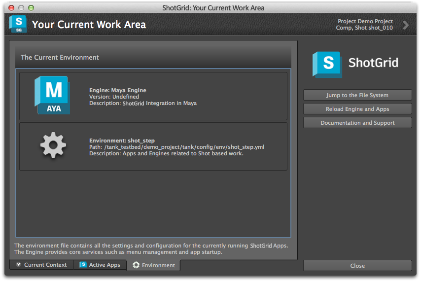

# 概要

このアプリは、現在の作業領域と現在の環境で実行しているすべてのアプリの詳細情報をグラフィカルに表示します。コンテキスト メニューからアクセスできます。

## すべてのアプリをリロードする
このアプリには、環境全体をリロードする便利なボタンがあります。これは、開発中に一部のコードを変更する場合に便利です。Maya や Nuke を再起動せず、リロード ボタンをクリックするだけです。

リロード機能とは別に、このアプリは、現在の作業領域と現在ロードされているすべてのアプリの詳細情報を表示します。

次の 3 つの異なるビューがあります。

## 現在の作業領域

ここには現在のショット、アセット、タスクなどが表示されます。リスト内の項目をダブル クリックすると、その項目の  の[詳細] (Detail)ページが表示されます。

## 実行中のアプリ

現在実行中のすべてのアプリおよびそのバージョンと説明を表示します。アプリをダブル クリックすると、そのアプリのマニュアル ページが開きます。

## 現在の環境

現在ロードされている環境ファイルとエンジンを表示します。これはデバッグの際に便利です。