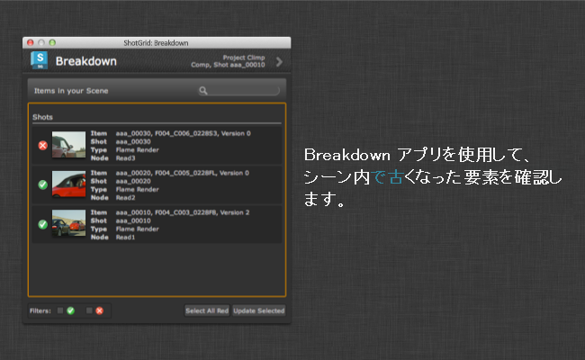

# 詳細情報

Scene Breakdown アプリは、参照コンテンツのリストを表示し、期限切れの項目を通知します。 メニューから利用できます。



1 つまたは複数の項目を選択し、選択項目の更新をクリックします。これにより、最新バージョンのコンテンツを使用するよう項目が切り替わります。

## シーンをスキャンする

Breakdown アプリが参照用にシーンをスキャンする場合は、特別なスキャン フックが呼び出されます。このスキャン フックは、ファイルに対応したパスを含むノードのリストを返します。検出した各参照はファイル パスを返し、Tank がファイル パスを確認して、パブリッシュとして認識するかどうかを最初にチェックし、パブリッシュとして認識した場合には、最新バージョンが利用可能かどうかを確認します。

ユーザが古いバージョンに表示される更新ボタンをクリックすると、アプリは実際の更新作業を実行する別のフックを呼び出します。つまり、このフックをカスタマイズすることで、Breakdown に新しいカスタム ノードを比較的簡単に追加できます。

##  のデータにアクセスする

フック内で更新しようとしているパブリッシュ用の  データにアクセスする必要がある場合、次のように `find_publish` を 1 回呼び出すだけで、アプリで受け渡しを行う全項目のメタデータを取得できます。

```python
class BreakdownHook(Hook):

    def update(self, items):
        """
        Perform replacements given a number of scene items passed from the app.

        Once a selection has been performed in the main UI and the user clicks
        the update button, this method is called.

        The items parameter is a list of dictionaries on the same form as was
        generated by the scan_scene hook above. The path key now holds
        the that each node should be updated *to* rather than the current path.
        """

        engine = self.parent.engine

        # resolve  data for all paths passed via the items dictionary
        sg_data = tank.util.find_publish(engine.sgtk,
                                         [i["path"] for i in items],
                                         fields=["id", "code", "version_number"])

        for i in items:
            node_name = i["node"]
            node_type = i["type"]
            new_path = i["path"]
            # now that each item is processed, it is easy to access the
            #  data via a dictionary lookup:
            sg_data = sg_data.get(i["path"])

            # once we have all our desired info and metadata, we can go ahead
            # and apply the update business logic.
            # [-business logic here-]

```

## API アクセス

API を使用すると、プログラムによって Breakdown アプリにアクセスできます。次のようなメソッドがあります。

### Breakdown の UI を表示する

```
app_object.show_breakdown_dialog()
```

Breakdown の UI を表示するには、`show_breakdown_dialog()` メソッドを実行します。アプリが現在実行している環境の `tk-multi-breakdown` セクションに含まれていると仮定すると、次のように実行できます。

```
>>> import sgtk
>>> e = sgtk.platform.current_engine()
>>> e.apps["tk-multi-breakdown"].show_breakdown_dialog()
```

### シーン解析を実行する

```
items = app_object.analyze_scene()
```

`analyze_scene()` メソッドを使用すると、プログラムによってシーン解析ロジックを実行できます。これにより、Breakdown の UI がシーン項目のリストを作成するときに使用するのとまったく同じロジックが実行されます。

このメソッドは、詳細情報項目のリストを返します。各項目は、項目を定義する複数のキーが含まれるディクショナリによって表されます。検出されるのは、パスが Toolkit テンプレート ファイルのテンプレートに対応するファイルのみです。 にパブリッシュ ファイルは必要はありませんが、パブリッシュ ファイルがある場合、このメソッドは基本的な  パブリッシュ メタデータを返します。

`node_name` と `node_type` の 2 つのキーを使用すると、DCC 中心の「アドレス」またはリプリゼンテーションが返されるため、DCC 内のパスを特定できます。たとえば、Maya と Nuke の場合、ノード名とタイプを返します。このロジックはフックに実装され、DCC 間で異なります。このメソッドは  への接続を試行しますが、実行される呼び出しの数は一定で、シーンの複雑さとは関係ありません。

次に、返されるデータ内のディクショナリの一般的な例を示します。

```
{'fields': {'Sequence': 'aaa',
            'Shot': 'aaa_00010',
            'Step': 'Comp',
            'eye': '%V',
            'height': 1556,
            'name': 'test',
            'output': 'output',
            'version': 1,
            'width': 2048},
 'template': <Sgtk TemplatePath nuke_shot_render_pub_mono_dpx>,

 'node_name': 'Read2',
 'node_type': 'Read',

 'sg_data': {'code': 'aaa_00010_test_output_v001.%04d.dpx',
             'entity': {'id': 1660, 'name': 'aaa_00010', 'type': 'Shot'},
             'id': 1424,
             'name': 'test',
             'published_file_type': {'id': 3,
                                     'name': 'Rendered Image',
                                     'type': 'PublishedFileType'},
             'task': {'id': 4714, 'name': 'Comp', 'type': 'Task'},
             'type': 'PublishedFile',
             'project': {'id': 234, 'name': 'Climp', 'type': 'Project'},
             'version_number': 1},
 }
```

**ヒント**: 上記から分かるように、各項目はパスを表すために `template` オブジェクトと `fields` ディクショナリを返します。この項目について実際の未処理のパスを確認するには、`template_obj.apply_fields(fields_dict)` を実行します。このメソッドで返されるいずれかのディクショナリ項目のコンテキストでは、コードが次のようになります

```
breakdown_items = analyze_scene()
for item in breakdown_items:
   path = item["template"].apply_fields(item["fields"])
```

### 項目の最新バージョンを計算する

```
highest_version = app_object.compute_highest_version(template, fields)
```

項目の最新バージョンを計算するには、`compute_highest_version(template, fields)` メソッドを使用します。パラメータ `template` と `fields` は解析すべきパスを表し、通常は `analyze_scene()` メソッドの出力から取得します。Breakdown アプリを使用する場合は、バージョン番号を含むテンプレート キーを常に `{version}` という名前にする必要があります。

これにより、ディスクをスキャンして最新バージョンを判断します。このメソッドはディスク上の最新バージョン番号を返します。詳細については、次の使用例を参照してください。

### シーン項目を更新する

```
app_object.update_item(node_type, node_name, template, fields)
```

項目を更新するには `update_item(node_type, node_name, template, fields)` メソッドを使用します。パラメータ `template` と `fields` は更新する必要のあるパスを表します。パラメータ `node_name` と `node_type` を使用すると、修正する必要のあるシーン内のノードを特定できます。通常、この値は `analyze_scene()` メソッドの出力から取得します。

これは、Breakdown の UI で更新を実行する場合に似ています。実際の更新の呼び出しは、DCC 固有のロジックを処理するフックにディスパッチされます。詳細については、次の使用例を参照してください。

### Breakdown の API の例

次の例では、シーンの内訳を取得し、最新バージョンを使用していないすべての項目を更新する方法について説明します。

```
# find the breakdown app instance
import sgtk
engine = sgtk.platform.current_engine()
breakdown_app = engine.apps["tk-multi-breakdown"]

# get list of breakdown items
items = breakdown_app.analyze_scene()

# now loop over all items
for item in items:

    # get the latest version on disk
    latest_version = breakdown_app.compute_highest_version(item["template"], item["fields"])

    # if our current version is out of date, update it!
    current_version = item["fields"]["version"]
    if latest_version > current_version:

        # make a fields dictionary representing the latest version
        latest_fields = copy.copy(item["fields"])
        latest_fields["version"] = latest_version

        # request that the breakdown updates to the latest version
        breakdown_app.update_item(item["node_type"], item["node_name"], item["template"], latest_fields)

```
