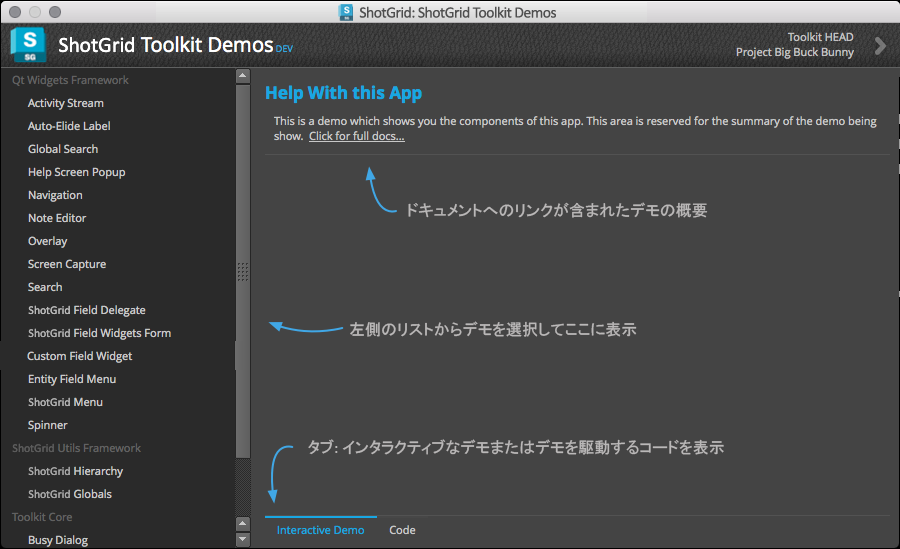
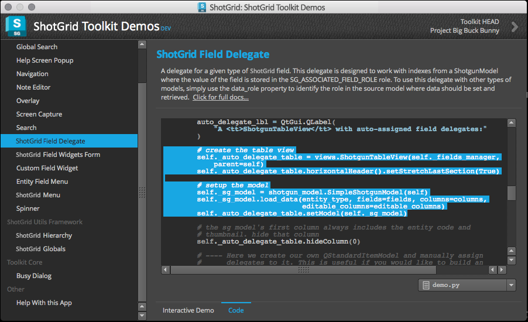

# デモ

Demo アプリでは、 Utilities フレームワーク、Qt ウィジェット フレームワーク、Toolkit コアなど、 のネイティブ開発プラットフォーム コンポーネントのライブ デモを視聴できます。


アプリに表示される各デモには、ネイティブ プラットフォームの 1 つまたは複数のコンポーネントを使用する方法を示す、動作可能でインタラクティブな UI が含まれています。さらに、実行しているコードは、自分のアプリに簡単にコピーして貼り付けることができます。



アプリは簡単に使用できます。左側のリストからデモを選択し、右側のコンポーネントを操作します。一部のデモは、Qt ウィジェット フレームワークから単一のウィジェットを表示するだけです。 プラットフォーム コンポーネントをプロダクション アプリで使用する場合の一般的な接続例を紹介するデモもあります。




新しいデモは、新しいコンポーネントがプラットフォームに追加されたのち、時間があるときに追加されます。コンポーネントの使用法に一定のパターンがある場合や、ご覧になりたいデモがある場合は、[サポート リクエスト](https://support.shotgunsoftware.com/hc/ja/requests/new)からお知らせください。

## インストール

Demo アプリをインストールするには、次のコマンドを実行します。

```
tank install_app project tk-shell tk-multi-demo
```

インストールしたら、次のコマンドを実行するとアプリを起動できます。

`./tank demos`
