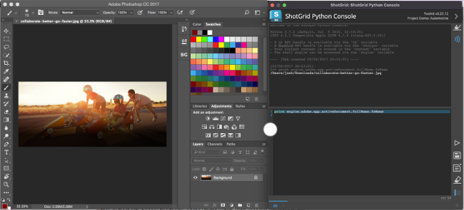
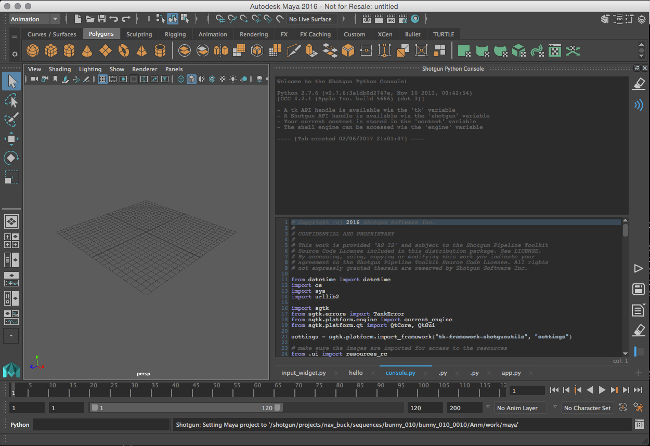
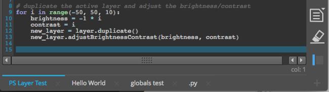
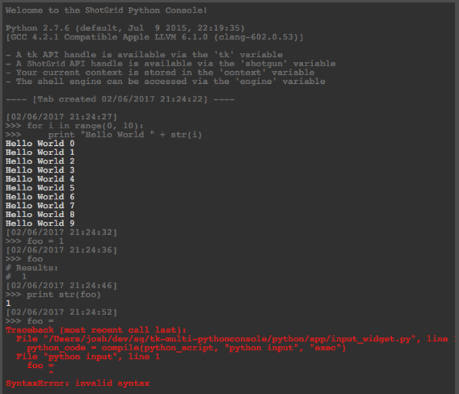
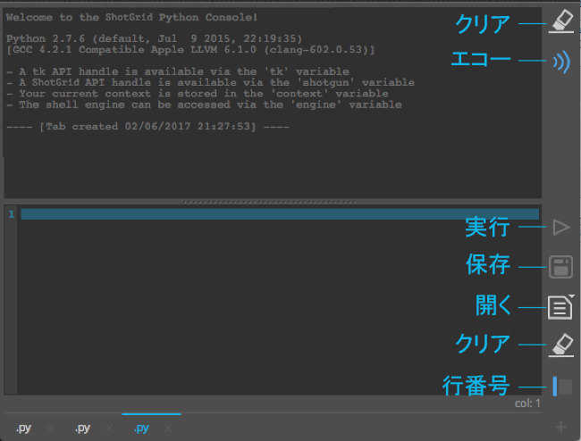
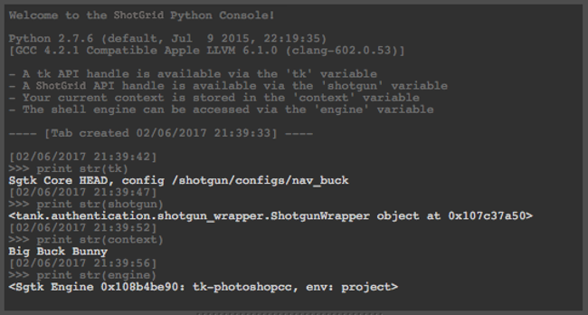

# Python コンソール

これは、Python インタープリタにアクセスする DCC で使用するための Python コンソール パネルです。該当のインタープリタとのインタラクションが制限されている、またはそのサポートがない場合に使用します。

## パネル

コンソールをインストールするとパネルとして DCC に登録され、 メニューで利用できるようになります。組み込みの Toolkit パネル(maya、nuke、houdini)をサポートするアプリでは、コンソールはドッキングされたパネルに表示されます。古いバージョンの DCC またはパネルをサポートしない DCC で使用する場合、コンソールは通常の Toolkit ダイアログとして表示されます。

## タブ

Python コンソールには 1 つまたは複数のタブが表示され、それぞれエディタと出力ウィンドウが含まれています。右下隅にある `+` ボタンをクリックすると、新しいタブを作成できます。タブ名の横には `x` ボタンがあり、タブを削除できます。タブ自体をダブルクリックすると、タブの新しい名前を入力するよう求められます。タブの配置はドラッグ アンド ドロップによって変更することができます。DCC を閉じるときにタブの状態が保存され、次回の起動時に復元されます。

### エディタ

コンソールには、Python を編集するための入力領域があります。エディタには行番号が含まれ、カーソルの現在の行を強調表示し、またいくつかの基本構文を強調表示します。コンソールは DCC のパレットを使用して統合されたルック アンド フィールを提供しようとします。

ブロックのインデントおよびインデント解除がサポートされています。1 つまたは複数の行を選択し、`tab` を押すとスペース 4 つ分がインデントされ、`shift + tab` を押すとスペース 4 つ分のインデントが解除されます。4 つのスペースを 1 つのインデントのグループとして維持しようとするため、4 つのスペースのブロック単位でインデント/インデント解除が行われます。

ブロックのコメント付けとコメント解除もサポートされています。1 行または複数の行を選択し、Mac では `cmd + /`、Windows と Linux では `ctrl + /` を押します。選択した行の先頭に `#` がない場合は、選択したすべての行に 1 つづつ追加されます。すべての行に `#` が存在する場合は、それらが削除されます。

### 出力

出力領域には実行した Python の結果が表示されます。ソースの Python コマンド エコーは既定でオンになっており、`>>>` で始まるので出力画面で区別できます。各実行にはタイムスタンプも付けられます。エコーをオフにするためのトグルがあります。構文およびランタイム エラーは、デバッグ用の完全なスタック トレースとともに赤色で表示されます。

## ボタン

### 出力

* **[クリア] (Clear)** - 出力ブラウザの内容をクリアします。
* **[エコー] (Echo)** - 実行されたコマンドを出力ブラウザにエコーするかどうかを切り替えます。

### エディタ

* **[実行] (Execute)** - エディタの内容を実行します。
* **[保存] (Save)** - エディタの現在の内容をファイルに保存します。
* **[開く] (Open)** - エディタでファイルを開きます。
* **[クリア] (Clear)** - エディタの内容をクリアします。
* **[行番号] (Lines)** - 現在のタブの行番号を切り替えます。

## グローバル

一部の /Toolkit グローバル変数は、[シェルの  エンジン](https://developer.shotgridsoftware.com/ja/2ad59ee8/?title=Shell)で利用可能なグローバル変数と同様、コンソールにあらかじめ定義されています。

* Tk API ハンドルは `tk` 変数を介して利用できます
*  API ハンドルは `shotgun` 変数を介して利用できます
* 現在のコンテキストは `context` 変数に格納されます
* シェル エンジンは `engine` 変数を介してアクセスできます

## 外部ソース

アプリには、外部ロケーションから Python ソースをロードするために実装できるフックが付属しています。フックは `external_sources_hook` と呼ばれ、使用するには `get_external_source_actions` というメソッドを実装する必要があります。このメソッドは、`QActions` のリストを返し、アクションがトリガされると新しいタブが(コンテンツとともに)コンソールに追加されます。事前定義されたユーザのリストのために github から gist をロードする実装例が提供されます。フックによって返されるアクションは、**[開く] (Open)**ボタンを押し続けると表示されるポップアップ メニューに表示されます。

## ホットキー

* `Ctrl + Enter` で選択内容を実行
* `Ctrl + T` を押して新しいタブを作成
* `Ctrl + Shift + [` または `Ctrl + Shift + ]` でタブ間を移動
* `Ctrl + Wheel` によって入力/出力フォントのサイズを調整

**注:** これらのホットキーはすべての DCC で使用できるわけではありません。

## その他の注意事項

* 一部の古いバージョンの DCC では、セッションを閉じるときに Python コンソールを開いたままにしておくとクラッシュする可能性があります。これは一部の古いバージョンの PySide のバグの可能性があります。新しいバージョンの PySide にバンドルされている最新バージョンの DCC は終了時にクラッシュしないようです。最新の DCC リリースでこの問題が発生する場合は、[チケットを送信](https://knowledge.autodesk.com/ja/contact-support)してください。調査にご協力をお願いいたします。