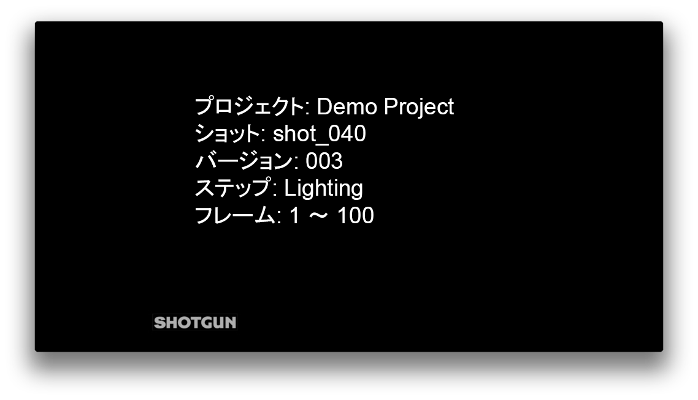
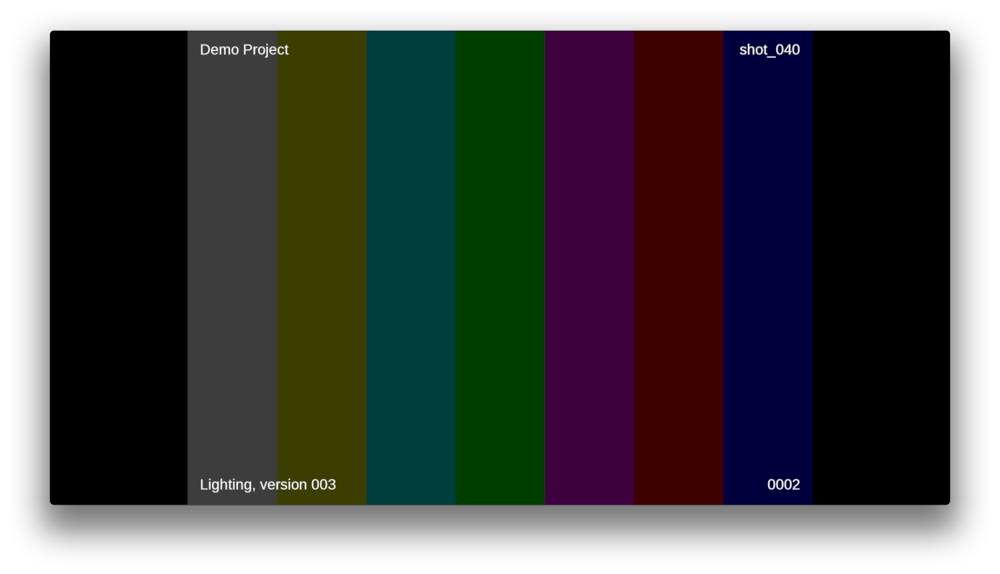

# レビュー提出

## このアプリの使用方法

### API として使用する場合

このアプリには、Multi Publish アプリのような他のアプリ内から呼び出して使用するためのモードがあります。

このモードはイメージ シーケンスから QuickTime ファイルを作成して、レビューできるようにバージョンとして  に送信します。生成された QuickTime にはスレートとバーンインがあります。フォント、ロゴの位置、ムービーの圧縮オプション、バーンイン/スレート情報などの項目は現在既定のフックでハードコードされているため、動作を調整するためにフック関数を再実装することをお勧めします。

次に、スレートとバーンインの、現在の既定の形式を示します。





独自のアプリまたはフック内からこのアプリを使用する場合について、その方法の概要を簡単に説明します。

- 現在のエンジンから `tk-multi-reviewsubmission` アプリを取得します。これは呼び出し `self.parent.engine.apps.get('tk-multi-reviewsubmission')` を使用してフック内部から実行できます。
- アプリが使用可能な場合は、`render_and_submit_version()` メソッドを呼び出します。

次に、フック コードの内容の例を示します。

```python
review_submission_app = self.parent.engine.apps.get("tk-multi-reviewsubmission")
if review_submission_app:
    review_submission_app.render_and_submit_version(
        template,
        fields,
        first_frame,
        last_frame,
        sg_publishes,
        sg_task,
        comment,
        thumbnail_path,
        progress_cb,
        color_space
    )
```

`render_and_submit_version` に渡す必要のある引数は次のとおりです。

* `template`: パブリッシュするファイルが格納される場所を定義するテンプレート
* `fields`: テンプレートの入力に使用されるフィールド
* `first_frame`: 処理するイメージ シーケンスの最初のフレーム
* `last_frame`: 処理するイメージ シーケンスの最後のフレーム
* `sg_publishes`: バージョンのリンク先の  パブリッシュ ファイル オブジェクトのリスト
* `sg_task`: バージョンのリンク先の  タスク リンク ディクショナリ
* `comment`: バージョンの説明に追加するテキスト。
* `thumbnail_path`: ムービーが  にアップロードされていない場合にバージョンで使用するサムネイルのパス(設定ファイルで指定)
* `progress_cb`: 進行状況を一緒に報告するコールバック。`callback(percent, message)` のような形式になります。
* `color_space`: 入力フレームのカラースペース。Nuke では、書き込みノードに使用するカラースペース ノブの列挙値のいずれかになります。

### メニュー項目として使用する場合

このモードは、DCC 内の  メニューにメニュー項目を追加します。 

また、現在のビューポートのクイック スナップショットを作成して、バージョンのドラフトとして  Create に送信します。これにより、 Create 内で注釈、文字、比較のメモを追加できるため、詳しいレビューを提出できます。

この機能をコンテキストに追加するには、次の操作を行う必要があります。
* `display_name` フィールドがメニュー項目に含まれるように設定します。
* `render_media_hook` フィールドを、DCC でのメディアのレンダリング方法を指示するフックに設定します(tk-photoshopcc と tk-maya で既定の実装は異なります)。
* `submitter_hook` フィールドを `{self}/submitter_create.py` に設定します。

例:

```yaml
tk-multi-reviewsubmission:
  display_name: Send for review
  render_media_hook: '{self}/render_media.py:{self}/{engine_name}/render_media.py'
  submitter_hook: '{self}/submitter_create.py'
  location:
    type: app_store
    name: tk-multi-reviewsubmission
    version: v1.0.1
```
