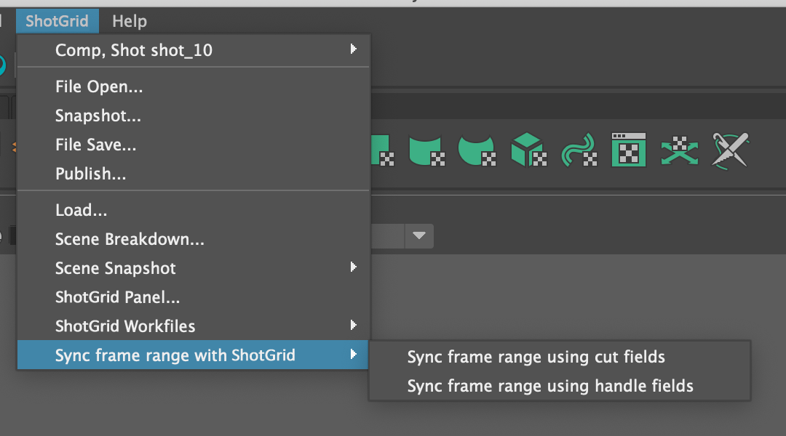

# フレーム範囲の設定

このアプリは、現在開いているシーンのフレーム範囲を管理します。 メニューで**[フレーム範囲と  を同期する] (Sync Frame Range with Shotgun)**メニュー オプションをクリックすると、このアプリを利用できます。

このオプションをクリックすると、 Toolkit は現在の作業領域(通常はショット)に関連する  エンティティを確認し、インとアウトのフレーム情報を含むイン フィールドとアウト フィールドを探します。通常、これはショットと一緒に使用されるため、この場合、アプリは  の既定の設定で定義された標準的なショットのイン フィールドとアウト フィールドを使用します。ただし、他のフィールドからフレーム範囲を取得するようにアプリを完全に設定することもできます。


アプリを実行すると、このインとアウトを使用して現在のシーンが更新され、最後に概要メッセージが表示されます。


## 複数の  フィールドの同期オプション

`menu_name` プロパティを設定すると、 メニューでこのアプリの複数のインスタンスを定義できます。これにより、さまざまな  フィールドを同期する複数のメニュー アクションを定義することができます。

定義するには、`menu_name` にそれぞれのアプリ インスタンス名を設定し、各インスタンスにフレーム イン フィールドとフレーム アウト フィールドを設定します。

```yaml
tk-multi-setframerange_cuts:
  menu_name: Sync frame range using cut fields
  sg_in_frame_field: sg_cut_in
  sg_out_frame_field: sg_cut_out
  location: "@apps.tk-multi-setframerange.location"
tk-multi-setframerange_handles:
  menu_name: Sync frame range using handle fields
  sg_in_frame_field: sg_handle_in
  sg_out_frame_field: sg_handle_out
  location: "@apps.tk-multi-setframerange.location"
```
 メニューには、別個のオプションとして表示されます。



注: この機能は、バージョン `v0.4.0` のアプリで新しく導入されました。

## 操作フック

現在のシーン フレーム範囲の取得、またはフレーム範囲の設定に使用するソフトウェア固有のロジックは、フレーム操作フックで処理されます。新しいエンジンのサポートを追加する場合、または動作の実装方法を変更する場合は、`hook_frame_operation` アプリ プロパティを設定して取得と設定の独自のロジックを実装すると、フレーム操作フックを引き継ぐことができます。

注: この機能は、バージョン `v0.4.0` のアプリで新しく導入されました。