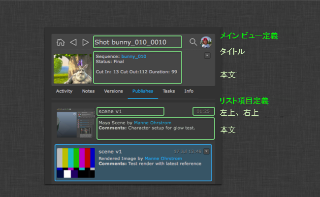

# ShotGrid Panel

このドキュメントは、Toolkit の設定を管理するユーザのみが使用可能な機能について説明します。詳細については、『[ 統合ユーザ ガイド](https://support.shotgunsoftware.com/hc/ja/articles/115000068574#The%20Shotgun%20Panel)』を参照してください。

##  Panel を設定する

 Panel で広範囲に設定できる主な領域は 2 つあります。UI の文字の表示と、データに関連付けるアクションです。次のセクションでは、2 つのシステムの設定を制御する方法について説明します。

### 表示内容を設定する

詳細領域の値とリストは両方とも `_fields` フックから設定可能です。正確な値を表示するために、このフックをサブクラス化して実装を変更できます。



**システムをテンプレート化する**

フックはシンプルなテンプレート言語をサポートしているため、優れた柔軟性が得られます。また、Qt でサポートされている HTML サブセットもサポートしているため、表示される値の色、フォント サイズ、ウェイトなどを制御できます 。テンプレート言語は次のように機能します。

-  の値は、`{brackets}` のように `<b>Description:</b> {description}` で囲まれています。このテンプレートをレンダリングすると、`{description}` の部分が説明フィールドの値で置き換えられます。

- 値が空以外の場合にのみ表示される値にオプションの接頭辞または接尾辞を指定する場合、`{[Prefix]sg_field[suffix]}` 構文を使用できます。両方の値が追加されている場合、テンプレート `{[Start: ]start_date} {[End: ]end_date}` は `Start: 12 July 2009 End: 14 July 2012` をレンダリングします。ただし、終了日を設定していない場合は `Start: 12 July 2009` をレンダリングします。

- 一部の値が設定されていない場合はフォールバックを定義することができます。 のバージョンについては、プロデューサがアーティストの代わりにバージョンを送信するというワークフローをサポートするため、`created_by` フィールドが `artist` フィールドよりも優先されます。この場合、バージョンはプロデューサによって作成されますが、`artist` フィールドはアーティストに設定されます。ただし、いつもそういうわけではありません。アーティストが自分の作業を送信するパイプラインでは、アーティスト欄は空欄になります。バージョンを表示する場合、最初に `artist` フィールドを確認できるようにしておくと役立ちます。今回このフィールドは設定されていないため、`created_by` フィールドにフォールバックします。このようにするには、`Created By: {artist|created_by}` のように構文 `{field1|field2}` を使用します。`{[Created By: ]artist|created_by}` のようにオプション フィールドを組み合わせることができます。


このフックには次のメソッドが含まれます。

**リストに表示される項目を制御する**

`get_list_item_definition()` メソッドは、 のエンティティ タイプを考慮して、さまざまなリストの項目の外観を制御するディクショナリを返します。たとえば、`top_left`、`top_right`、および `body` といったキーを持つディクショナリを返します。

```python
{
 "top_left": "<big>{code}</big>",
 "top_right": "{updated_at}",
 "body": "By: {created_by}<br>Description: {description}"
}
```

**上部の細部領域を制御する**

`get_main_view_definition()` メソッドは、 のエンティティ タイプを考慮して、`title` キーと `body` キーを含むディクショナリを返します。これらの値は、詳細領域のオブジェクトの外観を次のように制御します。

```python
{
 "title": "{type} {code}",
 "body": "By: {created_by}<br>Description: {description}"
}
```

**[情報] (Info)タブに表示されるフィールドを制御する**

`get_all_fields()` メソッドは、[情報] (Info)タブで任意のエンティティがレンダリングされる場合に表示するフィールドのリストを返します。

### アクションを設定する

アクションは  のデータを操作するコードの小さなスニペットです。例を次に示します。

- 任意の  バージョンの RV を起動するアクション
- 任意のタスクに自分に割り当てることができるアクション
- Maya リファレンスとして Maya に  パブリッシュをロードするアクション

アクションの実際のペイロードはアクション フック**で定義されます。アクションのロジックを定義したら、アプリ設定の  オブジェクトにこのアクションをマップすることができます。次に、このアクション マッピングの例を示します。

```yaml
action_mappings:
  PublishedFile:
  - actions: [reference, import]
    filters: {published_file_type: Maya Scene}
  - actions: [texture_node]
    filters: {published_file_type: Rendered Image}
  Task:
  - actions: [assign_task]
    filters: {}
  Version:
  - actions: [play_in_rv]
    filters: {}
```

上記の例では、`reference`、`import`、`texture_node`、`assign_task`、および `play_in_rv` といったアクションを使用します。次に、さまざまな  のオブジェクトと条件にこのアクションをマップします。たとえば `import` アクションは、タイプが「Maya Scene」であるすべてのパブリッシュに表示されるよう要求しています。

オブジェクトがパネルにロードされると、上記のアクション設定が読み込まれ、分析されます。現在のオブジェクトに適したアクションのリストが決定され、`generate_actions()` フック メソッドが実行されます。この特定の  オブジェクトに対してアクションを実行できるかどうかをフック コードが判断できるように、この時点で指定したエンティティの  データがフックに渡されます。この方法により、各フックで表示前にチェックを実行できます。たとえば、`play_in_rv` フックはメディアをローカルで利用できる場合にのみ意味を持ちます。設定でセットアップされたアクション マッピングは指定した  エンティティで有効にするアクションをパネルに通知しますが、指定したオブジェクトに適していないと `generate_actions()` メソッドによって判断された場合は、すべてのアクションが表示されない可能性があります。

`generate_actions()` メソッドから返されるアクションはアクション メニューに表示されます。ユーザがクリックすると、`execute_action()` フック メソッドが呼び出されてアクションが実行されます。

パネルがサポートするアプリケーションごとに、適切なアクションを実装するアクション フックがあります。たとえば Maya などの場合、既定のフックは `reference`、`import`、`texture_node` の各アクションを実装し、それぞれが特定の Maya コマンドを実行して現在の Maya シーンにパブリッシュを取り込みます。すべてのフックと同様に、アクションを完全にオーバーライドおよび変更できます。また、埋め込まれたフックに基づいたフックも作成できるため、たくさんのコードを複製しなくても、組み込みのフックに他のアクションを簡単に追加できます。

パネルは Toolkit の第 2 世代のフック インタフェースを使用するため、柔軟性に優れています。このフックの形式は改善された構文を使用します。これは既定の構成設定で次のように表示されます。

```yaml
actions_hook: '{self}/tk-maya_actions.py'
```

キーワード `{self}` は、フックのアプリの `hooks` フォルダを確認するように Toolkit に指示します。
 このフックをユーザが設定した実装でオーバーライドする場合は、値を `{config}/panel/maya_actions.py` に変更します。これにより、設定フォルダ内の `hooks/panel/maya_actions.py` と呼ばれるフックを使用するように Toolkit に指示します。

詳細については、アプリに付属するフック ファイルを参照してください。フックは継承も活用します。つまり、フック内のすべての項目をオーバーライドすることなく、さまざまな方法で既定のフックを簡単に拡張または強化して簡単にフックを管理できます。

LINKBOX_DOC:5#The%20hook%20data%20type:こちらで、第 2 世代のフック形式を確認してください。

フックの継承を使用すると、次のように既定のフックに他のアクションを追加できるようになります。

```python
import sgtk
import os

# toolkit will automatically resolve the base class for you
# this means that you will derive from the default hook that comes with the app
HookBaseClass = sgtk.get_hook_baseclass()

class MyActions(HookBaseClass):

    def generate_actions(self, sg_data, actions, ui_area):
        """
        Returns a list of action instances for a particular object.
        The data returned from this hook will be used to populate the
        actions menu.

        The mapping between  objects and actions are kept in a different place
        (in the configuration) so at the point when this hook is called, the app
        has already established *which* actions are appropriate for this object.

        This method needs to return detailed data for those actions, in the form of a list
        of dictionaries, each with name, params, caption and description keys.

        Because you are operating on a particular object, you may tailor the output
        (caption, tooltip etc) to contain custom information suitable for this publish.

        The ui_area parameter is a string and indicates where the publish is to be shown.

        - If it will be shown in the main browsing area, "main" is passed.
        - If it will be shown in the details area, "details" is passed.

        :param sg_data:  data dictionary with all the standard publish fields.
        :param actions: List of action strings which have been defined in the app configuration.
        :param ui_area: String denoting the UI Area (see above).
        :returns List of dictionaries, each with keys name, params, caption, group and description
        """

        # get the actions from the base class first
        action_instances = super(MyActions, self).generate_actions(sg_data, actions, ui_area)

        if "my_new_action" in actions:
            action_instances.append( {"name": "my_new_action",
                                      "params": None,
                                      "group": "Pipeline Utils",
                                      "caption": "My New Action",
                                      "description": "My New Action."} )

        return action_instances


    def execute_action(self, name, params, sg_data):
        """
        Execute a given action. The data sent to this be method will
        represent one of the actions enumerated by the generate_actions method.

        :param name: Action name string representing one of the items returned by generate_actions.
        :param params: Params data, as specified by generate_actions.
        :param sg_data:  data dictionary with all the standard publish fields.
        :returns: No return value expected.
        """

        if name == "my_new_action":
            # do some stuff here!

        else:
            # call base class implementation
            super(MyActions, self).execute_action(name, params, sg_data)


```

これで、この新しいアクションを設定内のパブリッシュ タイプのセットにバインドできます。

```yaml
action_mappings:
  PublishedFile:
  - actions: [reference, import, my_new_action]
    filters: {published_file_type: Maya Scene}
  Version:
  - actions: [play_in_rv]
    filters: {}
```

上記のようにフックの派生を利用すれば、カスタム フック コードには、管理と更新を簡単にするために実際追加するビジネス ロジックを含めるだけで構いません。

