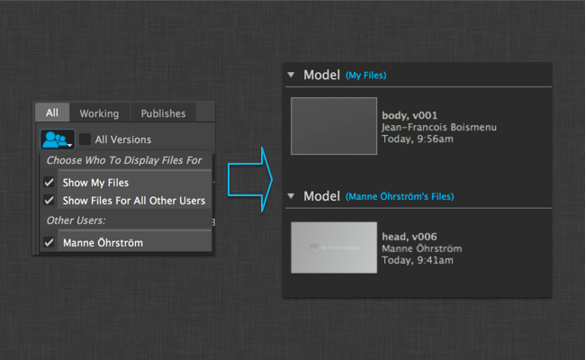
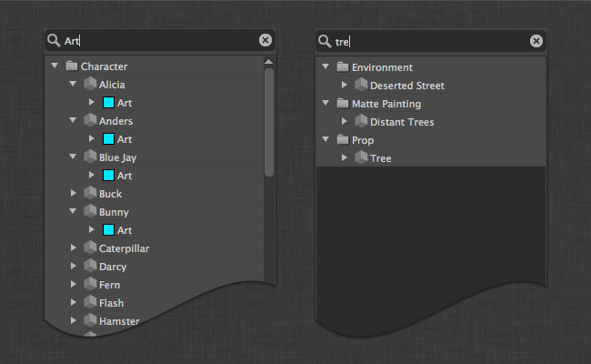
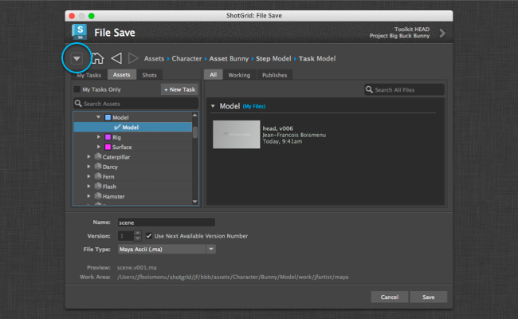
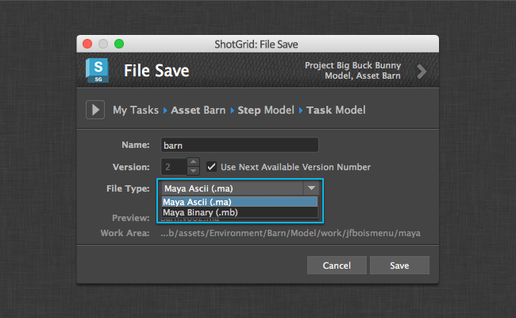
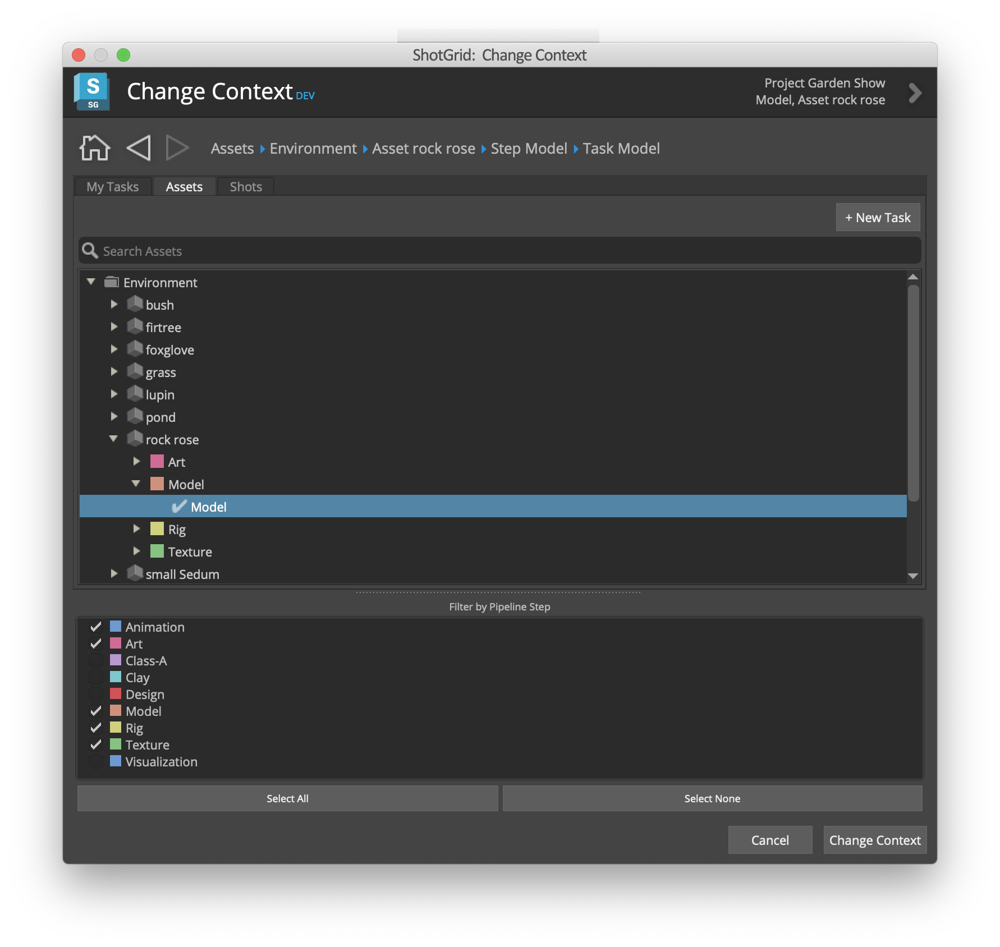
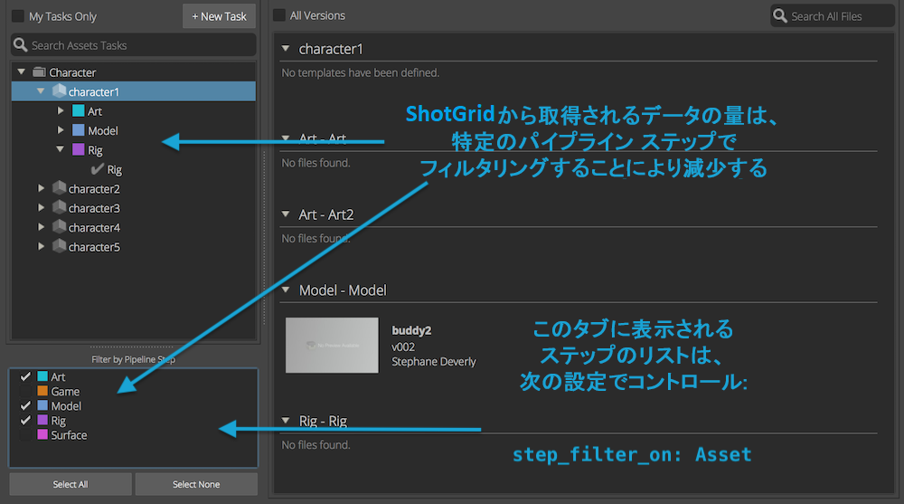
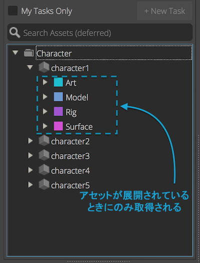

# 作業ファイル

## File Open ダイアログ

### 作業領域を移動する


メイン ダイアログは半分ずつに分かれています。左側には一連のタブがあります。最初のタブは「My Tasks」と呼ばれ、現在のユーザに割り当てられているすべてのタスクが表示されます。 の Web サイトの[マイ タスク](My Tasks)ページに非常によく似ています。

エンティティのタブを使用して  エンティティを参照することもできます。既定では、作業ファイル アプリケーションにより、それぞれのタブを確認することでショットまたはアセットに関連したタスクを参照できます。

一連のタブは、環境ファイルの `entities` 設定を利用して完全に設定可能です。

アプリ設定で `show_file_open: true/false` を設定すると、このダイアログを無効または有効にできます。

### ファイルを検索する


右側には、左側で選択した内容に関連する作業ファイルとパブリッシュが表示されます。作業ファイルとパブリッシュは、「All」、「Working」、「Publishes」の各タブを使用して一緒に表示したり、別々に表示したりできます。

### 以前のバージョンにアクセスする


以前のバージョンにアクセスする方法は 2 つあります。1 つ目の方法では、ブラウザ上部の「All versions」ボックスをクリックしてバージョンを展開し、ブラウザですべてのバージョンを個別に表示します。もう 1 つの方法では、ファイルを右クリックし、最新 10 件のバージョンにアクセスします。

### ユーザ サンドボックス



パイプライン設定でユーザ サンドボックスを使用する場合、既定で表示されるのは現在のユーザのファイルのみです。他のユーザのサンドボックスにあるファイルを表示する場合は、上部のボタンをクリックすると、サンドボックスを選択して元のファイルを表示できます。

### 結果を絞り込む



文字を入力すると、表示の結果を絞り込むことができます。検索は項目の名前と一致します。

## File Save ダイアログ

既定では、「File Save」ダイアログを使用すると、現在のコンテキストでファイルを保存できます。シーン名、バージョン番号、およびオプションのファイル拡張子(該当する場合)の入力が要求されます。「Save」ボタンはグレー表示されます。いったんアプリケーションでシーン名として次に利用可能なバージョン番号が確認されると、右下の「Save」ボタンが有効になります。

アプリ設定で `show_file_save: true/false` を設定すると、このダイアログを無効または有効にできます。

### 異なるコンテキストで保存する



異なるコンテキストでファイルを保存するためにダイアログの左上にある展開ボタンをクリックすると、「File Save」ダイアログが展開し、保存先として別のコンテキストを選択できます。

### ファイル拡張子ドロップダウンを追加する



新しい File Save ダイアログで、保存するファイルの拡張子を選択できます。これを有効にするためには、パイプライン設定の `templates.yml` ファイルを調整する必要があります。最初に、`templates.yml` 内のトークン リストでトークンを定義する必要があります。

```yaml
maya_extension:
    type: str
    choices:
        ma: Maya Ascii (.ma)
        mb: Maya Binary (.mb)
    default: ma
    alias: extension
```

`maya_extension` はトークン名です。`choices` は、ドロップダウンに表示されるファイル タイプのディクショナリです。キー(`ma` と `mb`)は、このテンプレート トークンに指定できる有効な値です。値(`Maya Ascii (.ma)` と `Maya Binary (.mb)`)は、Toolkit アプリケーションで使用できる UI に適した説明です。`alias` は作業ファイル アプリケーションで必要なヒントです。このトークンが拡張子であり、ドロップダウン ウィジェットに表示されるということがアプリケーションに通知されます。

その後、このトークンは Maya 固有のテンプレートに追加できます。

```yaml
maya_shot_work:
    definition: '@shot_root/work/maya/{name}.v{version}.{maya_extension}'
    root_name: 'primary'
```

## [コンテキスト変更] (Context Change)ダイアログ



[コンテキスト変更] (Context Change)ダイアログは、右側にファイルを参照する領域がないことを除けば、[開く] (Open)ダイアログと同様です。[コンテキスト変更] (Context Change)ボタンを押すと、タスクまたはエンティティを選択して、現在のエンジンのコンテキストを変更できます。

アプリ設定で `show_change_context: true/false` を設定すると、このダイアログを無効または有効にできます。

## ステップ フィルタ

タスクを取得するときに、階層に `step` が含まれている場合は、パイプライン ステップのフィルタを使用して、 から取得されるデータの量を減らすことができます。選択したステップ リストにリンクされているタスクのみが取得されます。

タブに表示されるステップのリストは、`step_filter_on` 設定によってコントロールされます。設定しない場合は、すべての既存のパイプライン ステップが表示されます。

次の例では、アセットおよびショットのタスクをそれぞれ表示する 2 つのタブを定義します。

```yaml
  - caption: Assets Tasks
    entity_type: Task
    step_filter_on: Asset
    filters:
    - [entity, type_is, Asset]
    hierarchy: [entity.Asset.sg_asset_type, entity, step, content]
  - caption: Shots Tasks
    entity_type: Task
    step_filter_on: Shot
    filters:
    - [entity, type_is, Shot]
    hierarchy: [entity.Shot.sg_sequence, entity, step, content]
```



## 遅延クエリー

エンティティ ツリーを次のように 2 つのステップ クエリーに分割して構築すると、パフォーマンスを向上させることができます。
- 最初のクエリーは、 からレコードを取得し、ツリーの上部に入力するために使用します。
- 2 番目のクエリーは、ツリーを展開するときに子を取得するために使用します。

次の設定では、アプリを起動するときに  からアセットおよびショットを取得します。特定のアセットまたはショットを選択した場合、またはツリー ビューで展開した場合は、このアセットまたはショットにリンクされたタスクのみが取得されます。

```yaml
  entities:
  - caption: Assets
    entity_type: Asset
    hierarchy: [sg_asset_type, code]
    filters:
    sub_hierarchy:
      entity_type: Task
      filters:
      link_field: entity
      hierarchy: [step]
  - caption: Shots
    entity_type: Shot
    filters:
    hierarchy: [sg_sequence, code]
    sub_hierarchy:
      entity_type: Task
      filters:
      link_field: entity
      hierarchy: [step]
```


