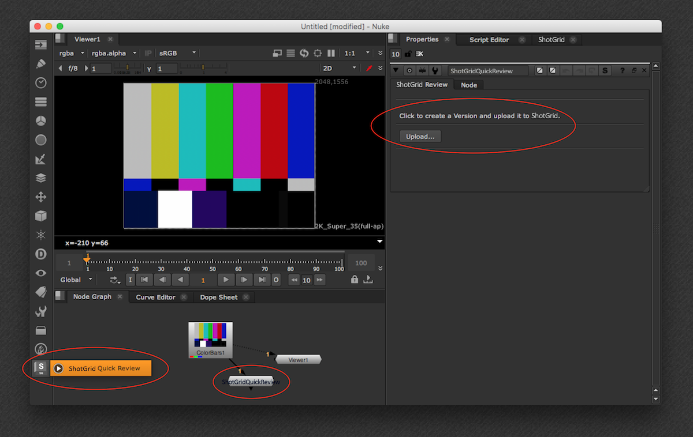
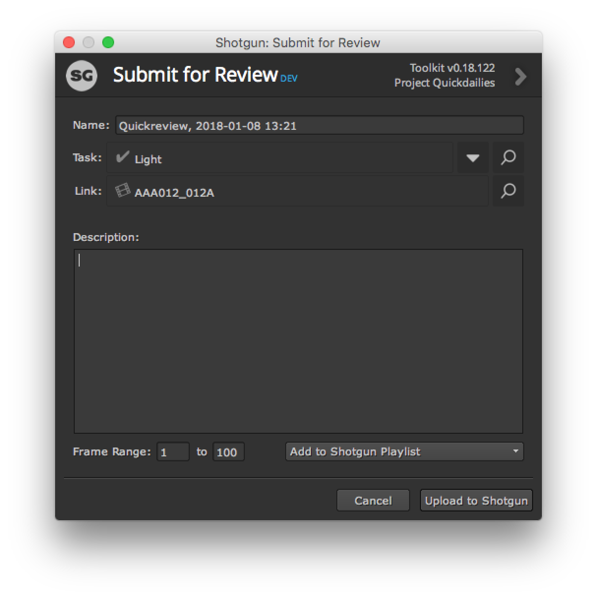
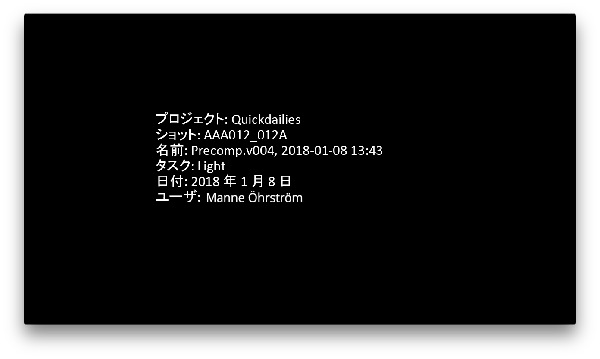
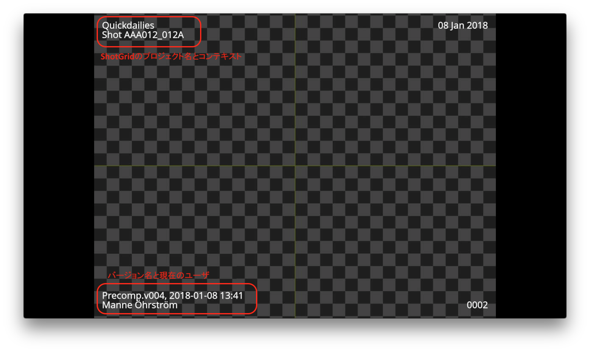

# Nuke Quickreview

Quickreview アプリを使用すると、Nuke でレンダリングしたファイルを  に送信してレビューする作業が簡単になります。Quickreview で送信するたびに、 に**バージョン**が作成されます。バージョンは、Nuke 内の  ノード メニューにノードとして表示されます。新しいノードを作成し、Nuke ネットワークに接続してから、ダブルクリックして[アップロード] (Upload)ボタンをクリックするだけです。

次の UI が表示され、 でのバージョンの作成方法を制御できるようになります。

次のアイテムを制御できます。

- バージョン名は現在ロードされている Nuke スクリプトに基づいて事前に入力され、必要に応じて調整することができます。
- バージョンに関連付けられているエンティティ リンクおよびタスクは現在のコンテキストに基づいて決まり、調整することができます。
- 送信するフレーム範囲を調整することができます。
- 作成されたバージョンは、プレイリストに追加できます。最新のプレイリストを含むドロップ ダウンが表示されます。

[アップロード] (Upload)ボタンをクリックすると、Nuke 内に QuickTime が生成されて、 にアップロードされます。アップロードすると、次の画面が表示され、Nuke に組み込まれている  Panel や Web オーバーレイ プレイヤにバージョンを表示できるようになります。

## バーンインとスレート

既定では、アプリはスレートおよびバーンインを使用して QuickTime を生成します。

## カスタマイズ

レビュー送信のほとんどの要素は、フックを使用して調整できます。詳細な説明については、[こちら](http://developer.shotgridsoftware.com/tk-nuke-quickreview)を参照してください。

