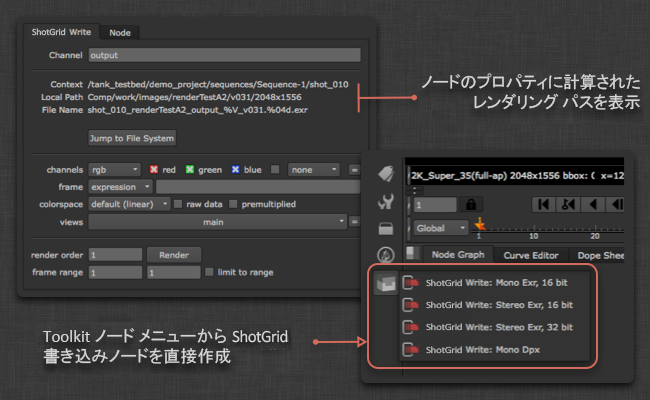
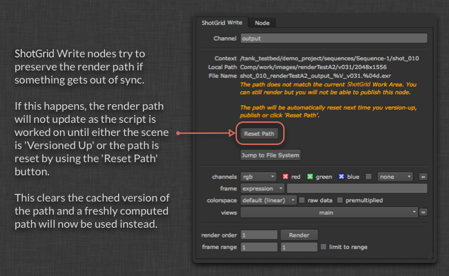
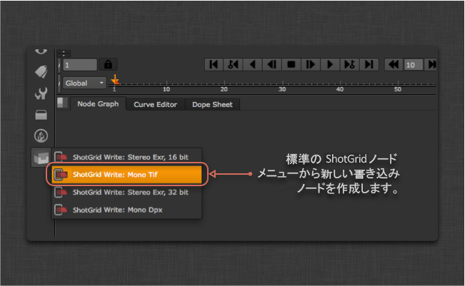
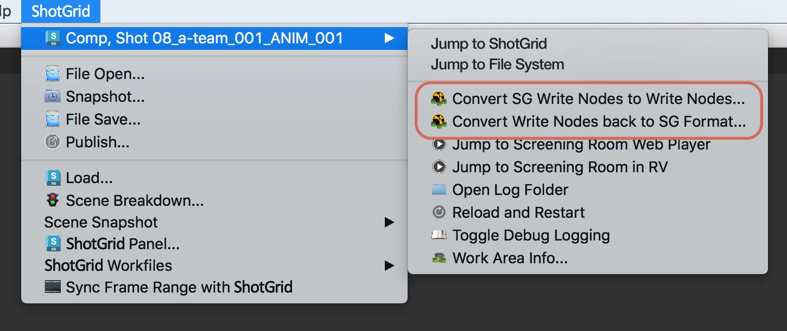

# Nuke Write Node

Nuke Write Node アプリは、イメージのレンダリング先を簡単に標準化できる、カスタムの  書き込みノードを提供します。各環境に合わせた設定が可能です。パス以外に、使用するレンダリング形式も設定で決まります。

## 一般用途

 Write Node を使用するには、最初にスクリプトを Toolkit 作業ファイルとして保存し、Nuke メニューから新しいノードを作成します。これにより、通常の書き込みノードに類似したノードが作成されます。



手動でパスを入力するのではなく、出力名を指定するだけで、Toolkit が残りのパスを自動的に計算してくれます。計算されたパスが UI に表示されます。*Show in File System* ボタンをクリックすると、ディスク上の該当する場所が開きます。レンダリングの書き込み先は Toolkit の設定に応じて異なります。

レンダリングはバージョンで管理され、バージョン番号は、Multi Publish を使用してパブリッシュする場合に自動的に増分される現在の Nuke スクリプト バージョンに常に準拠します。

## レンダリング パスをリセットする

Write Node は、ファイルを Toolkit 作業領域外から開いても有効になるように現在のパスをキャッシュ化します。場合によっては、パスが同期できなくなり「ロック状態」になることがあります。レンダリング パスがロックされた場合、この Write Node で作成されたレンダリングはパブリッシュできません。

レンダリング パスをリセットするには、作業ファイル アプリの「Version Up Scene」コマンドを使用してシーンをバージョンアップするか、書き込みノードを個別に選択して **Reset Path** をクリックします。



## 別の書き込みノード プロファイルを追加する

 Write Node は Nuke に組み込まれた書き込みノードをラップするため、Nuke でサポートされている形式をアプリで使用して、別のノードを設定から追加できます。最も簡単な開始方法は、任意のパラメータを使用して簡単な Nuke 書き込みノードをセットアップすることです。次の例では、LZW 圧縮で 16 ビット TIF を実行しているものと仮定します。テキスト エディタで Nuke スクリプトを確認すると、書き込みノードは次のように表示されます。

```
Write {
    file /Users/ryanmayeda/Desktop/test.%04d.tif
    file_type tiff
    datatype "16 bit"
    compression LZW
    checkHashOnRead false
    name Write1
    xpos -145
    ypos -61
}
```

テキストから必要なパラメータ名と値が分かります。この場合は `datatype` と `compression` です。次に、環境設定(例: `/path/to/pipeline/config/env/shot_step.yml`)に移動し、`tk-nuke-writenode` アプリを設定する領域を探します。`settings` に次の 2 つのパラメータを指定した別の Write Node を追加します。

```yaml
tk-nuke-writenode:
  location: {name: tk-nuke-writenode, type: app_store, version: v0.1.6}
  template_script_work: nuke_shot_work
  ...
  write_nodes:
  - file_type: exr
    ...
  - file_type: dpx
    ...
  - file_type: tiff
    name: Mono Tif
    publish_template: nuke_shot_render_pub_mono_tif
    render_template: nuke_shot_render_mono_tif
    proxy_publish_template: null
    proxy_render_template: null
    settings: {datatype: 16 bit, compression: LZW}
    tank_type: Rendered Image
    tile_color: []
    promote_write_knobs: []
```

設定を更新すると、追加した  Write Node が Nuke で表示されるようになります。



__注:__ 新しいテンプレート(nuke_shot_render_mono_tif など)はプロジェクト設定(`<configuration root>/config/core/templates.yml`)内の `templates.yml` ファイルに必ず追加してください。

別の例として、圧縮を 0.5、サブサンプリングを 4:2:2 に設定した JPEG に出力する  Write Node を追加する方法を以下に示します。また、このプロファイルは JPEG 品質ノブをギズモのユーザ インタフェースにまでプロモートする「promote_write_knobs」オプションも使用します。これにより、プロファイルの品質に既定の値が設定され、この設定自体を変更するためのスライダもユーザに表示されます。

```yaml
tk-nuke-writenode:
  write_nodes:
    - file_type: jpeg
      name: Compressed JPEG
      publish_template: nuke_shot_render_pub_jpeg
      render_template: nuke_shot_render_jpeg
      proxy_publish_template: null
      proxy_render_template: null
      settings: {_jpeg_quality: 0.5, _jpeg_sub_sampling: "4:2:2"}
      tank_type: Rendered Image
      tile_color: []
      promote_write_knobs: [_jpeg_quality]
```

### 書き込みノブをプロモートする

上記のプロファイルに示すように、カプセル化された書き込みノードのノブをプロモートして、 Write Node のプロパティ パネルに表示することができます。プロモートされた書き込みノブはプロファイルの一部として定義され、ノブ名で識別されます。複数のノブをプロモートすることができます。

## レンダリング ファーム統合

スタジオでは一般的に、[Deadline](https://deadline.thinkboxsoftware.com/) などのジョブ管理ツールを実行するレンダリング ファームを使用します。このようなツールを使用すると、通常は、レンダリング時に Nuke が直接起動されます。このようなツールは、 が認識できる方法(デスクトップや `tank` コマンドなどの使用)で Nuke を起動しないため、 書き込みノードには Nuke を実行するために必要な情報が保持されません。この制限を回避するために、いくつかのオプションが用意されています。

###  書き込みノードを標準の Nuke 書き込みノードに変換する

簡単な方法は、 書き込みノードを標準の Nuke 書き込みノードに変換してから、レンダリングするスクリプトを送信することです。これには次の 2 つのオプションがあります。1. 変換メニュー オプションを有効にして、使用します。2. この API 変換方法をアプリ上で使用します。

#### 変換メニューオプションを有効にする

yml 環境ファイル内のアプリの設定に追加できる、`show_convert_actions` という名前の設定オプションがあります。設定 `show_convert_actions: True` を追加するときに、*[SG 書き込みノードを書き込みノードに変換...]*および*[書き込みノードを SG 形式に再変換...]*メニュー オプションが使用できるようになります。



ただし、書き込みノブをプロモートする、定義済みの  書き込みノード プロファイルがある場合は、`show_convert_actions` が `True` に設定されている場合でも、このメニュー オプションは表示されません。これは、現時点で、再変換機能がプロモートされたノブをサポートしていないためです。

#### API を使用して変換する

この変換を実行する `convert_to_write_nodes()` メソッドが、`tk-nuke-writenode` アプリに用意されています。

スクリプト内のすべての  書き込みノードを標準の Nuke 書き込みノードに変換するには、Nuke 内で次のコードを実行します。

```python
import sgtk
eng = sgtk.platform.current_engine()
app = eng.apps["tk-nuke-writenode"]
if app:
    app.convert_to_write_nodes()
```

これにより、シーンから  書き込みノードが削除されるため、レンダリングするスクリプトのコピーを作成し、そのコピーを変換してファームに送信するというワークフローをお勧めします。シーンには Toolkit の参照が含まれなくなっているため、レンダリング ファームで Nuke スクリプトを開いたときに、Toolkit は不要になります。

**注:** 対応する `convert_from_write_nodes()` メソッドを使用できますが、データの整合性を維持するために、パイプラインの一部としてではなく、デバッグでのみ使用することをお勧めします。

### init.py を使用して  Pipeline Toolkit エンジンをブートストラップする

Nuke は、プラグイン パス上にあるすべての `init.py` スクリプトを実行します。このオプションを使用すると、`tk-nuke` エンジンの最小限のブートストラップを実行するコードが `init.py` に追加されるため、 書き込みノードはレンダリング ファーム上で期待どおりに動作します。

このワークフローにはいくつかの手順があります。最初に、 対応の Nuke セッション内で実行される「pre-flight」送信スクリプトによって、ファーム ジョブの環境設定に使用するデータが取得されます。次に、レンダリング ファーム管理者が、レンダリング ファーム上の  セッションを認証するために使用する追加の環境変数を設定します。最後に、 ブートストラップ コードを含む `init.py` が、レンダリング ファーム上の Nuke セッションによって検出および実行される場所に配置され、セッション内で `tk-nuke` エンジンをブートストラップします。これにより、 書き込みノードが適切に機能するようになります。

#### 1. 事前送信スクリプト

この方法は、アーティストが Nuke の  対応セッション内でファーム ジョブを送信していることが前提となります。送信時に、次のコードを実行する必要があります。これにより、Toolkit コンテキスト、パイプライン設定 URI、Toolkit Core API の場所など、環境に関する情報が現在の Nuke セッションから取得されて、ディクショナリに入力されます。このディクショナリがレンダリング ジョブに渡され、そこでこの情報を使用して環境変数が設定されます。

```python
# Populating environment variables from running Nuke:
# http://developer.shotgridsoftware.com/tk-core/platform.html#sgtk.platform.create_engine_launcher
current_engine = sgtk.platform.current_engine()
launcher = sgtk.platform.create_engine_launcher(
     current_engine.sgtk,
     current_engine.context,
     current_engine.name
)

# Get a dictionary with the following keys:
# SHOTGUN_SITE: The  site url
# SHOTGUN_ENTITY_TYPE: The  Entity type, e.g. Shot
# SHOTGUN_ENTITY_ID: The  Entity id, e.g. 1234
environment = launcher.get_standard_plugin_environment()

# Get the current pipeline config descriptor
environment["SHOTGUN_CONFIG_URI"] = os.path.join(current_engine.sgtk.configuration_descriptor.get_uri(),"config")

# Get the current tk-core installation path
environment["SHOTGUN_SGTK_MODULE_PATH"] = sgtk.get_sgtk_module_path()
```

この情報の収集が完了したら、レンダリング送信ツールに渡すことができます。このプロセスは、使用しているレンダリング ファーム管理システムによって異なります。レンダリング送信スクリプトの記述方法の詳細については、ファーム管理システムのドキュメントを参照してください。

#### 2.  認証

ブートストラップ API の ToolkitManager を初期化するには、スクリプト ユーザが必要です。オートデスクの例では、ファーム マシン上にサイト名、スクリプト ユーザ、およびスクリプト キーが環境変数として存在することを想定しています。通常、これはレンダリング ファームの管理者によって管理されます。次に、オートデスクのコードで想定されている環境変数の名前と、サンプル値を示します。

```
SHOTGUN_SITE = “https://mysitename.shotgunstudio.com”
SHOTGUN_FARM_SCRIPT_USER = “sg_api_user”
SHOTGUN_FARM_SCRIPT_KEY = “xxxxxxxxxxxxxxxxxxxxxxxxxxxxxxxxxxxxxxxxxxxxxxxxxxxxxxx”
```

認証の詳細については、オートデスクの[開発者用ドキュメント](http://developer.shotgridsoftware.com/tk-core/authentication.html)を参照してください。

**スクリプト ユーザの保護に関する注意事項:** ファームで使用するスクリプト ユーザをロックして、管理者レベルの権限が付与されないようにすることをお勧めします。[こちらで、API ユーザの権限を確認してください。](https://support.shotgunsoftware.com/hc/ja/articles/219376228-API-user-permission-groups)

#### 3. init.py スクリプト

この時点で、レンダリング送信ツールから Toolkit 環境データが渡されていて、レンダリング ファーム マシンの環境変数に認証データが格納されています。レンダリング ジョブ内で Toolkit をブートストラップするためには、最後に、次の `init.py` サンプル コードを Nuke のプラグイン パスに配置して、Nuke を開始するときに起動されるようにする必要があります。(詳細については、[起動スクリプトに関する Foundry のドキュメント](http://docs.thefoundry.co.uk/nuke/63/pythondevguide/startup.html)を参照してください。)

```python
# This script shows how a Toolkit as a plugin approach could be used to bootstrap
# Toolkit in Nuke on the render farm.
# http://developer.shotgridsoftware.com/tk-core/bootstrap.html#bootstrapping-toolkit

import sys
import os

# If your render nodes can access the same tk-core install location as
# artist workstations, retrieve its path from the environment and ensure
# it is in the PYTHONPATH
TK_CORE_PATH = os.environ["SHOTGUN_SGTK_MODULE_PATH"]
if TK_CORE_PATH not in sys.path:
    sys.path.append(TK_CORE_PATH)

# If your render nodes don’t have access to the Toolkit Core API in the same filesystem location as artist workstations, you have to make sure that it is available in the PYTHONPATH, so that render nodes can import it. An easy way
# to install tk-core in a centralized location is with pip. You can read more
# about it here:
# http://developer.shotgridsoftware.com/tk-core/bootstrap.html#installing-the-sgtk-module-using-pip

import sgtk

# Authenticate using a pre-defined script user.
sa = sgtk.authentication.ShotgunAuthenticator()

# Here we retrieve credentials from environment variables, assuming a script user
# will be used when rendering. This should be typically be handled by your render
# farm administrators.
SG_SITE_URL = os.environ["SHOTGUN_SITE"]
SG_SCRIPT_USER = os.environ["SHOTGUN_FARM_SCRIPT_USER"]
SG_SCRIPT_KEY = os.environ["SHOTGUN_FARM_SCRIPT_KEY"]
user = sa.create_script_user(
    api_script=SG_SCRIPT_USER,
    api_key=SG_SCRIPT_KEY,
    host=SG_SITE_URL
)

# Start up a Toolkit Manager with our script user
mgr = sgtk.bootstrap.ToolkitManager(sg_user=user)

# Set the base pipeline configuration from the environment variable:
mgr.base_configuration = os.environ["SHOTGUN_CONFIG_URI"]

# Disable  lookup to ensure that we are getting the Pipeline
# Configuration defined in SHOTGUN_CONFIG_URI, and not a dev or override
# Pipeline Configuration defined in .
mgr.do_shotgun_config_lookup = False

# Set a plugin id to indicate to the bootstrap that we are starting
# up a standard Nuke integration
mgr.plugin_id = "basic.nuke"

# Retrieve the Toolkit context from environment variables:
# SHOTGUN_SITE: The  site url
# SHOTGUN_ENTITY_TYPE: The  Entity type, e.g. Shot
# SHOTGUN_ENTITY_ID: The  Entity id, e.g. 1234
sg_entity = mgr.get_entity_from_environment()

# Now start up the Nuke engine for a given  Entity
nuke_engine = mgr.bootstrap_engine("tk-nuke", entity=sg_entity)
```

設定がこの例よりも複雑な場合、または Nuke (`.nk`)スクリプトでなく `-t` フラグを使用して、Python スクリプトをコマンド ラインに渡している場合は、このスクリプトを拡張しなければならない可能性があります。

#### 期限固有の手順

Deadline は、レンダリング時に Nuke スクリプトを一時的な場所にコピーします。この手順を行うと、Toolkit が認識可能なディスク上の場所にファイルが存在しなくなるため、問題が発生します。この動作を無効にして元の場所からスクリプトをロードするには、次の操作を行います。

1. Deadline で、Tools > Configure Plugin に移動します(スーパー ユーザ モード)
2. [Enable Path Mapping]オプションを無効にします。

## 技術の詳細

アプリでは次の API メソッドを使用できます。

### get_write_nodes()

現在のシーンの  書き込みノードすべてが含まれるリストを返します。

`list` app.get_write_nodes()

**パラメータと戻り値**

* **戻り値: **`list` - シーン内で見つかった Toolkit 書き込みノードのリスト

**例**

```python
>>> import sgtk
>>> eng = sgtk.platform.current_engine()
>>> app = eng.apps["tk-nuke-writenode"]
>>> nodes = app.get_write_nodes()
```

### get_node_name()

指定した書き込みノードの名前を返します。

`string` get_node_name(`node` ノード)

**パラメータと戻り値**

* `node` **ノード**: クエリーする書き込みノード
* **戻り値:** `string` - ノードの名前

**例**
```python
>>> import sgtk
>>> eng = sgtk.platform.current_engine()
>>> app = eng.apps["tk-nuke-writenode"]
>>> nodes = app.get_write_nodes()
>>> app.get_node_name(nodes[0])
```

### get_node_profile_name()

指定した書き込みノードによって使用される設定プロファイルの名前を取得します。

`string` get_node_profile_name(`node` ノード)

**パラメータと戻り値**

* `node` **ノード**: クエリーする書き込みノード
* **戻り値:** `string` - 設定で定義されたこの書き込みノードのプロファイル名

**例**
```python
>>> import sgtk
>>> eng = sgtk.platform.current_engine()
>>> app = eng.apps["tk-nuke-writenode"]
>>> nodes = app.get_write_nodes()
>>> app.get_node_profile_name(nodes[0])
```

### get_node_render_path()

指定した書き込みノードがイメージのレンダリング先として使用するパスを取得します。

`string` get_node_render_path(`node` ノード)

**パラメータと戻り値**

* `node` **ノード**: クエリーする書き込みノード
* **戻り値:** `string` - このノードのレンダリング パス

**例**
```python
>>> import sgtk
>>> eng = sgtk.platform.current_engine()
>>> app = eng.apps["tk-nuke-writenode"]
>>> nodes = app.get_write_nodes()
>>> app.get_node_render_path(nodes[0])
```

### get_node_render_files()

指定した書き込みノードに対してレンダリングされているすべてのイメージ ファイルのリストを取得します。

`list` get_node_render_files(`node` ノード)

**パラメータと戻り値**

* `node` **ノード**: クエリーする書き込みノード
* **戻り値:** `list` - この書き込みノードでレンダリングされるイメージ ファイルのリスト

**例**
```python
>>> import sgtk
>>> eng = sgtk.platform.current_engine()
>>> app = eng.apps["tk-nuke-writenode"]
>>> nodes = app.get_write_nodes()
>>> app.get_node_render_files(nodes[0])
```

### get_node_render_template()

設定の定義に従い、指定した書き込みノードに対するレンダリング イメージが書き込まれる場所を決定するテンプレートを取得します。

`template` get_node_render_template(`node` ノード)

**パラメータと戻り値**

* `node` **ノード**: クエリーする書き込みノード
* **戻り値:** `template` - このノードが使用するように設定されているレンダリング テンプレート

**例**
```python
>>> import sgtk
>>> eng = sgtk.platform.current_engine()
>>> app = eng.apps["tk-nuke-writenode"]
>>> nodes = app.get_write_nodes()
>>> app.get_node_render_template(nodes[0])
```

### get_node_publish_template()

設定の定義に従い、指定した書き込みノードに対するレンダリング イメージがパブリッシュされる場所を決定するテンプレートを取得します。

`template` get_node_publish_template(`node` ノード)

**パラメータと戻り値**

* `node` **ノード**: クエリーする書き込みノード
* **戻り値:** `template` - このノードが使用するように設定されているパブリッシュ テンプレート

**例**
```python
>>> import sgtk
>>> eng = sgtk.platform.current_engine()
>>> app = eng.apps["tk-nuke-writenode"]
>>> nodes = app.get_write_nodes()
>>> app.get_node_publish_template(nodes[0])
```

### get_node_proxy_render_path()

指定した書き込みノードがプロキシ イメージのレンダリング先として使用するパスを取得します。

`string` get_node_proxy_render_path(`node` ノード)

**パラメータと戻り値**

* `node` **ノード**: クエリーする書き込みノード
* **戻り値:** `string` - このノードのプロキシ レンダリング パス

**例**
```python
>>> import sgtk
>>> eng = sgtk.platform.current_engine()
>>> app = eng.apps["tk-nuke-writenode"]
>>> nodes = app.get_write_nodes()
>>> app.get_node_proxy_render_path(nodes[0])
```

### get_node_proxy_render_files()

指定した書き込みノードに対してレンダリングされているすべてのプロキシ イメージ ファイルのリストを取得します。

`list` get_node_proxy_render_files(`node` ノード)

**パラメータと戻り値**

* `node` **ノード**: クエリーする書き込みノード
* **戻り値:** `list` - この書き込みノードでレンダリングされるプロキシ イメージ ファイルのリスト

**例**
```python
>>> import sgtk
>>> eng = sgtk.platform.current_engine()
>>> app = eng.apps["tk-nuke-writenode"]
>>> nodes = app.get_write_nodes()
>>> app.get_node_proxy_render_files(nodes[0])
```

### get_node_proxy_render_template()

設定の定義に従い、指定した書き込みノードに対するプロキシ レンダリング イメージが書き込まれる場所を決定するテンプレートを取得します。

指定したノードにプロキシ レンダリング テンプレートが設定されていない場合は、代わりに通常のレンダリング テンプレートを返します。

`template` get_node_proxy_render_template(`node` ノード)

**パラメータと戻り値**

* `node` **ノード**: クエリーする書き込みノード
* **戻り値:** `template` - このノードが使用するように設定されているプロキシ レンダリング テンプレート

**例**
```python
>>> import sgtk
>>> eng = sgtk.platform.current_engine()
>>> app = eng.apps["tk-nuke-writenode"]
>>> nodes = app.get_write_nodes()
>>> app.get_node_proxy_render_template(nodes[0])
```

### get_node_proxy_publish_template()

設定の定義に従い、指定した書き込みノードに対するプロキシ レンダリング イメージがパブリッシュされる場所を決定するテンプレートを取得します。

指定したノードにプロキシ パブリッシュ テンプレートが設定されていない場合は、代わりに通常のパブリッシュ テンプレートを返します。

`template` get_node_proxy_publish_template(`node` ノード)

**パラメータと戻り値**

* `node` **ノード**: クエリーする書き込みノード
* **戻り値:** `template` - このノードが使用するように設定されているプロキシ パブリッシュ テンプレート

**例**
```python
>>> import sgtk
>>> eng = sgtk.platform.current_engine()
>>> app = eng.apps["tk-nuke-writenode"]
>>> nodes = app.get_write_nodes()
>>> app.get_node_proxy_publish_template(nodes[0])
```

### get_node_published_file_type()

設定の定義に従い、指定した書き込みノードがレンダリング イメージに対してパブリッシュ ファイルを作成するときに使用されるパブリッシュ ファイル タイプを取得します。

`string` get_node_published_file_type(`node` ノード)

**パラメータと戻り値**

* `node` **ノード**: クエリーする書き込みノード
* **戻り値:** `string` - このノードが使用するように設定されているパブリッシュ ファイル タイプ

**例**
```python
>>> import sgtk
>>> eng = sgtk.platform.current_engine()
>>> app = eng.apps["tk-nuke-writenode"]
>>> nodes = app.get_write_nodes()
>>> app.get_node_published_file_type(nodes[0])
```

### generate_node_thumbnail()

指定した書き込みノードのサムネイルを生成します。一時ファイル(.png)として最大サイズ 800x800 ピクセルでシーケンスの中からフレームをレンダリングします。不要になったら、呼び出し側がこのファイルをクリーンアップします。

`string` generate_node_thumbnail(`node` ノード)

**パラメータと戻り値**

* `node` **ノード**: クエリーする書き込みノード
* **戻り値:** `string` - ディスク上にあるレンダリングされたサムネイル イメージのパス

**例**
```python
>>> import sgtk
>>> eng = sgtk.platform.current_engine()
>>> app = eng.apps["tk-nuke-writenode"]
>>> nodes = app.get_write_nodes()
>>> app.generate_node_thumbnail(nodes[0])
```

### reset_node_render_path()

現在のスクリプトと一致するように、指定した書き込みノードのレンダリング パスをリセットします。

`None` reset_node_render_path(`node` ノード)

**パラメータと戻り値**

* `node` **ノード**: クエリーする書き込みノード
* **戻り値:** `None` - 値は何も返されません。

**例**
```python
>>> import sgtk
>>> eng = sgtk.platform.current_engine()
>>> app = eng.apps["tk-nuke-writenode"]
>>> nodes = app.get_write_nodes()
>>> app.reset_node_render_path(nodes[0])
```

### is_node_render_path_locked()

指定した書き込みノードのレンダリング パスがロック状態かどうかを判別します。

`bool` is_node_render_path_locked(`node` ノード)

**パラメータと戻り値**

* `node` **ノード**: クエリーする書き込みノード
* **戻り値:** `bool` - レンダリング パスがロックされている場合は True で、それ以外の場合は False です

**例**
```python
>>> import sgtk
>>> eng = sgtk.platform.current_engine()
>>> app = eng.apps["tk-nuke-writenode"]
>>> nodes = app.get_write_nodes()
>>> app.is_node_render_path_locked(nodes[0])
```

### convert_to_write_nodes()

現在のスクリプトで見つかったすべての  書き込みノードを標準の Nuke 書き込みノードに変換します。追加の Toolkit 情報は「tk_*」という名前のユーザ ノブに保存されます。

`None` convert_to_write_nodes()

**例**
```python
>>> import sgtk
>>> eng = sgtk.platform.current_engine()
>>> app = eng.apps["tk-nuke-writenode"]
>>> app.convert_to_write_nodes()
```

### convert_from_write_nodes()

以前に  書き込みノードから変換された標準の Nuke 書き込みノードを、すべて  書き込みノードに戻します。

`None` convert_from_write_nodes()

**例**
```python
>>> import sgtk
>>> eng = sgtk.platform.current_engine()
>>> app = eng.apps["tk-nuke-writenode"]
>>> app.convert_from_write_nodes()
```

### process_placeholder_nodes()

プレースホルダ ノードを完全な  書き込みノードに変換します。これは主に、スクリプトを最初に Nuke で開いたときに Hiero Toolkit スクリプト書き出し機能によって作成されるプレースホルダ ノードを変換するために使用します。

`None` process_placeholder_nodes()

**例**
```python
>>> import sgtk
>>> eng = sgtk.platform.current_engine()
>>> app = eng.apps["tk-nuke-writenode"]
>>> app.process_placeholder_nodes()
```
