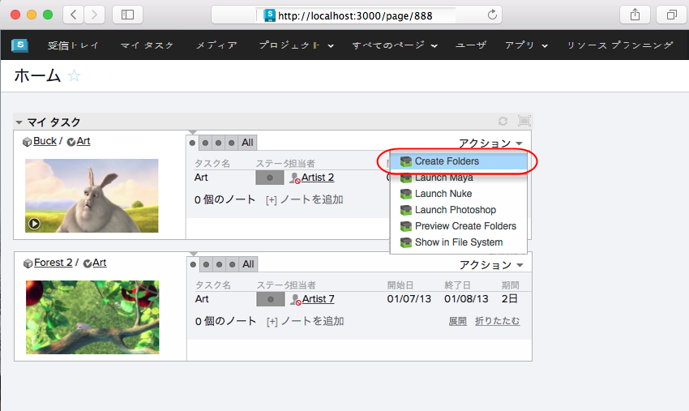
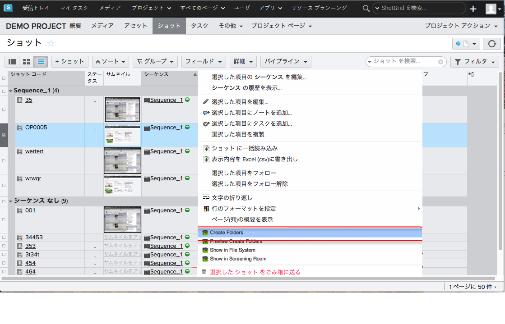

# ShotGrid フォルダ

 Toolkit には、設定に基づいて標準化されたフォルダ構造を作成するシステムが組み込まれています。このため、複数のショットで一貫したファイル システム レイアウトを簡単に作成できます。

このアプリは、Sgtk Core API のファイル システム作成 API メソッドを  に接続します。これにより、一連のショットまたはアセットをクリックして、Create Folders アクションをクリックするだけで簡単にフォルダを作成できます。

## 仕組み
1 つまたは複数のタスク、ショット、または(設定に応じて)他のエンティティを選択します。ここでアクション メニューから作成フォルダを選択します。処理が完了したら、作成したフォルダの数が報告されます。

