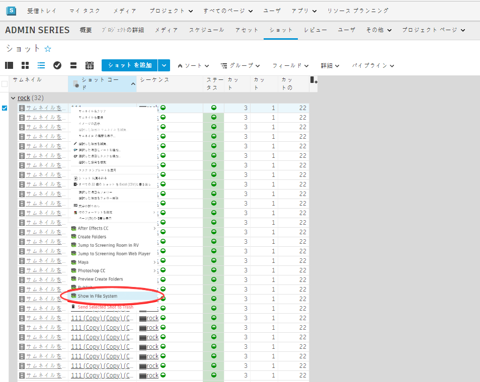

# ShotGrid 起動フォルダ

Launch Folder アプリは  ユーティリティです。 からファイル システムにジャンプできるようにします。

## 仕組み
Launch Folder アプリを使用すると、 からファイル システムにジャンプできます。このアプリは、ショット、アセット、シーケンスなどの  エンティティに登録できます。有効にすると、Action メニューに表示されます。

1 つまたは複数のエントリを  で選択できます。メニュー アクションを選択すると、標準のファイル ブラウザ(Windows のエクスプローラーや Mac の Finder など)が起動されます。

