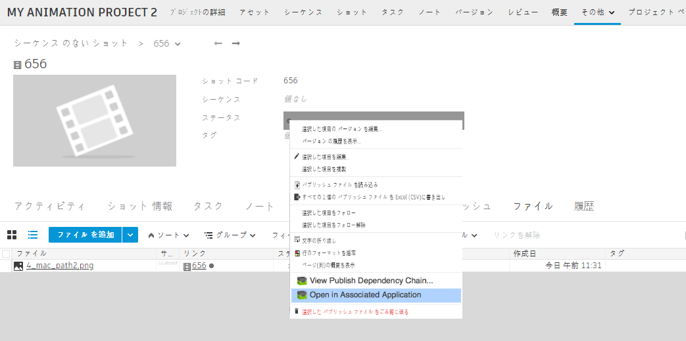

# ShotGrid Launch Publish

このアプリにより、 のパブリッシュされたファイルのエンティティで、[関連アプリケーションで開く](Open in Associated Application)アクションを実行できるようになります。これにより、既にパブリッシュされたファイルを簡単に開くことができます。ファイルに移動して右クリックし、アクションを選択するだけです。

このアプリにより、異なるファイルに別々のアプリ起動シーケンスを簡単に設定できます。このすべての操作はフック内から実行します。また、ビューア(RV など)にイメージ シーケンスを割り当てることもできます。このフックで認識されないファイルは、OS レベルのアプリに割り当てられます。
