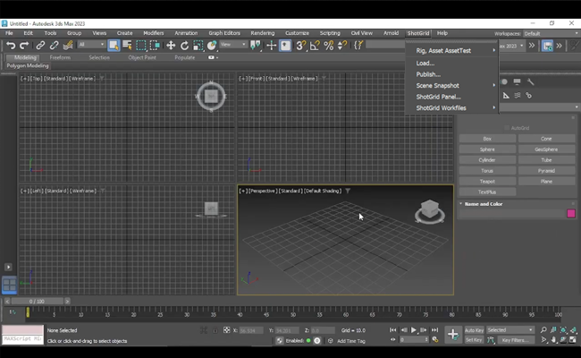

# 3dsMax Plus

 Engine for 3ds Max Plus は、3ds Max アプリケーションと  Pipeline Toolkit の橋渡しを行います。エンジンは PySide とすべてのマルチ アプリをサポートします。つまり、3ds Max 内の標準的なアプリ(Maya や Nuke などで動作するのと同じアプリ)を実行できます。このエンジンは 3ds Max と Python API を使用します。


## サポート対象のアプリケーション バージョン

この項目はテスト済みです。アプリケーション バージョン 2016-2020 で動作することが分かっています。 最新のリリースでの動作は十分可能ですが、正式なテストはまだ完了していません。

## ドキュメント

このエンジンは、Max Plus の Python サポートを介して  Pipeline Toolkit (Sgtk) と 3D studio Max を接続します。



## インストールと更新

###  Pipeline Toolkit にこのエンジンを追加する

Project XYZ にこのエンジンを追加するには、asset という名前の環境で次のコマンドを実行します。

```
> tank Project XYZ install_engine asset tk-3dsmaxplus
```

### 最新バージョンに更新する

この項目が既にプロジェクトにインストールされている場合に最新バージョンを取得するには、update コマンドを実行します。特定のプロジェクトに含まれている tank コマンドに移動し、そこでこのコマンドを実行します。

```
> cd /my_tank_configs/project_xyz
> ./tank updates
```

または Studio の tank コマンドを実行し、プロジェクトの名前を指定して、更新チェックを実行するプロジェクトを指定します。

```
> tank Project XYZ updates
```


## コラボレーションと発展

 Pipeline Toolkit にアクセスできる場合は、すべてのアプリ、エンジン、およびフレームワークのソース コードにも Github からアクセスできます。これらは Github を使用して格納および管理しています。これらの項目は自由に発展させてください。さらなる独立した開発用の基盤として使用したり、変更を加えたり(その際はプル リクエストを送信してください)、 いろいろと研究してビルドの方法やツールキットの動作を確認してください。このコード リポジトリには、https://github.com/shotgunsoftware/tk-3dsmaxplus からアクセスできます。

## 特殊な要件

上記の操作を行うには、 Pipeline Toolkit Core API バージョン v0.19.18 以降が必要です。
