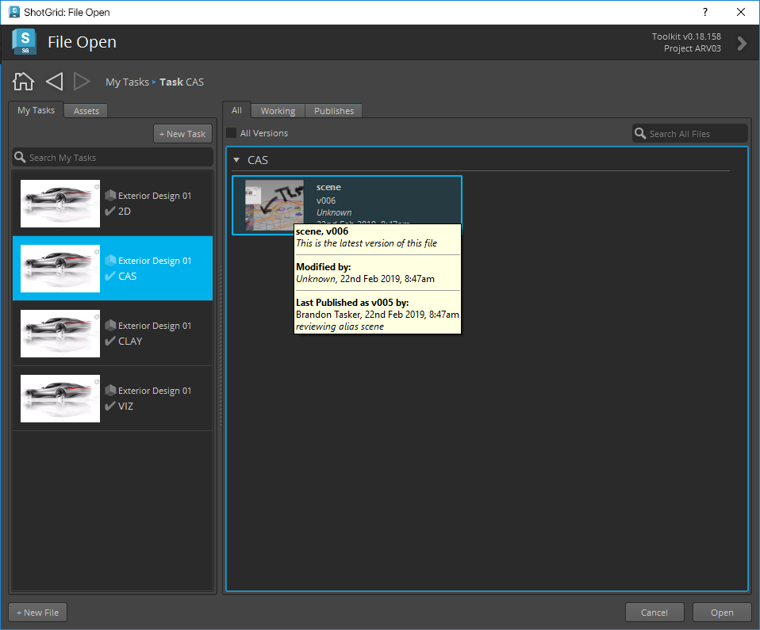

# Alias

 Engine for Alias は、 アプリと Alias を統合するための標準プラットフォームを提供します。軽量で操作性に優れており、Alias のメニューに  のメニューを追加します。

## サポート対象のアプリケーション バージョン

この項目はテスト済みです。次のアプリケーション バージョンで動作することが分かっています。 



最新のリリースでの動作は十分可能ですが、正式なテストはまだ完了していません。

## Python バージョンのサポート

> **重要:** Alias  ツールキット エンジンの v2.1.5 のリリースでは、Python v2.7.x のサポートが廃止されました。[ Desktop v1.7.3 (以降)をダウンロードして、Python 3 が既定で使用されるようにしてください。](https://community.shotgridsoftware.com/t/a-new-version-of-shotgrid-desktop-has-been-released/13877/14)

## 旧バージョン

[旧バージョンに対する Python バージョンのサポートの詳細を確認してください](https://github.com/shotgunsoftware/tk-alias/wiki/Python-Version-Support#older-versions)。

***
### 注記

ローカルにインストールされたインタプリタが予期しない動作を引き起こす可能性があります。スタジオ環境でこの機能を使用する場合は、[サポートにお問い合わせ](https://knowledge.autodesk.com/ja/contact-support)ください。

## アプリ開発者向けの情報
    
### PySide

 Engine for Alias には、 Desktop に付属の PySide がインストールされており、必要に応じて有効になります。 

### Alias プロジェクトの管理

 Engine for Alias が起動すると、このエンジンの設定で定義された場所を Alias プロジェクトが参照するように設定されます。つまり、新しいファイルを開くと、このプロジェクトも変更される場合があります。ファイルに基づく Alias プロジェクトの設定方法に関連する詳細設定は、テンプレート システムを使用して設定ファイルで指定できます。

***

## tk-alias を使用する

この  の統合では、Alias アプリケーション ファミリ(Concept、Surface、AutoStudio)がサポートされます。

Alias を開くと、 のメニュー(Alias エンジン)がメニュー バーに追加されます。

### ファイルの表示と保存

[マイ タスク] (My Tasks)タブと[アセット] (Assets)タブを使用すると、割り当てられたすべてのタスクを表示して、アセットを参照できます。 右側では、これらのタブを使用してすべてのファイル、作業ファイル、またはパブリッシュ ファイルを表示します。これらのファイルは、左側で選択されているものに関連付けられています。

### パブリッシュ

[パブリッシュ] (Publish)ダイアログを開き、ファイルを  にパブリッシュします。パブリッシュ ファイルは、下流工程でアーティストが使用します。詳細については、「[Alias でパブリッシュする](https://github.com/shotgunsoftware/tk-alias/wiki/Publishing)」を参照してください。 

### ローダー

Content Loader アプリを開いて、Alias にデータをロードできます。詳細については、「[Alias でロードする](https://github.com/shotgunsoftware/tk-alias/wiki/Loading)」を参照してください。

### シーンの詳細情報

[詳細情報](Breakdown)ダイアログが開き、参照される(WREF リファレンス)コンテンツのリストが表示され、シーン内で古くなっているものや Published File の別のバージョンを使用しているものが表示されます。詳細については、「[Alias の Scene Breakdown](https://github.com/shotgunsoftware/tk-alias/wiki/Scene-Breakdown)」を参照してください。

