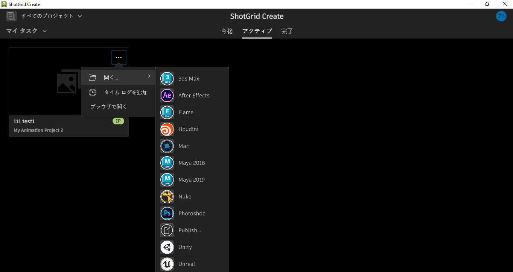

#  Create

Desktop2 Engine は [ Create](https://help.autodesk.com/view/SGSUB/JPN/?guid=SG_Supervisor_Artist_sa_create_sa_intro_create_html) アプリケーション内で実行されるエンジンです。 Create および  Web アプリケーションからブラウザ統合を介して DCC を起動する場合に使用します。

tk-desktop2 エンジンは、Toolkit と  Create の統合をサポートします。 Create は、[DCC の起動](https://help.autodesk.com/view/SGSUB/JPN/?guid=SG_Supervisor_Artist_sa_create_sa_create_artists_html#launching-your-creative-apps)など、Toolkit のユーザが慣れている機能をサポートします。




## インストールと更新

###  Pipeline Toolkit にこのエンジンを追加しています

Project XYZ にこのエンジンを追加するには、asset という名前の環境で次のコマンドを実行します。

```
> tank Project XYZ install_engine asset tk-desktop2
Updating to the latest version
```

この項目が既にプロジェクトにインストールされている場合に最新バージョンを取得するには、`update` コマンドを実行します。特定のプロジェクトに含まれている tank コマンドに移動し、そこでこのコマンドを実行します。

```
> cd /my_tank_configs/project_xyz
> ./tank updates
```

または、`tank` コマンドを実行し、プロジェクトの名前を指定して、更新チェックを実行するプロジェクトを指定します。

```
> tank Project XYZ updates
```

## コラボレーションと発展
	
 Pipeline Toolkit にアクセスできる場合は、すべてのアプリ、エンジン、およびフレームワークのソース コードにも Github からアクセスできます。これらは Github を使用して格納および管理しています。これらの項目は自由に展開できます。さらに独立した開発のベースとして使用したり、変更を加えたり(プルリクエストを送信して戻してください)、または機能を使い、どのように作られたのか、ツールキットがどのように機能するのかを確認することもできます。このコード リポジトリには、https://github.com/shotgunsoftware/tk-desktop2 からアクセスできます。

## 特殊な要件

上記の操作を行うには、Pipeline Toolkit Core API バージョン v0.19.1 以降が必要です。

##  統合エラーを修正しています

ユーザに次のエラー メッセージが表示されます。*統合の初期化に失敗しました。ValueError -  のローカル ホスト証明書データが無効です。サポートにお問い合わせください。*このエラーメッセージは、 インスタンスが  Toolkit 統合を使用するように設定されていない場合に、 機能にアクセスしようとしていることを示しています。 

ユーザが  Toolkit にアクセスしてエラー メッセージを表示しないようにするには、環境変数 `SHOTGUN_CREATE_DISABLE_TOOLKIT_INTEGRATION` を有効にします。この環境変数は、Create での  Toolkit の統合を完全に無効にします。

誤ってこの環境変数を有効にした場合、無効にすると  Toolkit 統合が復元されます。
