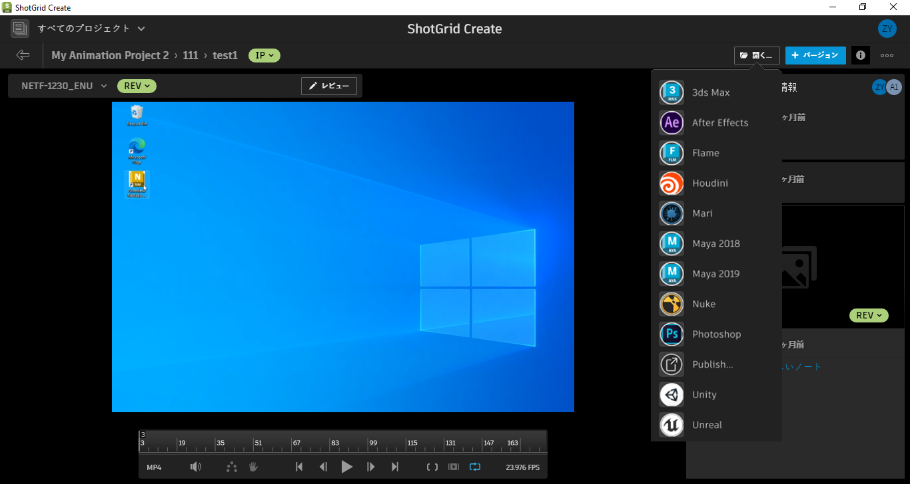

#  Create

Desktop2 Engine は [ Create](https://help.autodesk.com/view/SGSUB/JPN/?guid=SG_Supervisor_Artist_sa_create_sa_intro_create_html) アプリケーション内で実行されるエンジンです。 Create から DCC を起動した場合と、ブラウザの統合を使用して  Web アプリケーションから DCC を起動した場合を処理します。

tk-desktop2 エンジンは、Toolkit と  Create の統合を実現します。 Create は、[DCC の起動](https://help.autodesk.com/view/SGSUB/JPN/?guid=SG_Supervisor_Artist_sa_create_sa_create_artists_html#launching-your-creative-apps)など、Toolkit のユーザが精通している機能をサポートしています。




## インストールと更新

###  Pipeline Toolkit にこのエンジンを追加する

Project XYZ にこのエンジンを追加するには、asset という名前の環境で次のコマンドを実行します。

```
> tank Project XYZ install_engine asset tk-desktop2
Updating to the latest version
```

この項目が既にプロジェクトにインストールされている場合に最新バージョンを取得するには、`update` コマンドを実行します。特定のプロジェクトに含まれている tank コマンドに移動し、そこでこのコマンドを実行します。

```
> cd /my_tank_configs/project_xyz
> ./tank updates
```

または、`tank` コマンドを実行し、プロジェクトの名前を指定して、更新チェックを実行するプロジェクトを指定します。

```
> tank Project XYZ updates
```

## コラボレーションと発展

 Pipeline Toolkit にアクセスできる場合は、すべてのアプリ、エンジン、およびフレームワークのソース コードにも Github からアクセスできます。これらは Github を使用して格納および管理しています。これらの項目は自由に発展させてください。さらなる独立した開発用の基盤として使用したり、変更を加えたり(その際はプル リクエストを送信してください)、 いろいろと研究してビルドの方法やツールキットの動作を確認してください。このコードリポジトリには、https://github.com/shotgunsoftware/tk-desktop2 からアクセスできます。

## 特殊な要件

上記の操作を行うには、 Pipeline Toolkit Core API バージョン v0.19.1 以降が必要です。