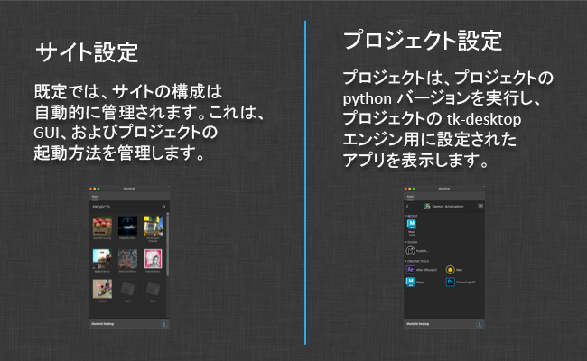

# Desktop

tk-desktop エンジンは Toolkit アプリケーションを簡単に実行できるアプリケーションです。これはシステム トレイ ベースのウィンドウで、Toolkit の開始、Toolkit のプロジェクトのセットアップ、プロジェクトのパイプラインへのアクセスを簡単に行うことができます。

## サイト設定とプロジェクト設定



デスクトップ アプリケーションを起動すると、サイト設定用に tk-desktop エンジンが起動されます。この動作を無効にして、その環境の内容を制御することもできますが、通常はこの設定が自動的に管理されます。

Toolkit の基本原則の 1 つは、プロジェクト同士を完全に分離できることです。これは通常、あるプロジェクトに対して行った変更が(配信間近の)他のプロジェクトに悪影響を与えないようにするために行います。このようにプロジェクトを分離するため、特定のプロジェクトのコマンドを実行する場合、デスクトップ エンジンはこのプロジェクト用に初期化された個別の Python インタプリタでコマンドを実行するようにします。

プロジェクトをクリックすると、Python インタプリタはバックグラウンドで起動されます。この Python インタプリタは、プロジェクトが使用できるように設定されているため、起動時にこのプロジェクトの tk-desktop を初期化します。エンジンのこのインスタンスは起動するコマンドを GUI に通知します。

コマンドをクリックすると、このバックグラウンド Python プロセスがコマンドの起動を管理します。これにより、あるプロジェクトで Python 2.6 を実行し、別のプロジェクトで Python 2.7 をテストすることなどが可能です。

## カスタム パネルを登録する

[パネル ベースの UI](http://developer.shotgunsoftware.com/tk-core/platform.html#sgtk.platform.Engine.show_panel) がある Toolkit アプリは、実行時に Desktop の内側のタブに自動的にドッキングされます。

 Panel などのパネル ベースのアプリを  Desktop でタブとして表示したい場合は、起動時に実行されるように設定します。Desktop がサイト コンテキスト モード(すべてのプロジェクトが表示される)で起動すると、自動起動するよう登録されたすべての項目が起動します。これらの項目にパネルが含まれる場合、ドッキングされます。項目は、設定で定義された順序で処理され、これによりタブの順序が決まります。

たとえば、 Panel を  Desktop にタブとして表示する場合は、サイト レベルの環境に次の設定を追加します。

```yaml
tk-desktop:
  apps:
    tk-multi-shotgunpanel:
      actions_hook: ...
      action_mappings: ...
      location: ...
  location: ...
  run_at_startup:
  - {app_instance: '', name: Apps}
  - {app_instance: tk-multi-shotgunpanel, name: ''}
```

`Apps` エントリは特別であり、既定の `Apps` タブが表示される場所(タブの順序)をコントロールすることに注意してください。

