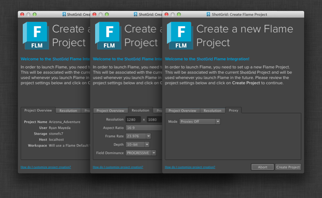

# Flame

## インストール

 Engine for Flame は、Flame 2015 Extension 2 に追加されている新しい統合フックを使用します。エンジンを機能させるためには、このバージョンの Flame を使用する必要**があります。Flame 2015 Extension 2 の詳細(取得方法など)については、「[Flame サポート](https://knowledge.autodesk.com/ja/support/flame-products/troubleshooting/caas/sfdcarticles/sfdcarticles/JPN/Contacting-Autodesk-Flame-or-Smoke-Customer-Support.html)」を参照してください。

 Engine for Flame の最も簡単な開始方法は、パイプライン設定例を使用して新しいテスト プロジェクトをセットアップすることです。それには、 Desktop を起動して、新しいプロジェクトのプロジェクト セットアップを実行し、(既定の設定セクションで)既定の Flame 設定を選択します。

## Flame プロジェクトのセットアップ

 Engine for Flame は  プロジェクトと Flame プロジェクトを関連付け、必要に応じてプロジェクトを作成します。Flame データが  の適切なデータと関連付けられるため、これが統合の鍵となります。追加機能として、エンジンには Flame プロジェクトの命名規則およびプロジェクトの他のさまざまな設定を管理するための機能が用意されています。

Flame を  から初めて起動すると、Flame プロジェクト作成 UI が表示されるため、アーティストは標準的な Flame プロジェクト作成画面から通常の設定を編集できます。

ただし、 と統合すると、パイプラインに最適な値があらかじめ設定されるため、アーティストは設定値について検討しなくてもすぐに使用することができます。既定値は `project_setup_hook` を介してカスタマイズできます。次のオプションをサポートしています。

`use_project_settings_ui` `True` に設定すると、プロジェクト作成 UI が表示されます。`False` の場合、Flame プロジェクトはフック内の他の既定値に基づいて自動的に作成されます。

`get_server_hostname`
 既定では「localhost」に設定されますが、必要に応じてオーバーライドできます。

`get_project_name` 既定では  プロジェクトと同じ値に設定されますが、必要に応じてオーバーライドできます。

`get_volume` 既定では最初に利用可能なストレージに設定されますが、必要に応じてオーバーライドできます。

`get_workspace` 既定では、Flame は標準的なワークスペース作成ロジックに従って既定のワークスペースを作成しますが、必要に応じてオーバーライドできます。

`get_user` Flame マシンにログインしたユーザと  のユーザの関連付けを試行します。

`get_project_settings` Flame のメイン設定を指定し、フックで Flame プロジェクト XML ストリームを構築する場所です。次のパラメータを指定する必要**があります。

* FrameWidth (例: `1280`)
* FrameHeight (例: `1080`)
* FrameDepth (`16-bit fp`、`12-bit`、`12-bit u`、`10-bit`、`8-bit`)
* FieldDominance (`PROGRESSIVE`、`FIELD_1`、`FIELD_2`)
* AspectRatio (`4:3`、`16:9`、または文字列として浮動小数点値)

プロキシ設定を指定することもできます。詳細については、[Autodesk Wiretap SDK のマニュアル](http://usa.autodesk.com/adsk/servlet/index?siteID=123112&id=7478536)を参照してください。

project_setup フックのコードベース全体を確認するには、[該当のエンジン向けの Github リポジトリ](https://github.com/shotgunsoftware/tk-flame/blob/master/hooks/project_startup.py)を参照してください。

