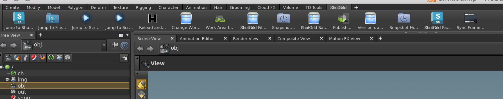
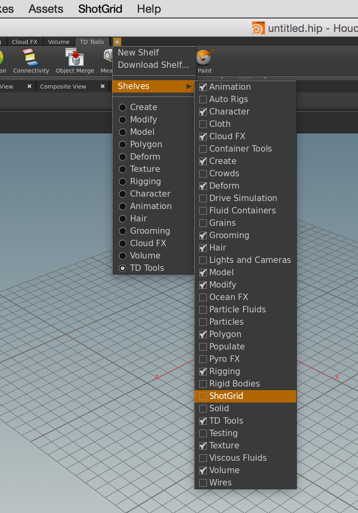
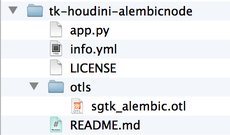

# Houdini

 Engine for Houdini は、 アプリと Houdini を統合するための標準プラットフォームを提供します。


# アプリ開発者向けの情報

## サポートされているプラットフォーム

現在、 Engine for Houdini は Windows、Linux、OSX でサポートされています。

## サポート対象のアプリケーション バージョン

この項目はテスト済みです。次のアプリケーション バージョンで動作することが分かっています。



## PySide

古いバージョンの Houdini (13 以前)の場合、PySide の外部ビルドが必要です。Windows の場合、Houdini が実行する Python と連携する、互換性のある PySide ビルドがバンドルされています。Linux の場合、Houdini は PySide または PyQt のサポートが必要な Python システム(http://www.sidefx.com/docs/houdini12.0/hom/)を使用しています。

## メニューのロード


Houdini 15 以降では、Side Effects により動的メニュー システムが導入され、このエンジンでコンテキスト切り替え時に  メニューの再構築がサポートされるようになりました。

Houdini 14 以前では、Houdini の  メニューは Houdini の起動前に生成され、セッション全体で固定されます。このため、メニューに登録されている Toolkit コマンドは、コンテキストが変更されても更新されません。

##  シェルフ



リリース **v0.2.4** では、エンジンに動的  シェルフが導入されています。このシェルフでは登録されたアプリ コマンドがツール ボタンとして表示されます。ボタンはメニュー コマンドとほとんど同じ順序で表示されます。

環境内のシェルフをオンにするには `enable_sg_shelf` 設定を使用します。動的メニューをサポートしないバージョンの Houdini (14 以前)を使用する場合、シェルフの使用時に  メニューをオフにすることもできます。その場合は、`enable_sg_menu` 設定を `false` に設定します。

シェルフを使用したコンテキストの切り替えを有効にするには、エンジン設定の `tk-multi-workfiles` アプリの `sg_entity_types` 設定にエンティティ タイプも追加する必要があります。

次に、 シェルフに関連する設定を示します。

```yaml
tk-houdini:
  apps:
    # ... other app definitions
    tk-multi-workfiles:
       # ... other app settings
       sg_entity_types: [Shot, Asset] # allow context switching to Shots or Assets
       # ... other app settings
  enable_sg_shelf: true
  enable_sg_menu: false
  # ... other engine settings
```

 シェルフを有効にしたら、Houdini 内で設定したシェルフに手動で追加する必要があります。



 シェルフをシェルフ セットに追加すると Houdini セッション間をまたいで保持されますが、 コンテキストが変更されると動的に更新されます。

## パネル

**v0.2.8** 以降のエンジンでは、埋め込み Toolkit パネルのサポートを追加できます。

埋め込まれた適切なパネルをサポートするには、**15.0.272** 以降のバージョンの Houdini が必要です。登録パネルは、サポート対象バージョンの Houdini でペイン メニューのペインとして表示されます。

古いバージョンの Houdini では登録パネルがダイアログとして表示されます。SESI はいくつかのバグ修正を Houdini 14 の最新ビルドに移植する場合があります。その場合は、埋め込みパネルがそれぞれのバージョンで動作するようにします。

## OTL を使用したアプリ

 Engine for Houdini を使用すると、アプリケーションによって提供される OTL ファイルを簡単にロードできます。OTL を使用するアプリを作成する場合、**otls** と呼ばれるフォルダにドロップするだけで、エンジンがアプリをセッションに自動的にロードします。



通常の Houdini メソッドからノードに簡単にアクセスできます。

**警告:**OTL の使用は便利ですが、シーン内で保持されるノードを作成する場合、一般的には適切な解決方法ではありません。その理由は、シーン内に OTL を配置するとすぐに、このシーンと OTL コードの間に依存関係が生まれるためです。シーンのロードのたびに  Toolkit をロードする必要があるだけでなく、コードを更新するときにシーン内で使用されている古い OTL が分割されないように慎重に管理する必要もあります。

## OSX のターミナルからデバッグを起動する

OS X の `tk-houdini` の `debug_logging` をオンにしても、すべてのデバッグ メッセージがターミナルに送信されるわけではありません。これは、既定で [`tk-multi-launchapp`](https://github.com/shotgunsoftware/tk-multi-launchapp) アプリが実行可能ファイルの起動に `open` コマンドを使用するためです。これでターミナルから新しいサブプロセスがスポーンされることはありませんが、代わりに OS X の起動サービスを使用して新しい場所が作成されます。その結果、ログのステートメントが表示されなくなります。Houdini でユーザの既定のデスクトップに Python シェルを保存しても、起動時にデバッグのステートメントは表示されないようです。起動後、埋め込み Python シェルはデバッグ ログのステートメントを表示しますが、起動時に使用可能な出力にはずれが生じます。エンジンの起動時にデバッグ ログのステートメントにアクセスする必要がある場合は、次の 2 つの変更を行います。

最初に、Houdini アプリ バンドル内の実行可能ファイルを指定するようにテスト設定で `houdini_mac` パスを(一時的に)変更します。以下に例を示します。

```yaml
#houdini_mac: /Applications/Houdini 15.0.272/Houdini Apprentice.app
houdini_mac: /Applications/Houdini\ 15.0.272/Houdini\ Apprentice.app/Contents/MacOS/happrentice
```

次に、テスト設定の `config/hooks` ディレクトリの `tk-multi-launchapp` アプリの `app_launch` フックのコピーを作成し、`config/env/includes/app_launchers.yml` ファイルでそのコピーを指定します。

```yaml
launch_houdini:
  defer_keyword: ''
  engine: tk-houdini
  extra: {}
  hook_app_launch: app_launch    # <----- use a custom app_launch hook
  hook_before_app_launch: default
  icon: '{target_engine}/icon_256.png'
  linux_args: ''
  linux_path: '@houdini_linux'
  location: {name: tk-multi-launchapp, type: app_store, version: v0.6.6}
  mac_args: ''
  mac_path: '@houdini_mac'
  menu_name: Launch Houdini
  versions: []
  windows_args: ''
  windows_path: '@houdini_windows'
```

その後は実行可能ファイルを直接起動するように起動ロジックを修正するだけです。たとえば、ディレクトリの古い動作(アプリケーション バンドル)を維持し、それ以外のコマンドを直接実行するとします。次に例を示します。

```python
        elif system == "darwin":
            # on the mac, the executable paths are normally pointing
            # to the application bundle and not to the binary file
            # embedded in the bundle, meaning that we should use the
            # built-in mac open command to execute it
            if os.path.isdir(app_path):
                cmd = "open -n \"%s\"" % (app_path)
                if app_args:
                    cmd += " --args \"%s\"" % app_args.replace("\"", "\\\"")

            # not a directory, execute directly
            else:
                cmd = "%s %s" % (app_path, app_args.replace("\"", "\\\""))
```

ターミナルで `tank` を使用して `launch_houdini` を実行すると、すべてのデバッグ出力を取得できます。テストが完了したら、パスを元に戻して、アプリ起動の変更を取り消してください。デバッグの成功をお祈りします。
