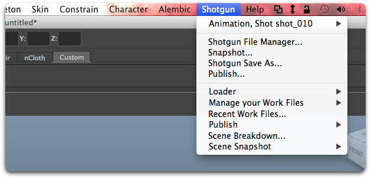

# Maya

 Engine for Maya は、 アプリと Maya を統合するための標準プラットフォームを提供します。軽量で操作性に優れており、Maya のメニュー バーに  のメニューを追加します。



## サポート対象のアプリケーション バージョン

この項目はテスト済みです。次のアプリケーション バージョンで動作することが分かっています。



最新のリリースでの動作は十分可能ですが、正式なテストはまだ完了していません。

## PySide

 Engine for Maya には PySide がインストールされており、必要に応じて有効になります。

## Maya のプロジェクト管理

 Engine for Maya が起動すると、このエンジンの設定で定義された場所を Maya プロジェクトが参照するように設定されます。つまり、新しいファイルを開くと、このプロジェクトも変更される場合があります。ファイルに基づく Maya プロジェクトの設定方法に関連する詳細設定は、テンプレート システムを使用して設定ファイルで指定できます。

## インストールと更新

このエンジンを  Pipeline Toolkit に追加します。
このエンジンを Project XYZ に追加して、さらに asset という環境に追加するには、次のコマンドを実行します。

```
> tank Project XYZ install_engine asset tk-maya
```

### 最新バージョンに更新する

この項目が既にプロジェクトにインストールされている場合に最新バージョンを取得するには、`update` コマンドを実行します。特定のプロジェクトに含まれている tank コマンドに移動し、そこでこのコマンドを実行します。

```
> cd /my_tank_configs/project_xyz
> ./tank updates
```

または Studio の tank コマンドを実行し、プロジェクトの名前を指定して、更新チェックを実行するプロジェクトを指定します。

```
> tank Project XYZ updates
```

## コラボレーションと発展

 Pipeline Toolkit にアクセスできる場合は、すべてのアプリ、エンジン、およびフレームワークのソース コードにも Github からアクセスできます。これらは Github を使用して格納および管理しています。これらの項目は自由に発展させてください。さらなる独立した開発用の基盤として使用したり、変更を加えたり(その際はプル リクエストを送信してください)、 いろいろと研究してビルドの方法やツールキットの動作を確認してください。このコード リポジトリには、https://github.com/shotgunsoftware/tk-maya からアクセスできます。


