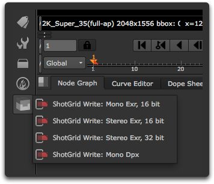
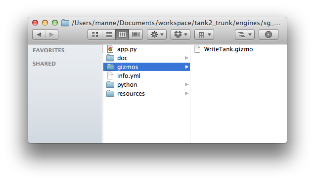
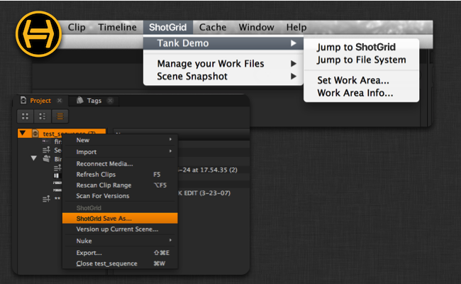
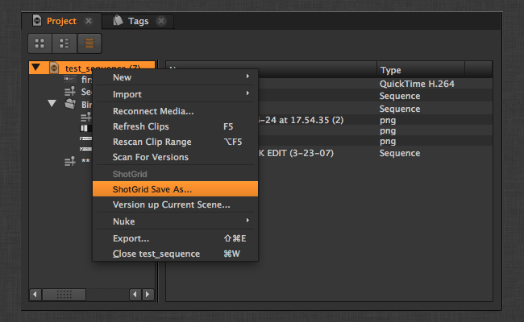
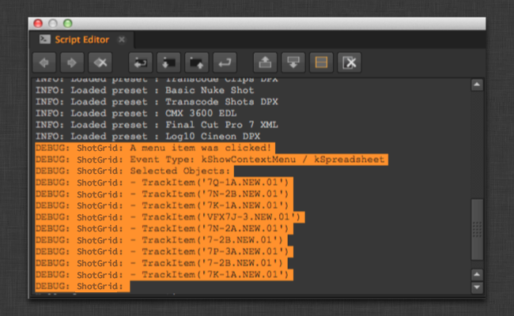

# Nuke

 Engine for Nuke は、 アプリと Nuke、Nuke Studio、および Hiero を統合するための標準プラットフォームを提供します。軽量で操作性に優れており、たくさんの新しい項目を Nuke に追加できます。

Nuke に ** メニュー**が作成され、さまざまな項目が表示されます。


Nuke に ** ノード メニュー**が作成され、さまざまな項目が表示されます。



ファイル システムのさまざまな場所に簡単にジャンプできる  ショートカットがファイル ダイアログに追加されます。


`favourite_directories` 設定を使用すると、現在の環境のテンプレート パスに基づいて独自のショートカットを追加できます。この設定は、リスト内の各項目が新しいお気に入りのディレクトリを表す、ディクショナリのリストを必要とします。次に、使用するフォーマットの例を示します(値として「""」と指定すると、アイコンを未指定のまま残すこともできます)。

```yaml
  favourite_directories:
  - display_name: "Shot Publish Path"
    template_directory: "shot_publish_area_nuke"
    icon: "icons/custom_publish_icon.png"
  - display_name: "Shot Work Path"
    template_directory: "shot_work_area_nuke"
    icon: "icons/custom_work_icon.png"
```

[ の現在のプロジェクト] (Shotgun Current Project)というお気に入りが、定義済みの各ルートに自動的に追加されます。`project_favourite_name` 設定を使用して名前をカスタマイズするか、値を空の文字列 `''` に設定してお気に入りを無効にします。


***

_注: 現在、CentOS 6.5 上で実行される Nuke 8.0 に限り、バグによって Toolkit の実行時に Nuke がクラッシュしてしまいます。他のバージョンの CentOS には影響ありません。Foundry はこの問題を認識しています(バグ 43766)。この問題が発生した場合は、当社までお問い合わせください。Nuke の今後の更新で解決されるまで、問題の回避をお手伝いします。_


## アプリ開発者向けの情報

### コンテキストのトラッキング

 Engine for Nuke は、ファイルのロード時にコンテキストを自動的に切り替えます。ファイルをロードすると、エンジンがファイルを確認してからコンテキストを解決します。

### カスタム ギズモを使用するアプリ

 Engine for Nuke を使用すると、カスタム ギズモを簡単に処理できます。カスタム ギズモを使用するアプリを作成する場合、**gizmos** と呼ばれるフォルダにドロップするだけで、エンジンがこの場所を Nuke のパスに自動的に追加します。



これでノード作成機能からギズモに簡単にアクセスできます。

* `nuke.createNode("WriteTank")`



### ノードを作成するアプリ

カスタム Nuke ノードを作成するアプリは慎重に作成する必要があります。シーンとギズモ コードの間に依存関係が必要になるため、ギズモを使用しないことをお勧めします。その代わりに、カスタム ノードを Nuke ファイルとして保存し、シーンに読み込みます。

```python
    group_node_script = os.path.join(self.disk_location, "resources", "my_group_node.nk")
    group_node = nuke.nodePaste(group_node_script)
```

アプリ内からノードを呼び出すコードは、返されたインスタンスのみを使用できます。

グループ内からアプリを呼び出す必要があるコードは下位互換性を持つように慎重に処理する必要があります。次の手順をお勧めします。

アプリの起動時に、アプリ ハンドルを Nuke ネームスペースの一部として登録します。

```python
    def init_app(self):

        nuke.tk_nuke_nameofmyapp = self
```

たとえば、グループ ノードにボタンがあり、何らかの  アプリ コードを呼び出す場合、 Toolkit が見つからないときには故意に失敗するようにしてください。次のコードは、アプリが作成したグループ ノードに属している Python ボタン ノブに関連付けられたコードです。

```python
# have to gracefully support the case when
# sgtk is not in the system at all!
import nuke
try:
  app = nuke.tk_nuke_nameofmyapp
  app.do_something_v1(nuke.thisNode())
except:
  nuke.warning("Could not do XYZ! Most likely Sgtk is not currently active.")
```

アプリの動作を変更する場合は、アプリのコールバックでバージョン番号を最新にしておきます。これにより、アプリ コードは新旧両方の動作をサポートできます。

## Hiero 内で  Engine for Nuke を使用する

 Engine for Nuke は、Hiero 内で実行される  対応の統合にも使用されます。

アプリケーションの複数の場所(メイン メニュー バーの特定の  メニューや、他の Hiero パネルにあるさまざまな右クリック コンテキスト メニュー)に、 アプリのアクションを登録できます。



### Hiero メニューの設定方法

Hiero にはいくつかの異なるメニューがあるため、Maya や Nuke などよりも、メニュー項目の配置先を設定するオプションがたくさんあります。 Engine for Nuke の Hiero ワークフロー設定は次のようになります。

```yaml

  tk-hiero:
    location: {name: tk-nuke, type: app_store, version: v0.6.9}
    debug_logging: false

    timeline_context_menu:
    - {app_instance: tk-hiero-openinshotgun, keep_in_menu: false, name: Open in Shotgun, requires_selection: true}

    spreadsheet_context_menu:
    - {app_instance: tk-hiero-openinshotgun, keep_in_menu: false, name: Open in Shotgun, requires_selection: true}

    bin_context_menu:
    - {app_instance: tk-multi-workfiles, keep_in_menu: false, name: " Save As...", requires_selection: true}
    - {app_instance: tk-multi-workfiles, keep_in_menu: false, name: "Version up Current Scene...", requires_selection: true}
    - {app_instance: tk-multi-snapshot, keep_in_menu: false, name: "Snapshot...", requires_selection: true}
    - {app_instance: tk-multi-snapshot, keep_in_menu: false, name: "Snapshot History...", requires_selection: true}
    - {app_instance: tk-multi-publish, keep_in_menu: false, name: "Publish Project...", requires_selection: true}

    menu_favourites:
    - {app_instance: tk-multi-workfiles, name: Shotgun File Manager...}
```

ほとんどのエンジンには `menu_favourites` オプションがあります。これは、 のメイン メニューに登録する「ショートカット」を指定するリストです。これとは別に、Hiero 固有の設定には次の 3 つの特別なセクションがあります。

- `timeline_context_menu` は、タイム ライン エディタのクリップを右クリックすると表示されるメニューを表します。
- `spreadsheet_context_menu` は、スプレッドシート エディタの項目をクリックすると表示されるメニューを表します。
- `bin_context_menu` は、bin エディタの項目を右クリックすると表示されるメニューを表します。ここにはさまざまなプロジェクトとメディアがすべて表示されます。

これらのメニューに項目を追加するには、設定で定義する `name` フィールドとアプリがメニューに表示する内容が一致するようにするだけです。

#### 現在のシーンという概念を必要とするアプリ

一部の Toolkit アプリには、既定のシーンまたはプロジェクトの概念が必要です。たとえば、スナップショット アプリは現在のシーンのスナップショットを作成する方法を把握しています。ただし、Maya や Nuke とは異なり、Hiero に現在のシーンという概念はありません。Hiero では複数のプロジェクトを同時に開くことができます。そのため、アプリがクリック対象のプロジェクトを理解できるようにするため、多くの場合フックに特別なロジックを追加することが必要になります。以降のセクションではこの仕組みについて説明します。

### アプリ開発者向けの情報

Hiero には現在のプロジェクトという概念がないため、アプリが Hiero 内でクリックされた内容を簡単に確認できるようにするため、たくさんの強力なツールが追加されています。 Engine for Hiero には、次の 2 つのメソッドが追加されています。


#### get_menu_selection()

最後にクリックしたメニューで選択された Hiero オブジェクトのリストを返します。
このリストにはさまざまなタイプの項目が含まれます。どのメソッドで何が返されたのかを正確に確認するには、デバッグ ログをオンにします。これにより動作内容の詳細が出力されます。

返されるオブジェクトの例は次のとおりです。

- bin ビューでプロジェクトを選択する: [hiero.core.Bin](https://learn.foundry.com/hiero/developers/2.0/hieropythondevguide/api/api_core.html#hiero.core.Bin)
- bin ビューで項目を選択する: [hiero.core.BinItem](https://learn.foundry.com/hiero/developers/2.0/hieropythondevguide/api/api_core.html#hiero.core.BinItem)
- トラックを選択する: [hiero.core.TrackItem](https://learn.foundry.com/hiero/developers/2.0/hieropythondevguide/api/api_core.html#hiero.core.TrackItem)

`list` engine_object.get_menu_selection()

**パラメータと戻り値**

* **戻り値:** Hiero オブジェクトのリスト

**例**

最後にクリックして選択したオブジェクトを取得します。1 つのオブジェクトが選択されており、このオブジェクトが有効な Hiero プロジェクトであることを確認します。これは Hiero でプロジェクトの保存、ロード、またはパブリッシュ操作をトリガする場合などに役立ちます。

```python
# get the menu selection from the engine
selection = engine_obj.get_menu_selection()

if len(selection) != 1:
    raise TankError("Please select a single Project!")

if not isinstance(selection[0] , hiero.core.Bin):
    raise TankError("Please select a Hiero Project!")

project = selection[0].project()
if project is None:
    # apparently bins can be without projects (child bins I think)
    raise TankError("Please select a Hiero Project!")
```

#### HieroEngine.get_menu_category()

最後にクリックしたメニューがある UI 領域を返します。このコマンドはあまり使用しないかもしれません。読み出し元のメニューに応じて異なる動作を求めるアプリ コマンドを使用する場合に必要になることがあります。

`area_enum` engine_object.get_menu_category()

**パラメータと戻り値**

次の定数の 1 つを返します。

- `HieroEngine.HIERO_BIN_AREA`
- `HieroEngine.HIERO_SPREADSHEET_AREA`
- `HieroEngine.HIERO_TIMELINE_AREA`
- `None` (不明または未定義の場合)

#### Hiero と連携するようにフックを設定する方法

通常、Hiero で設定したマルチ アプリでは、どのプロジェクトがクリックされているかを特定する必要があります。たとえば、`tk-multi-workfiles` アプリでプロジェクトの[ を名前を付けて保存] (Shotgun Save As)を実行する必要があるとします。そのため、ユーザが bin ビュー内のプロジェクトを右クリックして *[名前を付けて保存] (Save As)*オプションを選択できるように、Hiero の bin メニューに Tank Save As コマンドを追加します。



エンジンの設定は次のようになります。

```yaml
bin_context_menu:
- {app_instance: tk-multi-workfiles, keep_in_menu: false, name: " Save As...", requires_selection: true}
```

ここでは、アプリ自体の各エンジンで保存やロードなどのシーン イベントを処理するフックを設定する必要があります。Maya や Nuke などのアプリケーションの場合、通常は保存やロードなどを実行するだけです。
ただし Hiero の場合は、実際にクリックされたプロジェクトを見つけてから開始する必要があります。前述のフック コードの例は、次のようになります。

```python
class SceneOperation(Hook):
    """
    Hook called to perform an operation with the
    current scene
    """

    def execute(self, operation, file_path, context, **kwargs):
        """
        Main hook entry point

        :operation: String
                    Scene operation to perform

        :file_path: String
                    File path to use if the operation
                    requires it (e.g. open)

        :context:   Context
                    The context the file operation is being
                    performed in.

        :returns:   Depends on operation:
                    'current_path' - Return the current scene
                                     file path as a String
                    'reset'        - True if scene was reset to an empty
                                     state, otherwise False
                    all others     - None
        """

        if operation == "current_path":
            # return the current script path
            project = self._get_current_project()
            curr_path = project.path().replace("/", os.path.sep)
            return curr_path

        elif operation == "open":
            # open the specified script
            hiero.core.openProject(file_path.replace(os.path.sep, "/"))

        elif operation == "save":
            # save the current script:
            project = self._get_current_project()
            project.save()

        elif operation == "save_as":
            project = self._get_current_project()
            project.saveAs(file_path.replace(os.path.sep, "/"))

        elif operation == "reset":
            # do nothing and indicate scene was reset to empty
            return True

        elif operation == "prepare_new":
            # add a new project to hiero
            hiero.core.newProject()


    def _get_current_project(self):
        """
        Returns the current project based on where in the UI the user clicked
        """

        # get the menu selection from the engine
        selection = self.parent.engine.get_menu_selection()

        if len(selection) != 1:
            raise TankError("Please select a single Project!")

        if not isinstance(selection[0] , hiero.core.Bin):
            raise TankError("Please select a Hiero Project!")

        project = selection[0].project()
        if project is None:
            # apparently bins can be without projects (child bins I think)
            raise TankError("Please select a Hiero Project!")

        return project
```

#### メニュー イベントの確認にデバッグ ログを使用する

特定の選択項目がクリックされた場合に Hiero から返されるオブジェクトを確認するには、エンジン デバッグ モードをオンにするだけです。スクリプト エディタで、各クリックで選択したオブジェクトの概要を取得します。



