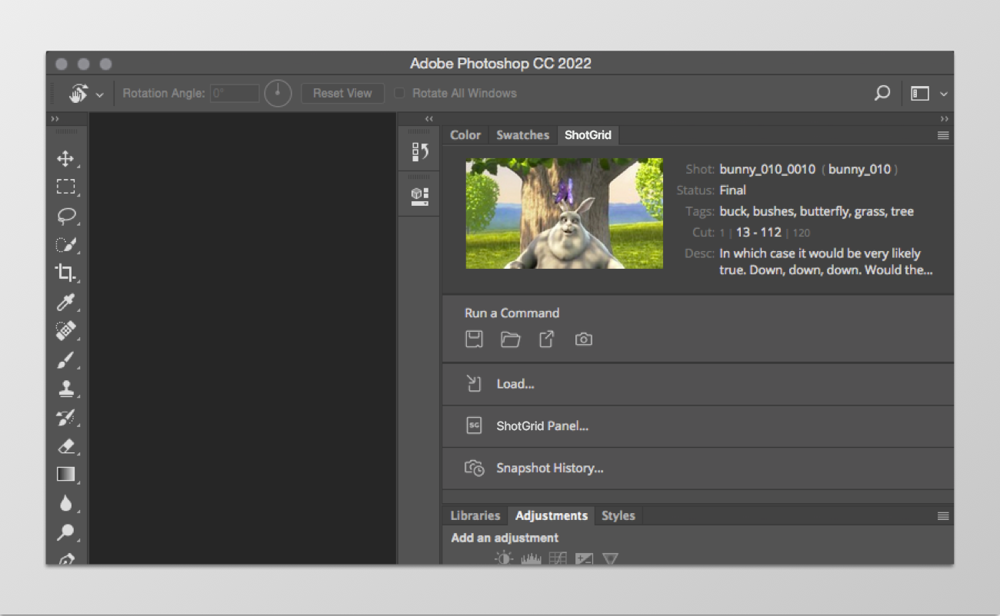
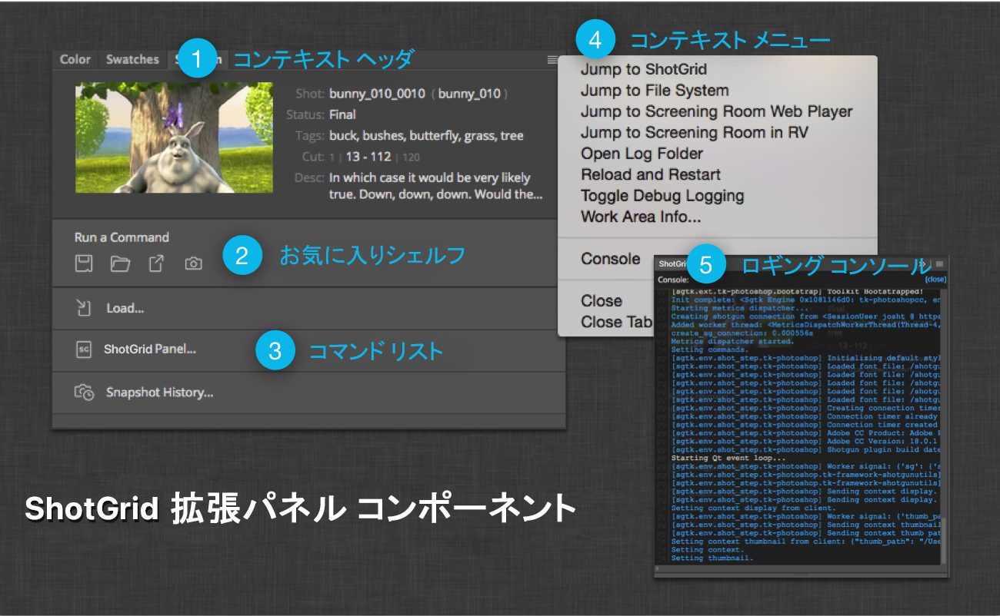
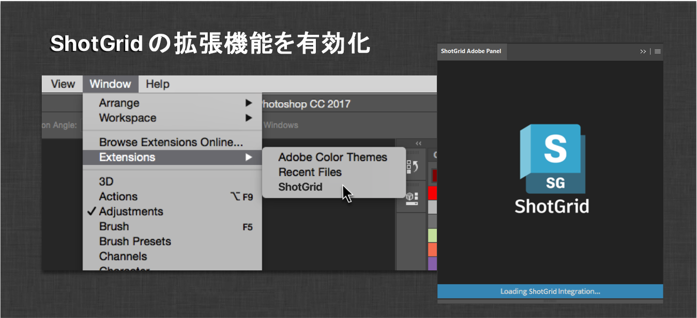
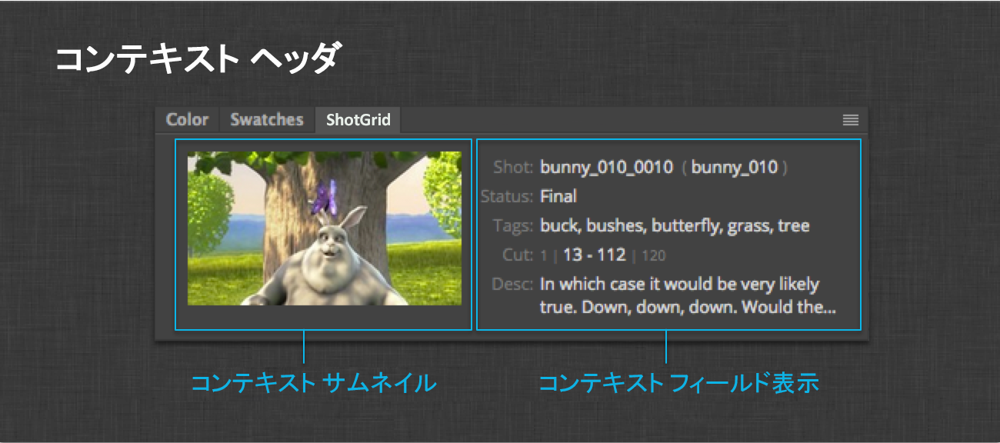
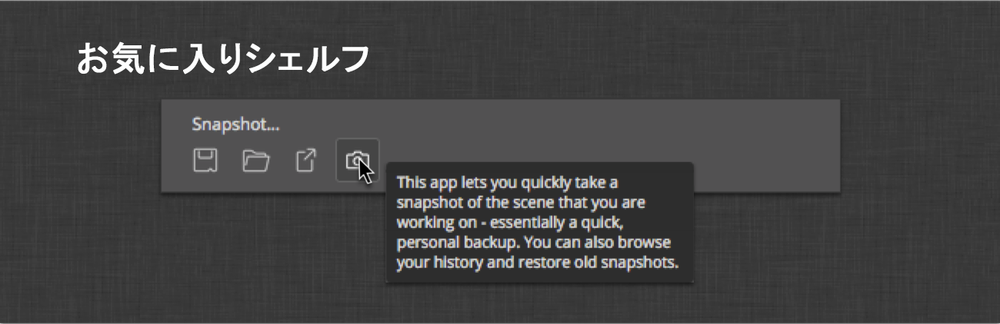
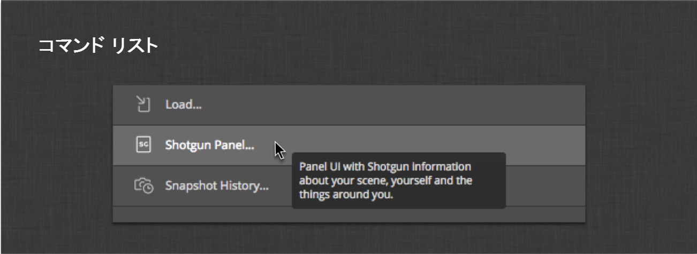
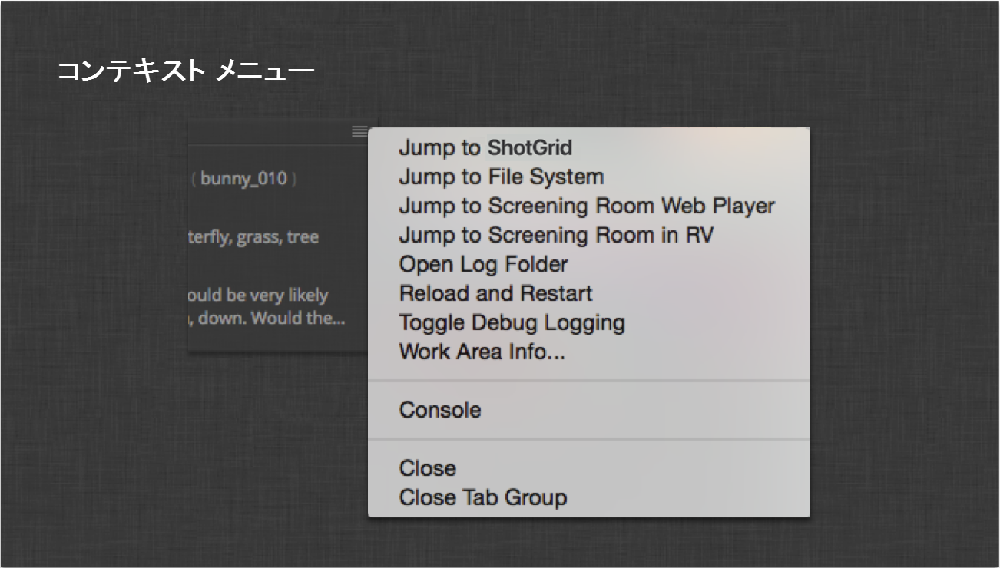
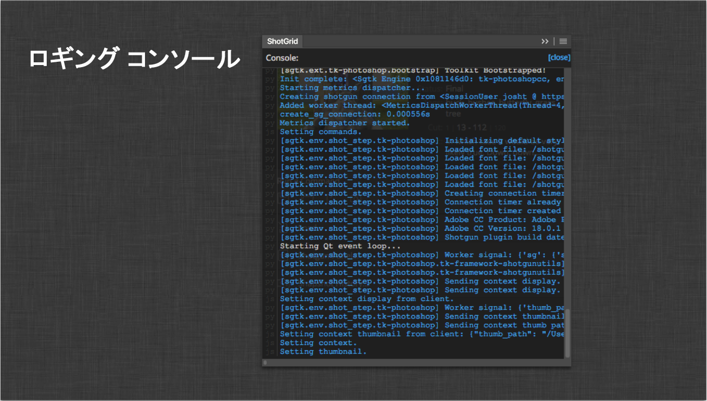

# Photoshop

 Engine for Photoshop CC は、 と Photoshop CC のワークフローを統合するプラットフォームを提供します。 Pipeline Toolkit の標準エンジンで構成され、[tk-framework-adobe](https://github.com/shotgunsoftware/tk-framework-adobe) (CEP)を使用します。

有効にすると、**Adobe パネル**を Photoshop CC で使用できるようになります。現在の  コンテキストの情報とそのコンテキストにインストールされたアプリに登録されているコマンドが表示されます。



## サポート対象のアプリケーション バージョン

この項目はテスト済みです。次のアプリケーション バージョンで動作することが分かっています。



最新のリリースでの動作は十分可能ですが、正式なテストはまだ完了していません。

## インタフェースの概要

 拡張パネルは、Photoshop CC のネイティブ パネルと同じカラー パレットと基本レイアウトを使用します。次の 5 つのコンポーネントで構成されます。



1. **コンテキスト ヘッダ**: 現在のコンテキストのサムネイルとフィールドです。
2. **お気に入りシェルフ**: 現在のコンテキストで最もよく使用するアプリを表示するように設計されています。
3. **コマンド リスト**: 現在のコンテキストのお気に入りではないすべてのコマンドです。
4. **コンテキスト メニュー**: 追加のコンテキスト関連コマンドとデバッグ ツールです。
5. **ロギング コンソール**: デバッグのログ出力を表示するコンソール オーバーレイです。

## インストール

 Engine for Photoshop CC のインストールには、 と他の製品を統合する場合と同じプロトコルを使用します。エンジンやアプリのインストールについては、「[Toolkit を管理する](https://developer.shotgridsoftware.com/ja/425b1da4/)」という記事を参照してください。また、統合の設定方法の例については、「[Toolkit の既定の設定](https://github.com/shotgunsoftware/tk-config-default2)」を参照してください。

## 拡張機能を有効にする

拡張機能をインストールしたら、Photoshop CC の拡張メニューから起動する必要があります。



これは、1 回のみ実行する必要があります。それ以降は起動すると、有効にしなくても、 拡張機能パネルが Photoshop CC のレイアウトに表示されるようになります。

一度有効にすると、それ以降の起動では、 統合のブートストラップ時に、拡張パネルにロード画面が表示されます。

通常、この画面は、現在のコンテキストが決定され、コマンドが表示されるまでの数秒間表示されます。

## インタフェースのコンポーネント

以降のセクションでは、 と Photoshop CC を統合した場合のコンポーネントについて説明します。

### コンテキスト ヘッダ

コンテキスト ヘッダは、現在の  コンテキストに関する情報を表示するカスタマイズ可能な領域です。



コンテキストは現在アクティブなドキュメントによって決定されます。コンテキストがエンジンによって決定されると、ヘッダはコンテキストのサムネイル フィールドの詳細を表示するように更新されます。フィールド情報はフックで制御されます。フィールド表示のカスタマイズ方法については、「**コンテキスト フィールド表示フック**」を参照してください。

また、Photoshop CC はマルチドキュメント インタフェースであるため、アクティブなドキュメントを変更するとコンテキストが更新され、それに従って  拡張機能も更新されます。アーティストは、複数の  コンテキストで同時に作業する場合は特に、この動作を把握していることが重要です。

### お気に入りシェルフ

お気に入りシェルフは、Maya や Houdini のような他の  DCC 統合で利用できるお気に入りメニューと似ています。インタフェースのこのセクションはコンテキスト ヘッダのすぐ下にあるので、よく使用する Toolkit アプリが使いやすく、簡単に見つけられるようになります。



シェルフにはお気に入りのコマンドがボタンで表示されます。マウスを上に重ねると、灰色から色付きに変化し、上部のラベルにその名前が表示されます。マウスを上に重ねると、ボタンの説明が表示されます。

いずれかのボタンをクリックすると、実行する登録済みコマンドのコールバックがトリガされます。

コマンドをお気に入りとして指定する方法については、下記の「**shelf_favorites**」セクションを参照してください。

### コマンド リスト

コマンド リストには、現在のコンテキストに登録されているその他の「標準」コマンドが表示されます。



通常、パイプライン設定内にインストールされたアプリはここに表示される 1 つまたは複数のコマンドを登録します。コマンドがお気に入りとして識別されず、コンテキスト メニュー コマンドとしても識別されていない場合は、ここに表示されます。

コマンド リスト ボタンは、お気に入りシェルフ内のボタンと同じように動作します。唯一異なる点は、アイコンの右側に完全な名前のリストとして表示されることです。

### コンテキスト メニュー

コンテキスト メニュー コマンドとして登録されているコマンドは、 拡張パネルのコンテキスト メニューに表示されます。



他のコマンド領域と同様に、このコマンドはコンテキストに応じて変化します。**Jump to ** や **Jump to Filesystem** などのコマンドは常にここから使用できます。

### ロギング コンソール

ロギング コンソールは、CEP JavaScript インタプリタと Toolkit の Python プロセスの両方のログ出力をすべて表示します。



拡張機能に問題があり、サポートが必要な場合、ロギング コンソール出力は、 のサポート チームが問題をデバッグする際に非常に役立ちます。

## 設定と技術の詳細

次のセクションでは、貴社のパイプライン固有のニーズに合わせて統合を設定できるよう、統合の技術的な側面について少し説明します。

### PySide

 Engine for Photoshop CC は PySide を使用します。Pyside のインストールについては、[Pyside をインストールする](https://pyside.readthedocs.io/en/latest/installing/index.html)公式の手順を参照してください。

### CEP 拡張機能

拡張機能自体はエンジンにバンドルされており、エンジンが Photoshop CC の初回起動時に自動的にインストールします。拡張機能は、アーティストが使用するローカル マシンにある OS 固有の標準的な CEP 拡張ディレクトリにインストールされます。

```shell
# Windows
> C:\Users\[user name]\AppData\Roaming\Adobe\CEP\extensions\

# OS X
> ~/Library/Application Support/Adobe/CEP/extensions/
```

Photoshop CC を起動すると、エンジン ブートストラップ コードは、エンジンにバンドルされている拡張機能のバージョンとマシン上にインストールされているバージョンを比較します。つまり、新しいバージョンの拡張機能がバンドルされている場合は、エンジンを更新するとインストールされている拡張機能がバンドルされている新しいバージョンに自動的にアップデートされます。

### お気に入りを設定する

**お気に入りシェルフ**は、インストールしたアプリに登録されているコマンドを表示するように設定できます。表示するには、`shelf_favorites` 設定を環境設定の `tk-photoshopcc` セクションに追加するだけです。次に例を示します。

```yaml
shelf_favorites:
    - {app_instance: tk-multi-workfiles2, name: File Save...}
    - {app_instance: tk-multi-workfiles2, name: File Open...}
    - {app_instance: tk-multi-publish, name: Publish...}
    - {app_instance: tk-multi-snapshot, name: Snapshot...}
```

設定の値は、環境設定にインストールされたアプリの 1 つで提供される、登録済みコマンドを識別するディクショナリのリストです。`app_instance` キーは特定のインストール済みアプリを識別し、`name` キーはこのアプリによって登録されたコマンドの表示名に一致します。上記の例では、4 つのお気に入りコマンドが表示されています。`tk-multi-workfiles2` アプリのファイルの表示と保存のダイアログと、標準の Toolkit のパブリッシュとスナップショットのダイアログです。これら 4 つのコマンドはお気に入りシェルフに表示されます。

### コンテキスト フィールド表示フック

エンジンには、パネルの**コンテキスト ヘッダ** セクションに表示されるフィールドを制御するフックがあります。フックには表示する内容をカスタマイズするためにオーバーライドできる 2 つのメソッドがあります。

最初のメソッドは `get_entity_fields()` メソッドです。このメソッドは、現在の  コンテキストを表すエンティティ タイプを受け入れます。予想される戻り値は、表示するためにクエリーの必要があるエンティティのフィールドのリストです。エンジン自体はデータのクエリーを非同期に処理します。

 からデータをクエリーすると、フックの 2 番目のメソッドが呼び出されます。この `get_context_html()` メソッドは、`get_entity_fields()` メソッドで指定されたクエリー フィールドが入力されたコンテキスト エンティティ ディクショナリを受け取ります。予想される戻り値は、クエリー対象のエンティティ フィールドを表示するためにフォーマット化された HTML を含む文字列です。

これらのメソッドで必要とされる内容については、「[既定のフックの実装](https://github.com/shotgunsoftware/tk-photoshopcc/blob/master/hooks/context_fields_display.py)」を参照してください。

エンジンは、エンティティのサムネイルが使用可能であれば、それを常に表示します。

### Photoshop API

エンジンは Photoshop CC の JavaScript API を Python に公開します。

Photoshop API オブジェクトは `engine.adobe` として公開されます。次の例では、Toolkit のアプリやフック内から Photoshop DOM を直接操作する方法を示します。標準的な Toolkit アプリには、Photoshop マニュアルの操作方法に関する作業例が含まれています。

#### 例
ファイルをロードする。

```python
f = adobe.File('/Path/To/File.jpeg')
adobe.app.load(f)
```

ルーラの単位をピクセルに設定する。

```python
pixels = adobe.Units.PIXELS
adobe.app.preferences.rulerUnits = pixels
```

既定のオプションを使用して Web の現在のドキュメントを書き出す。

```python
temp_thumb_file = adobe.File(out_path)
save_for_web = adobe.ExportType.SAVEFORWEB
export_options = adobe.ExportOptionsSaveForWeb()
adobe.app.activeDocument.exportDocument(temp_thumb_file, save_for_web, export_options)
```

各レイヤを個別のファイルとして書き出す。

```python
doc = adobe.app.activeDocument
layers = doc.artLayers
layers = [layers[i] for i in xrange(layers.length)]
original_visibility = [layer.visible for layer in layers]

save_for_web = adobe.ExportType.SAVEFORWEB
export_options = adobe.ExportOptionsSaveForWeb()

for layer in layers:
    layer.visible = False

for layer in layers:
    layer.visible = True
    out_file = adobe.File("c:/layer.%s.jpg" % str(layer.name))
    doc.exportDocument(
        out_file,
        save_for_web,
        export_options,
    )
    layer.visible = False

for (i, layer) in enumerate(layers):
    layer.visible = original_visibility[i]
```

### 環境変数

デバッグをサポートするために、エンジンの既定値の一部を変更する環境変数のセットが用意されています。

`SHOTGUN_ADOBE_HEARTBEAT_INTERVAL`: Python ハートビート間隔(秒単位、既定は 1 秒)。従来の環境変数 `SGTK_PHOTOSHOP_HEARTBEAT_INTERVAL` が設定されている場合は優先されます。

`SHOTGUN_ADOBE_HEARTBEAT_TOLERANCE`: 終了までのハートビートのエラー数(既定は 2)。従来の環境変数 `SGTK_PHOTOSHOP_HEARTBEAT_TOLERANCE` が設定されている場合は優先されます。

`SHOTGUN_ADOBE_NETWORK_DEBUG`: ログ出力時に追加のネットワーク デバッグ メッセージを含めます。従来の環境変数 `SGTK_PHOTOSHOP_NETWORK_DEBUG` が設定されている場合は優先されます。

`SHOTGUN_ADOBE_PYTHON`: エンジンの起動時に使用する Python の実行可能ファイルへのパス。設定しない場合は、システムの Python が使用されます。Photoshop が  Desktop や tk-shell エンジンなどの Python プロセスから起動される場合、このプロセスで使用する Python は Photoshop との統合で使用されます。

注: 追加の環境変数が Adobe のフレームワークに存在します。詳細については、「[開発者用ドキュメント](https://developer.shotgridsoftware.com/tk-framework-adobe/)」を参照してください。

### アプリ開発者メモ

* Python プロセスは Photoshop CC プロセスから独立しているため、アプリ ウィンドウで上記の Photoshop ウィンドウをできるだけ整理して表示するには、エンジン内でいくつかの作業を行います。このセットアップの注意点の 1 つに、`QFileDialog` にネイティブ OS Windows を使用する既定のオプションがあります。このエンジンを使用してアプリを開発する場合は、ネイティブのダイアログを使用しないオプションを設定してください。[tk-multi-pythonconsole アプリの例を参照してください。](https://github.com/shotgunsoftware/tk-multi-pythonconsole/blob/master/python/app/console.py#L218)
