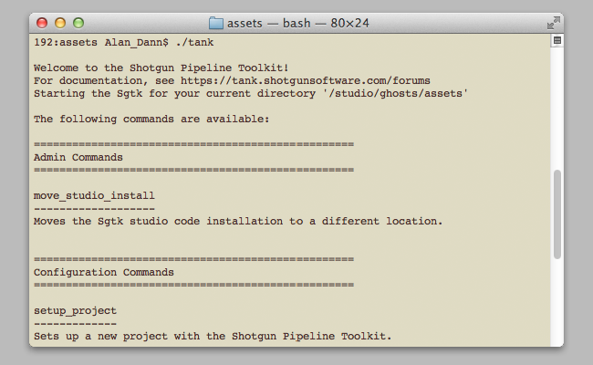

# シェル

シェル用の  Engine はコマンド ライン操作を処理し、Core API の 1 つとして配布される `tank` コマンドと緊密に統合されます。ターミナルで `tank` コマンドを実行すると、Toolkit はアプリの実行を処理するエンジンを起動します。

tank コマンドの詳細については、「[高度な Toolkit 管理](https://developer.shotgridsoftware.com/ja/425b1da4/?title=Advanced+Toolkit+Administration#using-the-tank-command)」のドキュメントを参照してください。



## インストールと更新

###  Pipeline Toolkit にこのエンジンを追加する

Project XYZ にこのエンジンを追加するには、asset という名前の環境で次のコマンドを実行します。


```
> tank Project XYZ install_engine asset tk-shell
```

### 最新バージョンに更新する

この項目が既にプロジェクトにインストールされている場合に最新バージョンを取得するには、`update` コマンドを実行します。特定のプロジェクトに含まれている tank コマンドに移動し、そこでこのコマンドを実行します。

```
> cd /my_tank_configs/project_xyz
> ./tank updates
```

または、`tank` コマンドを実行し、プロジェクトの名前を指定して、更新チェックを実行するプロジェクトを指定します。

```
> tank Project XYZ updates
```

## コラボレーションと発展

 Pipeline Toolkit にアクセスできる場合は、すべてのアプリ、エンジン、およびフレームワークのソース コードにも Github からアクセスできます。これらは Github を使用して格納および管理しています。これらの項目は自由に発展させてください。さらなる独立した開発用の基盤として使用したり、変更を加えたり(その際はプル リクエストを送信してください)、 いろいろと研究してビルドの方法やツールキットの動作を確認してください。このコード リポジトリには、https://github.com/shotgunsoftware/tk-shell からアクセスできます。