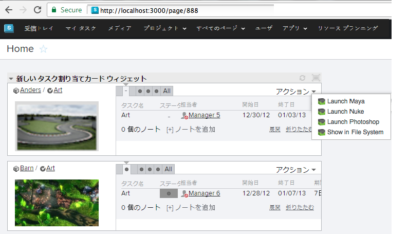
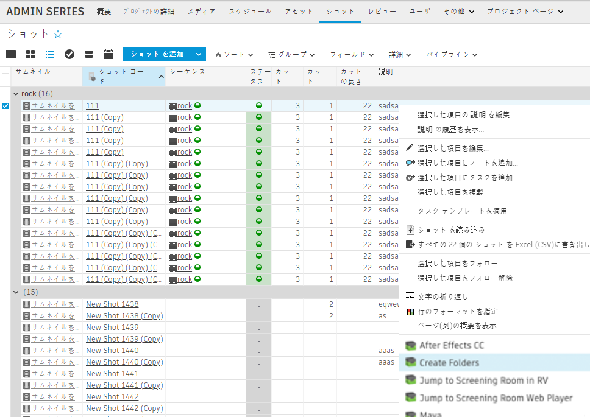

# 


 Engine は  内から起動できるアプリを管理します。この Toolkit アプリを *アクション* として参照することもあります。通常、このアプリは  内のメニュー項目として表示されます。

##  Pipeline Toolkit アクションを使用する

アクションは  のホーム ページに表示されます。



また、 の標準的なコンテキスト メニューにも表示されます。オブジェクトや選択項目を右クリックすると表示できます。



アクションをクリックすると、処理がすぐに開始されます。アプリの処理が完了すると、通常はいくつかのステータス情報を含むメッセージが表示されます。動作しなかった場合にはエラー メッセージが表示されます。

##  用のアプリを開発する

 内で実行するアプリの開発は簡単です。通常のアプリ開発の仕組みが分からない場合は、プラットフォームのマニュアルを見つけて、概要部分を確認してください。このセクションでは、 固有のアプリ開発プロセスの側面について説明します。

Core v0.13 以降では、 Engine ですべてのマルチ アプリを使用できます。技術的には、 Engine と他のエンジンの違いはほとんどありません。ただし、微妙な違いがあります。

*  Engine で QT ベースのアプリを実行する場合は、標準的な Python 環境に PySide や PyQt を手動でインストールする必要があります。
*  Engine では、ユーザが属する権限グループに応じてアクションを表示することができます。これは、 アクション メニューにコマンドを追加して、このコマンドを管理者にのみ表示する場合などに便利です。

 アプリで、管理者にのみ「Hello, World!」と表示する場合は、次のように記述します。

```python
from tank.platform import Application

class LaunchPublish(Application):

    def init_app(self):
        """
        Register menu items with 
        """        
        params = {
            "title": "Hello, World!",
            "deny_permissions": ["Artist"],
        }

        self.engine.register_command("hello_world_cmd", self.do_stuff, params)


    def do_stuff(self, entity_type, entity_ids):
        # this message will be displayed to the user
        self.engine.log_info("Hello, World!")    
```

## インストールと更新

###  Pipeline Toolkit にこのエンジンを追加する

Project XYZ にこのエンジンを追加するには、asset という名前の環境で次のコマンドを実行します。

```
> tank Project XYZ install_engine asset tk-shotgun
```

### 最新バージョンに更新する

この項目が既にプロジェクトにインストールされている場合に最新バージョンを取得するには、`update` コマンドを実行します。特定のプロジェクトに含まれている tank コマンドに移動し、そこでこのコマンドを実行します。

```
> cd /my_tank_configs/project_xyz
> ./tank updates
```

または Studio の tank コマンドを実行し、プロジェクトの名前を指定して、更新チェックを実行するプロジェクトを指定します。

```
> tank Project XYZ updates
```

## コラボレーションと発展

 Pipeline Toolkit にアクセスできる場合は、すべてのアプリ、エンジン、およびフレームワークのソース コードにも Github からアクセスできます。これらは Github を使用して格納および管理しています。これらの項目は自由に発展させてください。さらなる独立した開発用の基盤として使用したり、変更を加えたり(その際はプル リクエストを送信してください)、 いろいろと研究してビルドの方法やツールキットの動作を確認してください。このコード リポジトリには、https://github.com/shotgunsoftware/tk-shotgun からアクセスできます。

## 特殊な要件

上記の操作を行うには、 Pipeline Toolkit Core API バージョン v0.19.5 以降が必要です。