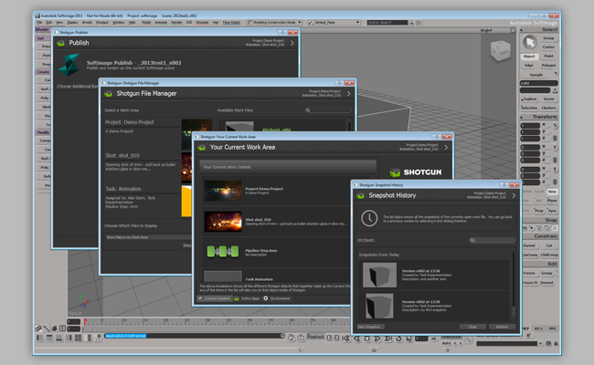

# Softimage

> **警告:** Softimage エンジンは 2021 年 2 月 13 日をもってサポート終了になりました。詳細については、[こちら](https://community.shotgridsoftware.com/t/end-of-life-for-softimage-support-on-february-13th-2021/10694)を参照してください。



 Engine for Softimage は  Pipeline Toolkit アプリと Softimage の橋渡しを行います。PySide/Qt ディストリビューションが含まれているため、エンジン内で動作する Python と PySide を使用してアプリを作成できます。ここでは高度な設定のセットアップ例を示します。

 Engine for Softimage には、 アプリと Softimage を統合するための標準プラットフォームが含まれています。このエンジンは、自動ファイル管理、適切に定義された作業エリアとパブリッシュ用ワークフロー、スナップショットなどを提供する通常のアプリ スイートをサポートします。

エンジンをロードすると、Softimage のメイン メニューバーに  メニューが表示されます。


## サポート対象のアプリケーション バージョン

この項目はテスト済みです。アプリケーション バージョン 2012 と 2013 で動作することが分かっています。 最新のリリースでの動作は十分可能ですが、正式なテストはまだ完了していません。

使用可能な Toolkit のコマンドはここに表示されます。

 Engine for Softimage はベータ版であり、いくつかの既知の問題があることに注意してください。完全なリストについては、以下を参照してください。

## アプリ開発者向けの情報

### サポート対象プラットフォーム

 Engine for Softimage は、現在 Windows の Softimage 2012 と 2013 および Linux の Softimage 2013 をサポートしています。

Softimage 2014 は Linux ではサポートされていません。Windows 上で実行することはできますが、安定性の問題があるため、使用はお勧めしません。

### PySide

#### 窓

Windows では、Softimage は組み込みの Python ディストリビューションまたは外部のディストリビューションのいずれかを使用するように設定できます。詳細については、http://download.autodesk.com/global/docs/softimage2013/ja_jp/userguide/index.html?url=files/userprefs528.htm,topicNumber=d30e797817 を参照してください。

このエンジンは、インストールされたバージョンの Python for Softimage (バージョン 2012 (Python 2.6 x64)、2013 (Python 2.6 x64)、および 2014 (Python 2.7 x64))向けのバージョンの PySide と Qt にバンドルされています。ただし、外部の Python ディストリビューションを使用している場合は、バイナリ互換性のある PySide と Qt も用意する必要があります。

Windows PySide ディストリビューションに最適なリソースについては、http://www.lfd.uci.edu/~gohlke/pythonlibs/ を参照してください。

#### Linux

Linux で、Softimage は組み込みバージョンの Python を使用する必要があります。Softimage 2013 の場合、構築済みの PySide と Qt のディストリビューションが必要です。[tk-framework-softimageqt](https://github.com/shotgunsoftware/tk-framework-softimageqt) から入手できます。このディストリビューションは Python 2.5.2 向けの GCC 4.1.2 を使用して構築されています。これは Softimage 2013 で使用されているのと同じバージョンです。

Linux にはたくさんの異なるディストリビューションがあり、すべての環境で動作するとは限らないため、動作するように自分で再構築することが必要な場合があります。対象バージョンの構築方法に関する詳細については、次のフレームワークに含まれる Readme を参照してください。

https://github.com/shotgunsoftware/tk-framework-softimageqt/tree/master/resources/pyside121_py25_qt485_linux

### 既知の問題(Windows)

#### Softimage 2014 の不安定性

このエンジンは Windows 上の Softimage 2014 で実行できますが、既知の問題があり、すべてのテストは完了していません。Publish ダイアログを開くと、Softimage がクラッシュします。

#### Softimage 2014 の SSL バグ

Softimage 2014 に付属する `_ssl.pyd` ファイルには、起動時の処理能力を低下する可能性のある既知のバグがあります。この問題を解決するには、このファイルのバックアップを作成し、Maya 2014 に付属する `_ssl.pyd` ファイルでこのファイルを上書きすることをお勧めします。この問題のサポートやアドバイスが必要な場合は、Toolkit のサポートまでお気軽にお問い合わせください。

#### ウィンドウのペアレント化

親を設定せず、エンジンの `show_modal` メソッドまたは `show_dialog` メソッドを使用せずに作成した Qt ウィンドウは、Softimage のメイン アプリケーションに正しくペアレント化されません。

### 既知の問題(Linux)

#### ssl と sqlite3 ライブラリの欠落

特定のバージョンの PySide が必要となる(詳細は上記参照)以外にも、Softimage には  Python API と Toolkit で必要となる ssl と sqlite3 ライブラリも欠落しています。

このライブラリは `tk-multi-launchapp` アプリの一部として含まれており、Softimage の起動前に LD_LIBRARY_PATH & PYTHONPATH にも追加されます。また、このライブラリに問題がある場合、システムに合わせてライブラリを構築する方法に関する詳細な説明を確認するには、アプリに付属する次の README を参照してください。

https://github.com/shotgunsoftware/tk-multi-launchapp/blob/master/app_specific/softimage/linux/lib/README

#### libX11 のセグメント化の失敗。

Linux 上の Softimage には、特定の Linux ディストリビューション上の速度の問題に対応するためにオプションのハックが含まれています。詳しくは次の URL を参照してください。

http://xsisupport.com/2011/01/19/the-case-of-the-slow-2011-startup-on-fedora-14/

この方法を使用すると、次の URL にある異なるバージョンの libX11 ライブラリを使用するよう Softimage に通知されます。

/usr/Softimage/Softimage_2013/Application/mainwin/mw/lib-amd64_linux_optimized/X11

このハックを使用している場合、Qt で libX11 ライブラリを呼び出す場合(呼び出しスタックの SIGSEGV)、高い確率でセグメント化の失敗が発生するため、頻繁にクラッシュします。これは、ハック バージョンの libX11 ライブラリが非常に古く、Qt が構築されたときのバージョンと互換性がないためです。

この問題を解決するには、Softimage ハック バージョンと互換性のある libX11 バージョンで新しいバージョンの Qt を構築する必要があります。

#### libssl のセグメント化の失敗

正しいバージョンの GCC (4.1.2) ではなく、最新バージョンの openssl を使用している場合、 API を使用するとセグメント化の失敗(SIGSEGV)が発生する可能性があります。

これは Qt/PySide に固有ではありませんが、2 番目に一般的な問題であるためここに明記しておく必要があります。

次の URL もご覧ください。

https://github.com/shotgunsoftware/tk-multi-launchapp/blob/master/app_specific/softimage/linux/lib/README

Softimage 2013 で互換性のあるバージョンの openssl を構築する方法を参照できます。

#### ウィンドウのペアレント化

現在、Toolkit のウィンドウは、Linux 上の Softimage メイン アプリケーション ウィンドウとペアレント化されていません。回避策としてウィンドウが一番上に作成されますが、これにより他のウィンドウ(特に確認ダイアログ)がこのウィンドウの後ろに隠れてしまう可能性があります。

Softimage が停止したように見える場合は、開いた Toolkit ウィンドウを動かして、この後ろにダイアログが隠れていないかを確認してください。

#### ウィンドウを移動した後に Softimage/Toolkit がフリーズする

モードレス ダイアログ( File Manager など)を移動すると、Softimage とダイアログの両方の内容がフリーズするか、応答しなくなります。これは Qt メッセージ キューが実装されている場合の問題ですが、残念ながら、解決方法はまだ見つかっていません。

簡単な回避方法は、この問題が発生したら、Softimage のメイン ビューポート内をクリックすることです。これですべてが再び正しく動作し始めます。

## インストールと更新

###  Pipeline Toolkit にこのエンジンを追加する

Project XYZ にこのエンジンを追加するには、asset という名前の環境で次のコマンドを実行します。

```
> tank Project XYZ install_engine asset tk-softimage
```

### 最新バージョンに更新する

この項目が既にプロジェクトにインストールされている場合に最新バージョンを取得するには、`update` コマンドを実行します。特定のプロジェクトに含まれている tank コマンドに移動し、そこでこのコマンドを実行します。

```
> cd /my_tank_configs/project_xyz
> ./tank updates
```

または、`tank` コマンドを実行し、プロジェクトの名前を指定して、更新チェックを実行するプロジェクトを指定します。

```
> tank Project XYZ updates
```

## コラボレーションと発展

 Pipeline Toolkit にアクセスできる場合は、すべてのアプリ、エンジン、およびフレームワークのソース コードにも Github からアクセスできます。これらは Github を使用して格納および管理しています。これらの項目は自由に発展させてください。さらなる独立した開発用の基盤として使用したり、変更を加えたり(その際はプル リクエストを送信してください)、 いろいろと研究してビルドの方法やツールキットの動作を確認してください。このコード リポジトリには、https://github.com/shotgunsoftware/tk-softimage からアクセスできます。

## 特殊な要件

上記の操作を行うには、 Pipeline Toolkit Core API バージョン v0.14.56 以降が必要です。